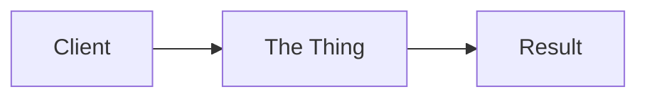

---
# Copy this file to content/concepts/<slug>.mdx — filename MUST equal the slug.
title: "Concept Name"
slug: "concept-name"
# One of: Scalability, Databases, Distributed Systems, Caching, Networking,
# Asynchronous Communication, Reliability, Architecture (see src/lib/constants.ts)
category: "Scalability"
tags: ["tag-one", "tag-two"]
difficulty: "beginner" # beginner | intermediate | advanced
oneLiner: "One friendly sentence that explains the whole idea."
summary: "One or two sentences used on cards, search results, and meta descriptions."
diagramType: "mermaid" # mermaid | image | both | none
relatedConcepts: [] # slugs of existing concepts — the build fails on typos
relatedQuestions: [] # slugs of existing questions
lastUpdated: "2026-07-18"
draft: true # set to false to publish
---

Open with 1–2 sentences expanding the one-liner — what it is and why anyone cares.

## Analogy

A real-world comparison a non-engineer would understand.

## How It Works

Explain the diagram in simple English right below it.

{/* For hand-drawn diagrams, export SVG to public/diagrams/concepts/<slug>/ and use:
<DiagramImage src="/diagrams/concepts/<slug>/name.svg" alt="Describe what the diagram shows" caption="Short caption" /> */}

## Deep Dive

The mechanics, variants, and when to use it. Use tables for comparisons.

<Callout type="tip">
An interview-specific insight worth calling out.
</Callout>

## Real-World Examples

- Who uses this and how.

## Interview Follow-Ups

- Likely follow-up question? (Direction of a strong answer.)
