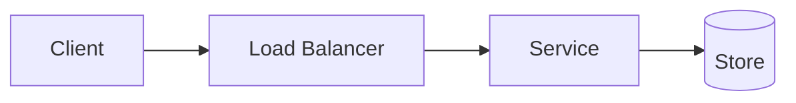

---
# Copy this file to content/questions/<slug>.mdx — filename MUST equal the slug.
title: "Design a Thing"
slug: "design-a-thing"
type: "case-study" # conceptual | case-study
category: "System Design Case Studies" # or "Interview Fundamentals" for conceptual
tags: ["tag-one"]
difficulty: "intermediate" # beginner | intermediate | advanced
estimatedTime: "30-40 min"
summary: "One or two sentences: what is being designed and what makes it interesting."
relatedConcepts: [] # slugs of existing concepts — the build fails on typos
relatedQuestions: []
diagramType: "mermaid"
lastUpdated: "2026-07-18"
draft: true # set to false to publish
---

## Problem Statement

The question exactly as an interviewer would ask it, plus what makes it hard.

## Clarifying Questions

- What should you ask before designing? (And the assumed answer.)

## Requirements

**Functional:** the 2–4 core features in scope.
**Non-functional:** latency, scale, consistency, availability targets.

## High-Level Design

Walk through the main read and write paths.

## Deep Dive

The 1–3 hardest sub-problems, each with its solution and reasoning.

<Callout type="tip">
The insight that separates a good answer from a great one.
</Callout>

## Trade-offs & Alternatives

- What you chose, what you gave up, and what you'd do differently at other scales.

## Follow-Up Questions

- Likely follow-up? (Direction of a strong answer.)
