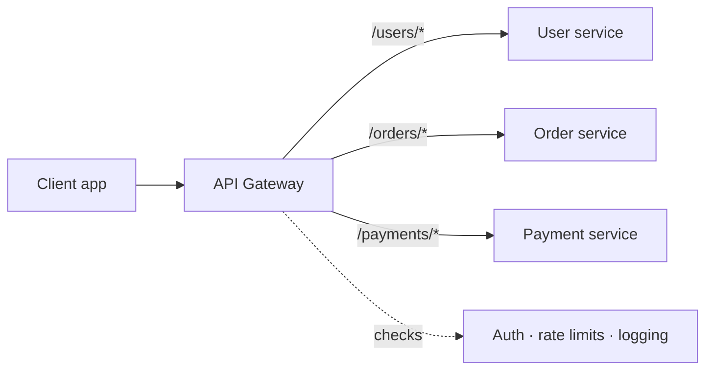
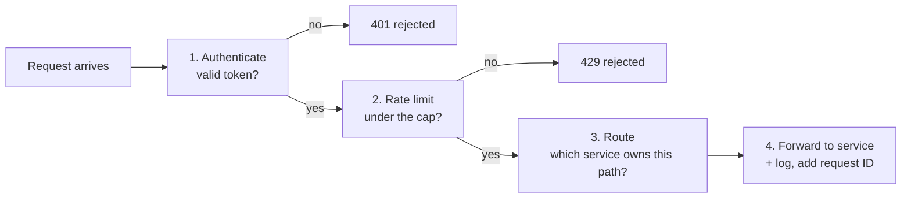

In a [microservices](/concepts/microservices-vs-monolith) system, clients would otherwise need to know about dozens of services, each with its own address, auth, and quirks. An API gateway gives them **one address that handles everything**.

## Analogy

A hotel front desk. Guests don't wander into the kitchen to order food, knock on housekeeping's door for towels, or find the manager for complaints — they call the front desk, which checks who they are, refuses unreasonable requests, and routes each request to the right department.

## How It Works

What happens to a single request, step by step:

Every request passes through the gateway, which typically handles:

- **Routing** — `/orders/…` goes to the order service, `/users/…` to the user service.
- **Authentication** — validate the token once, at the door, not in every service.
- **[Rate limiting](/concepts/rate-limiting)** — block abusive clients before they touch anything.
- **Protocol translation** — clients speak HTTPS/JSON; internal services may use gRPC.
- **Response aggregation** — one client call fans out to several services, merged into one response.
- **Cross-cutting concerns** — logging, metrics, request IDs, TLS termination.

## Deep Dive

### Gateway vs load balancer vs reverse proxy

All three sit in front of servers, and they layer naturally:

- A [reverse proxy](/concepts/proxy-vs-reverse-proxy) is the general idea — a middleman in front of servers.
- A [load balancer](/concepts/load-balancing) specializes in spreading traffic across *identical copies* of a service.
- An API gateway specializes in *API concerns* — routing across *different* services, auth, limits, versioning. Behind it, each service usually still has a load balancer.

### The costs

<Callout type="warning">
The gateway touches every request, so it must be fast and highly available — a slow or dead gateway is a slow or dead product. Run it replicated, keep its logic thin, and resist turning it into a "smart pipe" full of business logic.
</Callout>

- Extra network hop → a little added latency.
- A new critical component to operate and scale.
- Risk of becoming a bottleneck for team velocity if every API change needs gateway changes.

### Variations

- **BFF (Backend For Frontend)** — separate gateways per client type (mobile vs web), each shaped to that client's needs.

## Real-World Examples

- AWS API Gateway, Kong, Apigee, and NGINX in gateway mode.
- Netflix's Zuul — one of the first famous gateways, fronting hundreds of microservices.

## Interview Follow-Ups

- Isn't the gateway a single point of failure? (Run multiple instances behind DNS/L4 balancing, like any critical service.)
- Where would you implement rate limiting — gateway or service? (Gateway for global/user limits; services may add their own for protection in depth.)
- Gateway vs service mesh? (Gateway = north–south traffic, client to system; mesh = east–west, service to service.)
