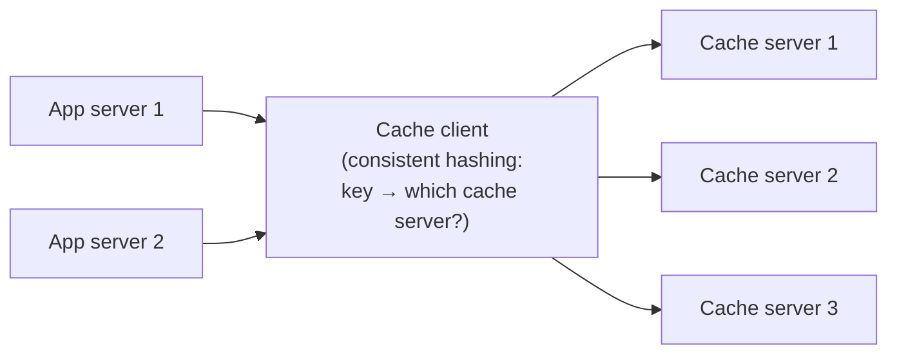
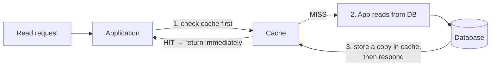
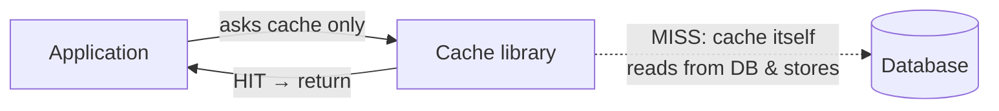
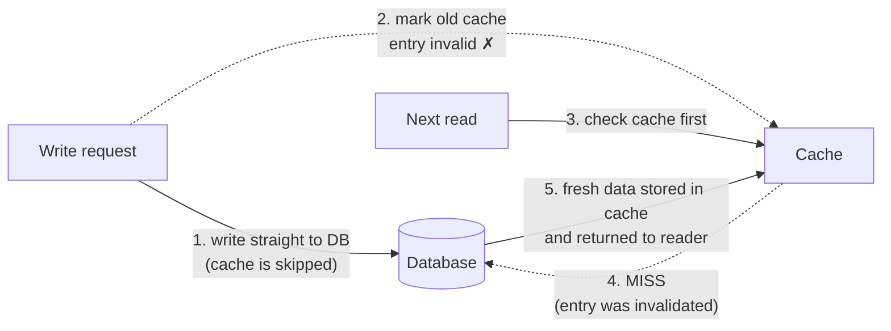
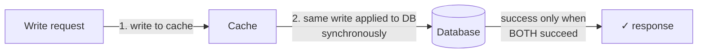
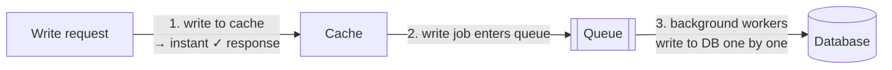

Caching means keeping frequently used data in **fast memory (RAM)** so we do not have to fetch it from **slow storage** (like a database on disk) every time. Reading from RAM takes microseconds; reading from a database takes milliseconds — a thousand times slower.

Caching gives you three wins at once:

- **Speed** — the system responds faster because latency (response time) drops.
- **Less database load** — fewer requests ever reach the database.
- **Better availability** — if the database is slow or temporarily down, some requests can still be served from the cache.

## Analogy

A barista keeps the five most-ordered syrups on the counter and the rest in the storeroom. Most orders are served without a trip to the back. Occasionally someone orders something rare (a cache miss) — the barista walks to the storeroom (the database), and if that syrup is suddenly trending, it earns a spot on the counter.

## Why Do We Need *Distributed* Caching?

Imagine all your application servers use **one single cache server** (one Redis instance). Two problems appear:

- **Scaling limit** — one server has limited memory and CPU. At some point you cannot scale it any further.
- **Single Point of Failure (SPOF)** — if that one cache server goes down, the whole cache is gone at once.

**Distributed caching** solves this: instead of one cache server, we use a **cache cluster** (a group of cache servers). Every application server talks to a **cache client**, and the cache client uses [consistent hashing](/concepts/consistent-hashing) to decide **which cache server** should store or serve a particular key.

The full design of such a cluster is its own case study: [Design a Distributed Cache](/questions/design-distributed-cache).

## The Five Caching Strategies

There are five common strategies. The first two are about **reading** data, the last three are about **writing** data. In real systems, **a read strategy is usually combined with a write strategy**.

### 1. Cache-Aside (Lazy Loading) — read strategy

Here **the application itself** manages the cache.

**How it works:** when a read request comes, the application first checks the cache. If the data is there (**cache hit**), it is returned immediately. If not (**cache miss**), the application reads it from the database, stores a copy in the cache, and then sends the response.

**Advantages**

- Great for **read-heavy** applications.
- Even if the cache is down, requests do not fail — the application simply reads from the database.
- You can store data in the cache in **any format you like**, not necessarily the same shape as in the database.

**Disadvantages**

- The first read of any new data is always a cache miss.
- **Risk of stale data:** if a write updates the database but the old value is still sitting in the cache, later reads return outdated data.

### 2. Read-Through Cache — read strategy

Similar to Cache-Aside, but here **the cache library** (not the application) fetches data from the database.

**How it works:** the application asks the cache for the data. On a hit, the cache returns it. On a miss, the **cache library itself** reads from the database, stores the value, and returns it to the application.

**Advantages**

- Good for read-heavy applications.
- The database-fetching logic lives in the cache library, so **application code stays simple**.

**Disadvantages**

- The first read of new data is always a cache miss.
- If writes do not update or expire the cache properly (e.g. with a **TTL** — time to live), cache and database become inconsistent.
- You **cannot** store data in your own custom format — the cache library controls how data is stored.

### 3. Write-Around Cache — write strategy

Writes go **directly to the database and skip the cache**.

**How it works:** a write request goes straight to the database, and the matching cache entry is **marked invalid** (stale) so nobody reads the old value. On the next read there's a cache miss, so fresh data is fetched from the database and stored in the cache.

**Advantages**

- Avoids the stale-data problem — the old cache entry is invalidated on every write.
- Best when data is **written often but read rarely** — no cache space wasted on data nobody reads.

**Disadvantages**

- The first read after a write is always a cache miss (slower).
- If the database is down, writes fail.

### 4. Write-Through Cache — write strategy

Writes go to the **cache first, then immediately (synchronously) to the database**.

**How it works:** the application writes into the cache; the same write is then applied to the database synchronously — the request only succeeds when **both** succeed.

**Advantages**

- Cache and database **always stay consistent**.
- Very high cache hit rate — every written value is already in the cache.

**Disadvantages**

- On its own it is not very useful and it **increases write latency** (two writes per request) — which is why it's usually combined with Read-Through or Cache-Aside.
- Needs something like a **two-phase commit** so both writes succeed or fail together; otherwise cache and DB can go out of sync.
- If the database is down, the write fails — not fault tolerant for writes.

### 5. Write-Back (Write-Behind) Cache — write strategy

Writes go to the **cache first; the database is updated later, asynchronously**.

**How it works:** the application writes into the cache and gets a quick success response. The write is placed in a **queue**, and background workers pick up jobs one by one and write them into the database.

**Advantages**

- Excellent for **write-heavy** applications.
- Very low write latency — the database write happens in the background.
- High cache hit rate.
- Works very well combined with Read-Through cache.
- Even if the database is down for a while, **writes still succeed** — they wait in the queue.

**Disadvantages**

- **Risk of data loss:** if the cache fails — or the data is evicted — *before* the background worker has written it to the database, that data is gone forever.

## Quick Comparison

| Strategy | Best for | Biggest advantage | Biggest risk |
| --- | --- | --- | --- |
| Cache-Aside | Read-heavy apps | Works even if cache is down | Stale (old) data in cache |
| Read-Through | Read-heavy apps | App code stays simple | Stale data without proper expiry (TTL) |
| Write-Around | Written often, read rarely | Keeps cache and DB consistent | Cache miss on first read after a write |
| Write-Through | When consistency matters most | Cache and DB always match | Slower writes; write fails if DB is down |
| Write-Back | Write-heavy apps | Very fast writes; works even if DB is down | Data loss if cache fails before DB write |

<Callout type="tip">
In interviews, name the *combination*: "I'd use Cache-Aside for reads with Write-Around invalidation on writes" (the most common pairing), or "Write-Back + Read-Through for a write-heavy workload, accepting the data-loss window." Pairing a read strategy with a write strategy shows you actually understand how they fit together.
</Callout>

## Eviction: What to Throw Out When Full

Caches are small by design. When full, an **eviction policy** picks a victim:

- **LRU (Least Recently Used)** — evict what hasn't been touched longest. The default choice.
- **LFU (Least Frequently Used)** — evict what's used least often.
- **TTL (Time To Live)** — every entry expires after a set time (e.g. 24 h), keeping the cache fresh and bounded.

## The Classic Caching Problems

<Callout type="warning">
Interviewers love these three failure modes — naming them unprompted is a strong signal.
</Callout>

- **Stale data** — the DB changed but the cache still holds the old value. Mitigate with TTLs or explicit invalidation on writes (Write-Around). "Cache invalidation is one of the two hard problems in computer science."
- **Cache stampede (thundering herd)** — a hot key expires and thousands of requests hit the database at once. Mitigate with per-key locks or staggered ("jittered") TTLs.
- **Cache penetration** — requests for keys that don't exist anywhere always miss and always hit the DB. Mitigate by caching "not found" results or using a Bloom filter.

## Where Caches Live

Browser cache → [CDN](/concepts/cdn) → application-level cache (Redis/Memcached) → database's own buffer cache. Each layer absorbs traffic before the next.

## Real-World Examples

- **Redis** and **Memcached** are the standard shared in-memory caches.
- URL shorteners cache short→long mappings because redirects are 90 %+ of traffic ([full case study](/questions/design-url-shortener)).
- Twitter caches whole rendered timelines — recomputing them per request would melt the database.

## Interview Follow-Ups

- How do you keep the cache consistent with the database? (Pick the right write strategy: Write-Around invalidation or Write-Through, plus TTL as a safety net.)
- What happens if the cache goes down? (Cache-Aside keeps working through the DB — size the DB to survive the miss storm, or run cache replicas.)
- When is caching a bad idea? (Write-heavy data with Write-Through, rarely-repeated reads, or correctness-critical reads.)
- Why does Write-Back need a queue instead of just writing later? (The queue survives worker crashes and lets you retry — without it, "later" can silently become "never.")
