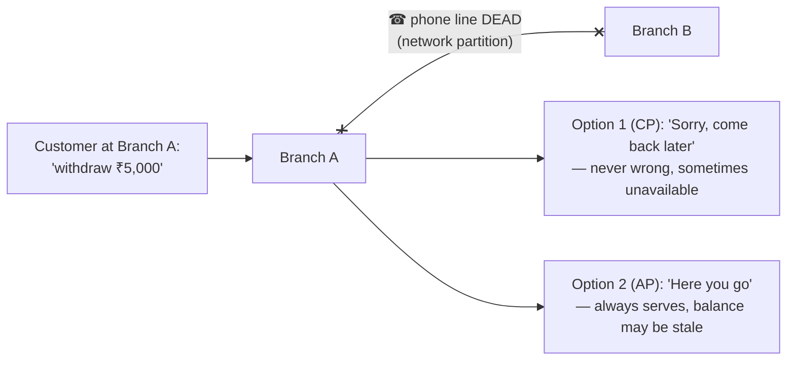
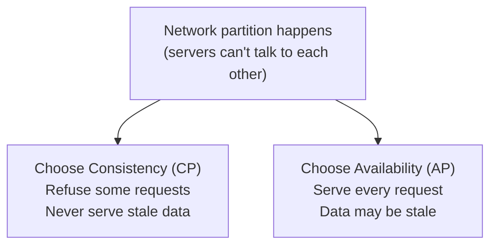

The CAP theorem says a distributed system can guarantee at most **two** of three properties: **C**onsistency, **A**vailability, and **P**artition tolerance. Since network partitions *will* happen, the real choice is between C and A when they do.

## Analogy

Two branches of a bank keep each other updated by phone. One day the phone line dies (a **partition**). A customer walks into branch A to withdraw money. The branch has two options: refuse service until the line is back ("we can't be sure of your balance" — choosing **consistency**), or serve the customer with the balance it last knew ("probably fine" — choosing **availability**). It cannot do both.

## How It Works

The three properties, precisely:

- **Consistency** — every read sees the most recent write (all servers agree on one truth).
- **Availability** — every request gets a (non-error) response, always.
- **Partition tolerance** — the system keeps working even when servers can't reach each other.

## Deep Dive

### Why you can't skip P

A "CA system" would require a network that never fails. Real networks fail — cables get cut, routers die, data centers lose connectivity. So partition tolerance isn't optional; the theorem is really: **when a partition happens, choose C or A**.

### CP systems — consistency first

During a partition, nodes that can't confirm they have the latest data **refuse to answer**. Users see errors or timeouts, but nobody ever sees wrong data. Examples: ZooKeeper, etcd, traditional single-leader databases with synchronous replication.

### AP systems — availability first

During a partition, every node **keeps answering with its local (possibly stale) data**. When the partition heals, replicas reconcile — this is [eventual consistency](/questions/eventual-consistency-explained). Examples: Cassandra, DynamoDB, DNS.

<Callout type="info">
In normal operation (no partition) you don't sacrifice anything — a well-built system is both consistent and available 99.9% of the time. CAP only bites during failures. The related PACELC theorem adds: *even without* partitions, you still trade latency vs consistency.
</Callout>

### It's a dial, not a switch

Real systems tune the trade-off per operation. Quorum systems (see [Design a Key-Value Store](/questions/design-key-value-store)) use the rule **R + W > N** to slide between stronger consistency and higher availability per read/write.

## Real-World Examples

- **Bank transfers:** CP — better to show an error than a wrong balance.
- **Amazon's shopping cart:** AP — never block "add to cart"; merge conflicts later.
- **Social media likes:** AP — a slightly stale like count hurts nobody.

## Interview Follow-Ups

- Give a real scenario where you'd pick CP over AP. (Payments, inventory of the last item in stock, seat booking.)
- What happens to an AP system's conflicting writes? (Conflict resolution: last-write-wins, vector clocks, or app-level merge.)
- What is PACELC? (If Partition: A vs C; Else: Latency vs Consistency.)
