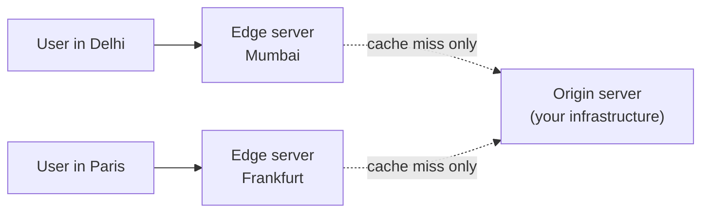
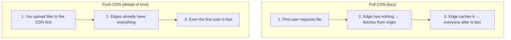

Every request to a server on another continent pays for the distance — light in fiber takes ~70 ms to cross the Atlantic and back. A CDN fixes this by keeping **copies of your content on servers physically near your users** ("edge servers").

## Analogy

A newspaper isn't printed in one city and mailed worldwide — it's printed in dozens of local printing plants from the same master copy, so every reader gets it fresh in the morning. The journalists (your origin server) write once; the plants (edge servers) distribute everywhere.

## How It Works

1. A user requests `logo.png`. DNS routes them to the **nearest edge server**.
2. If the edge has it cached → served immediately (a hit — the common case).
3. If not → the edge fetches it from your **origin**, caches it, then serves it. The next thousand users in that region hit the cache.

## Deep Dive

### What belongs on a CDN

Static content is the classic case: images, video, CSS/JS bundles, fonts, downloads. Modern CDNs also cache API responses and full HTML pages, and run code at the edge (Cloudflare Workers, Lambda@Edge).

### Pull vs push

- **Pull CDN** — edges fetch from origin on the first miss (lazy). Zero upkeep; the first user in a region pays the slow fetch.
- **Push CDN** — you upload content to the CDN ahead of time. Predictable, good for big planned releases (game updates, video launches).

### Invalidation and versioning

The stale-cache problem from [caching](/concepts/caching) applies at the edge too. The standard trick is **versioned file names** (`app.3f9c2.js`): a new deploy references new names, so nothing stale is ever served and old files can cache forever.

### Beyond speed

- **Origin offload** — 90 %+ of traffic never reaches your servers.
- **DDoS absorption** — attack traffic hits the CDN's massive capacity first.
- **TLS termination** near users speeds up connection setup.

## Real-World Examples

- Cloudflare, Akamai, AWS CloudFront, Fastly.
- Netflix runs its own CDN (Open Connect) with servers *inside* ISP data centers — see [Design Video Streaming](/questions/design-video-streaming).

## Interview Follow-Ups

- What can't a CDN cache? (Truly per-user, real-time, or write-path data.)
- How do you force an urgent content update? (Purge API + short TTLs, or versioned URLs.)
- CDN vs your own cache — when do you need both? (CDN for static/global, Redis for dynamic/per-user.)
