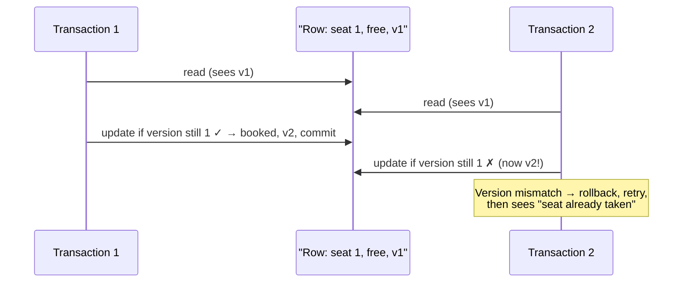
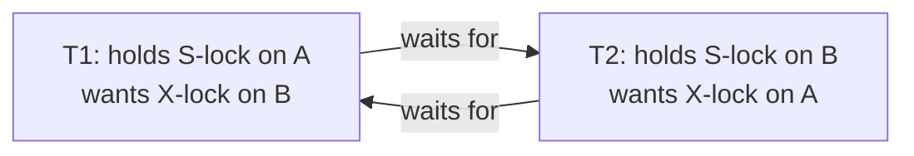

Imagine 3 people open a movie booking app at the same time and all try to book the same seat. Only one should get it. Making sure this happens correctly is **concurrency control**.

Inside a single Java process, `synchronized` works — one thread at a time enters the critical section. But in a distributed system, many servers handle requests, and one server's lock can't stop a thread on another server. So we rely on **the database** — the one shared place all servers talk to — using two techniques: **Optimistic (OCC)** and **Pessimistic (PCC)** concurrency control.

## Building Block 1: Transactions

A transaction is a group of database operations that must **succeed or fail together**. Transfer money from A to B: if the debit from A succeeds but the credit to B fails, the database rolls back everything — otherwise money simply disappears.

## Building Block 2: Locks

| Lock type | What others CAN do | What others CANNOT do |
| --- | --- | --- |
| **Shared (S)** | Also take a shared lock and read the row | Update (write) the row |
| **Exclusive (X)** | Nothing — owner only | Read or write the row |

Remember: **Shared = "everyone can read together." Exclusive = "mine only, stay away."**

## Building Block 3: The Read Problems & Isolation Levels

- **Dirty read** — B reads A's *uncommitted* value; A rolls back; B read data that never existed.
- **Non-repeatable read** — A reads the same row twice in one transaction and gets different values (someone updated it in between).
- **Phantom read** — the same *query* returns different **rows** the second time (someone inserted/deleted matching rows) — ghost rows.

Isolation levels decide which problems can happen:

| Isolation level | Dirty read | Non-repeatable | Phantom |
| --- | --- | --- | --- |
| Read Uncommitted | Possible | Possible | Possible |
| Read Committed | Solved | Possible | Possible |
| Repeatable Read | Solved | Solved | Possible |
| Serializable (adds range locks) | Solved | Solved | Solved |

Range locks (Serializable) lock a whole range like `id 1–10`, blocking inserts *into the range* — which is exactly what kills phantoms.

## Optimistic Concurrency Control (OCC)

"**Optimistic**" = we hope nobody touches our row, so we don't hold locks while thinking — we only **check at the very end**, using a **version number** that increments on every update. (Works on Read Committed; some databases track versions internally via MVCC, otherwise you add a `version` column yourself.)

Both transactions read version 1. T1 validates ("still v1? yes"), books the seat, bumps to v2. T2 then validates ("I read v1, current is v2 — mismatch!"), rolls back, retries, and on retry sees the seat is taken.

**Good for:** read-heavy systems with few conflicts. No waiting, no deadlocks — but under heavy conflict, transactions keep rolling back and retrying, wasting work.

## Pessimistic Concurrency Control (PCC)

"**Pessimistic**" = we assume someone WILL touch our row, so we **lock early and hold until commit** (Repeatable Read / Serializable). Readers hold shared locks; a writer's exclusive lock makes everyone else wait. Transactions effectively run one after another on the same data — strong safety, less concurrency.

### The price: deadlocks

T1 reads A then writes B; T2 reads B then writes A:

Both wait for each other forever — a **deadlock**. The database detects the cycle and aborts one transaction, which must start over.

## OCC vs PCC — Quick Comparison

| | Optimistic (OCC) | Pessimistic (PCC) |
| --- | --- | --- |
| Attitude | "Conflicts are rare — check at the end" | "Conflicts will happen — lock first" |
| Isolation level | Read Committed + version column | Repeatable Read / Serializable |
| Locks | Very short-lived | Held until commit |
| Conflict handling | Version mismatch → rollback & retry | Others simply wait (blocked) |
| Deadlocks | Not an issue | Real risk |
| Best for | Read-heavy, few conflicts | Write-heavy, critical data (money) |

<Callout type="tip">
The booking-app framing is a gift in interviews: OCC = "let both try, last one gets told the seat is gone"; PCC = "first one locks the seat row, second one waits." Pick OCC for read-mostly systems, PCC when conflicts are frequent or the cost of a retry is high.
</Callout>

## Interview Follow-Ups

- How does OCC behave under heavy contention? (Retry storms — PCC or queueing becomes better.)
- How do you prevent deadlocks in PCC? (Lock resources in a consistent global order; keep transactions short; rely on DB detection + retry.)
- Where does [idempotency](/concepts/idempotency) fit? (Retries — from OCC rollbacks or clients — must not double-apply effects.)
