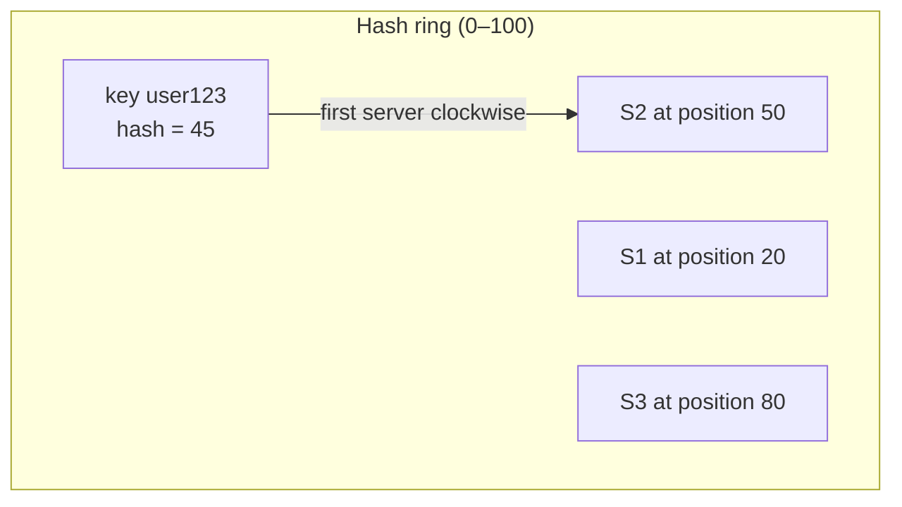
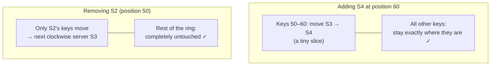
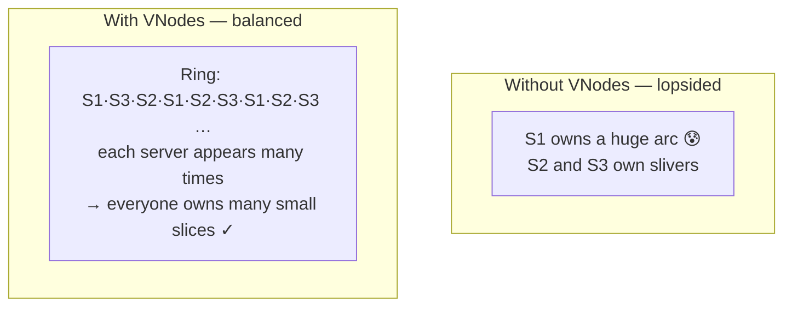

When data is spread across many servers, something must decide *which server owns which key*. Consistent hashing is the standard answer, because it keeps that mapping stable even as servers come and go.

## Analogy

Guests at a round table pass each dish clockwise to the nearest seated waiter. If a new waiter sits down, they only take over the dishes between them and the previous waiter — every other dish stays exactly where it was. Compare that with "divide all dishes by the number of waiters": one new waiter and *everyone's* dishes get reshuffled.

## The Problem with Normal Hashing

The obvious formula is:

```
server = hash(key) % n     (n = number of servers)
```

With `n = 4`: `hash(user123) % 4 = 2` → Server 2. But add one server (`n = 5`) and `hash(user123) % 5 = 4` → Server 4. **Almost every key in the system now maps to a different server.** Caches become useless, the network floods with data movement, and the system crawls — unacceptable at scale.

## How It Works

Consistent hashing places both **servers and keys on an imaginary circle** (the hash ring). A key belongs to the **first server found moving clockwise** from the key's position.



With servers at positions 20 (S1), 50 (S2), 80 (S3): `hash(user123) = 45` → first server clockwise is **S2**.

- **Adding S4 at position 60:** only the keys between positions 50 and 60 — which used to belong to S3, the next server clockwise — move to S4. Everything else stays put.
- **Removing S2:** only S2's keys move, shifting clockwise to S3. The rest of the ring is untouched.



## Deep Dive

### Virtual nodes (VNodes)

With few servers, the ring can be lopsided — one server may own a huge arc and become a **hot spot**. The fix: place each physical server at **many positions** (10, 50, even 150 "virtual nodes"). Data spreads far more evenly, and when a server dies its load is shared by *all* remaining servers instead of dumping onto one neighbor.



<Callout type="tip">
Consistent hashing appears in a huge fraction of design interviews — distributed caches, sharded databases, and load balancing all use it. Being able to sketch the ring and say "only the keys between the new server and its predecessor move" is a reliable way to signal depth.
</Callout>

## Real-World Examples

- **Amazon DynamoDB** and **Apache Cassandra** partition data with consistent hashing.
- **Redis Cluster** uses a closely related idea (fixed hash slots).
- CDNs and distributed caches use it to keep cache hits stable as nodes scale.

## Interview Follow-Ups

- Why not `hash(key) % n`? (One server change remaps nearly all keys.)
- What problem do virtual nodes solve? (Uneven load / hot spots; smoother redistribution on failure.)
- How does a new server learn its data? (It streams the keys in its ring range from the previous owner.)
