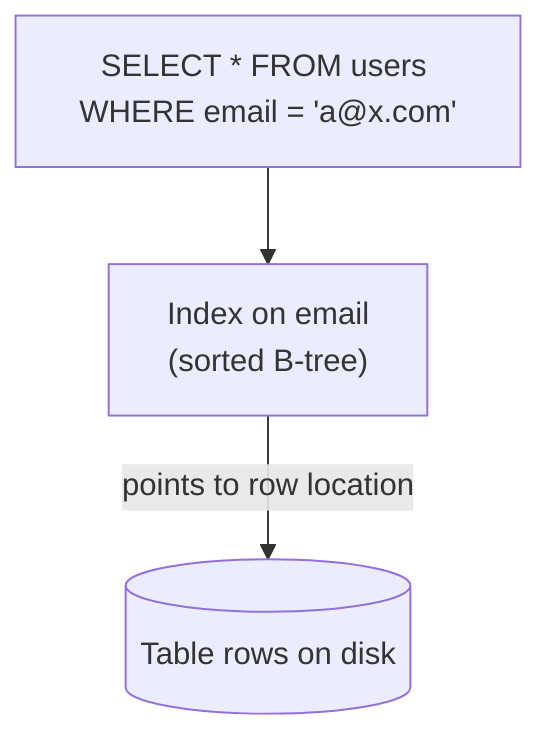
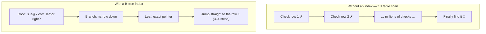

Without an index, finding one row in a table means checking every row — a **full table scan**. An index is an extra data structure the database maintains so it can jump almost directly to the rows you want.

## Analogy

Finding "Idempotency" in a textbook without an index means flipping through every page. With the index at the back — sorted alphabetically, each entry pointing to a page number — you find it in seconds. The index doesn't contain the content; it tells you exactly where the content lives.

## How It Works

Most databases use a **B-tree**: a balanced, sorted tree structure. Because it's sorted, the database can binary-search it in a handful of steps even with billions of entries — turning a scan of millions of rows into ~3–4 disk reads.

Compare the two paths for the same query:

## Deep Dive

### What indexes are good at

- **Exact lookups** — `WHERE email = …`
- **Ranges** — `WHERE created_at > …` (sorted structure ⇒ ranges are contiguous)
- **Sorting** — `ORDER BY` on an indexed column is free; the index is already sorted.

### What they cost

Every index must be updated on every `INSERT`, `UPDATE`, and `DELETE` of the indexed column. Indexes trade **write speed and storage for read speed**. A table with ten indexes writes ten extra structures per insert.

<Callout type="warning">
"Just add an index" is not free. In write-heavy systems, over-indexing is a real performance bug — mention this trade-off in interviews.
</Callout>

### Composite indexes and the leftmost rule

An index on `(country, city)` helps queries filtering by `country`, or by `country AND city` — but *not* by `city` alone. Think of a phone book sorted by last name then first name: useless for finding everyone named "Priya."

### Covering indexes

If the index itself contains every column the query needs, the database never touches the table at all — the fastest possible read.

## Real-World Examples

- Primary keys are automatically indexed in virtually every database.
- Postgres `EXPLAIN` / MySQL `EXPLAIN` show whether a query uses an index or scans.
- Search engines take the idea further with **inverted indexes**: word → list of documents containing it.

## Interview Follow-Ups

- Why not index every column? (Write amplification and storage.)
- Why is the query slow even though the column is indexed? (Functions on the column, leading wildcards `LIKE '%x'`, low-selectivity columns, or the optimizer choosing a scan.)
- What's an inverted index and where would you use one? (Full-text search — the heart of Elasticsearch.)
