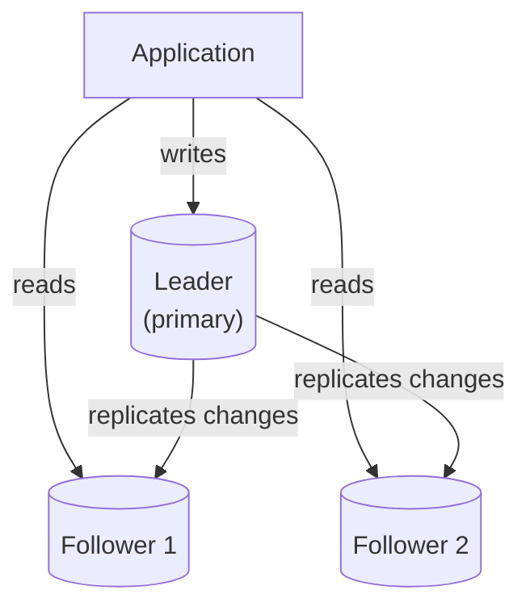
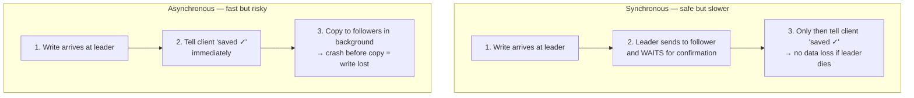
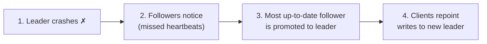

Replication means keeping the **same data on multiple database servers**. Where [sharding](/concepts/database-sharding) splits data into different pieces, replication copies *all* of it — for safety and read speed.

## Analogy

A busy office keeps the master copy of an important binder at the front desk, and photocopies at every department. Anyone can *read* their local photocopy instantly. But all *edits* must go through the front desk, which then sends updated pages around. For a moment, some photocopies are slightly out of date.

## How It Works

The most common setup is **leader–follower** (also called primary–replica):

- All **writes** go to the leader.
- The leader streams every change to its followers.
- **Reads** can be served by any follower, spreading the read load.

## Deep Dive

### Synchronous vs asynchronous replication

- **Synchronous:** the leader waits until a follower confirms it has the change before telling the client "saved." No data loss if the leader dies — but every write is as slow as the follower's confirmation.
- **Asynchronous:** the leader confirms immediately and copies changes in the background. Fast writes — but if the leader dies before copying, the latest writes are lost.

Many systems compromise: one synchronous follower (guaranteed copy) plus several asynchronous ones.

### Replication lag

Asynchronous followers are always slightly behind. This causes classic weirdness: a user updates their profile (write hits the leader), refreshes the page (read hits a lagging follower), and sees their *old* profile.

Fixes include **read-your-own-writes** routing (send a user's reads to the leader right after they write) — this is the practical face of [eventual consistency](/questions/eventual-consistency-explained).

### Failover

When the leader dies, a follower is promoted to leader:

This is how databases achieve high availability — but failover is delicate: pick the most up-to-date follower, make sure the old leader doesn't come back believing it's still in charge (**split brain**), and repoint clients.

### Other topologies

- **Multi-leader:** several leaders accept writes (e.g. one per data center). Great for geo-distribution, but concurrent writes to the same data now conflict and must be resolved.
- **Leaderless (Dynamo-style):** any replica accepts writes; reads and writes use quorums. Covered in [Design a Key-Value Store](/questions/design-key-value-store).

## Real-World Examples

- PostgreSQL and MySQL support leader–follower replication natively.
- Amazon RDS "read replicas" are asynchronous followers you can spin up per region.
- Cassandra and DynamoDB use leaderless replication with tunable quorums.

## Interview Follow-Ups

- Replication vs sharding — when do you need each? (Replication = availability + read scale; sharding = data volume + write scale. Big systems use both.)
- How do you handle replication lag for a user who just posted? (Read-your-own-writes; sticky reads to the leader.)
- What is split brain and how do you prevent it? (Two nodes both acting as leader; prevent with quorum-based leader election / fencing.)
