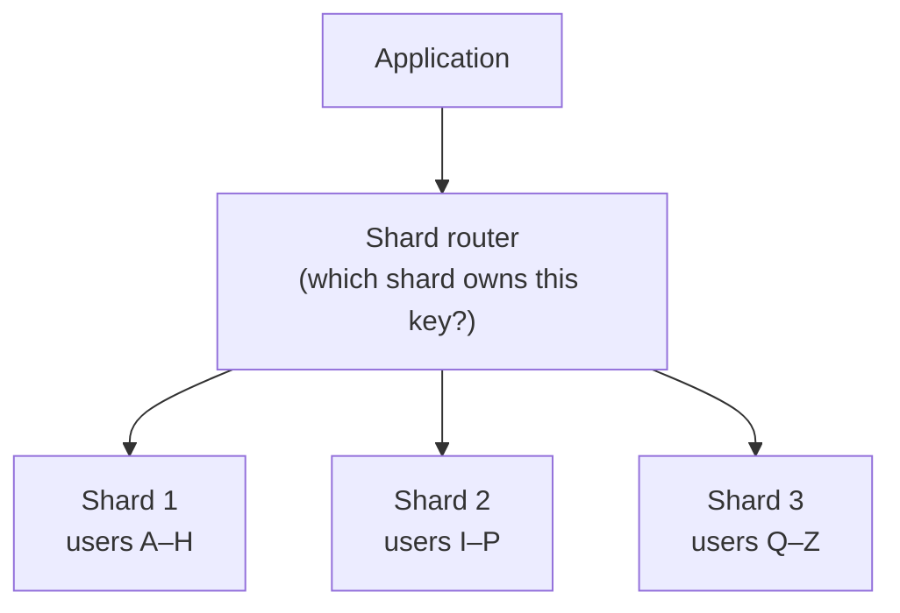
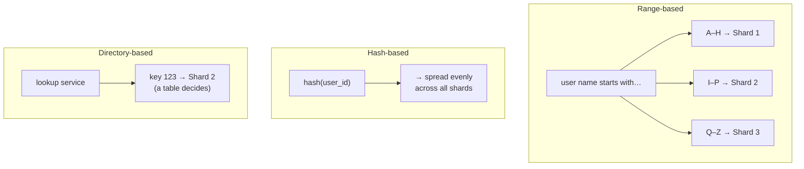

Sharding is horizontal scaling applied to a database: when one machine can't store or serve all your data, you split the data into **shards** and put each shard on its own server.

## Analogy

A library outgrows its building. Instead of building an impossibly large single library, the city opens branches: A–H books go to the north branch, I–P to the central branch, Q–Z to the south branch. To find a book you first check which branch owns its letter — then go straight there.

## How It Works

Every row is assigned to a shard based on a **shard key** (e.g. user ID). The application (or a routing layer) uses the key to find the right shard for every read and write.

## Deep Dive

### Choosing a sharding strategy

- **Range-based** — shard by value ranges (A–H, I–P…). Simple, and range queries stay on one shard, but popular ranges create **hot spots** (imagine one branch library getting all the bestsellers).
- **Hash-based** — `hash(key) % number_of_shards`. Spreads data evenly, but simple modulo breaks badly when you add servers — which is why real systems use [consistent hashing](/concepts/consistent-hashing).
- **Directory-based** — a lookup service maps each key to its shard. Flexible but adds a component that must itself be fast and highly available.

### The shard key decision

The shard key is the most important choice. A good shard key:

- Spreads data **evenly** (user ID is usually good; country is usually bad — one country can dwarf the rest).
- Matches your **query pattern** — queries that include the shard key hit one shard; queries that don't must ask *every* shard ("scatter-gather"), which is slow.

### What sharding costs you

<Callout type="warning">
Sharding is powerful but should be a late resort — it permanently complicates your system. Interviewers like hearing that you'd first try read replicas, caching, and indexing.
</Callout>

- **Cross-shard joins** are painful — the data you want to join lives on different machines.
- **Cross-shard transactions** need distributed coordination (slow and complex).
- **Resharding** (changing the number of shards) can mean massive data movement.

## Real-World Examples

- MongoDB and Cassandra shard automatically using hash-based partitioning.
- YouTube and Instagram famously sharded MySQL by user ID as they grew.
- Vitess (from YouTube) is a whole system built to make MySQL sharding manageable.

## Interview Follow-Ups

- How would you reshard with zero downtime? (Consistent hashing + moving one hash range at a time, dual-writing during migration.)
- What happens to a query that doesn't include the shard key? (Scatter-gather across all shards — avoid by design.)
- How do you handle a celebrity user who overloads one shard? (Hot-spot handling: split them further or cache aggressively.)
