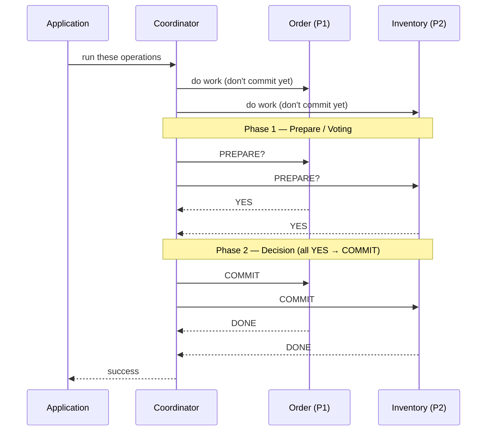
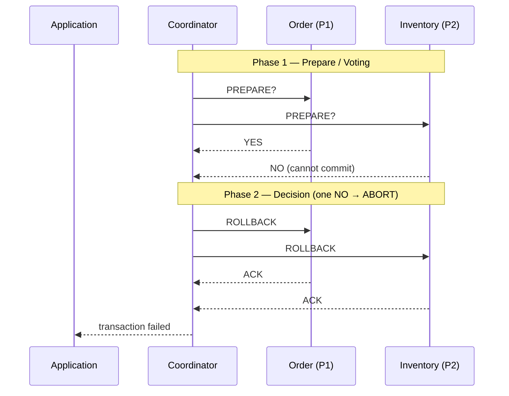
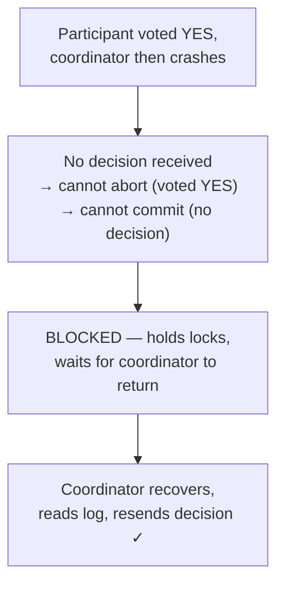
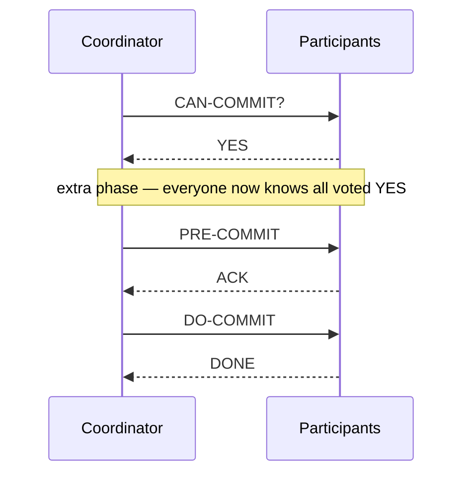
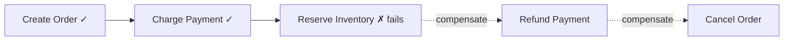
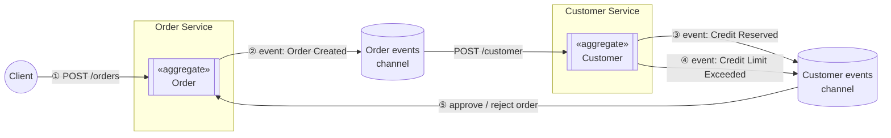
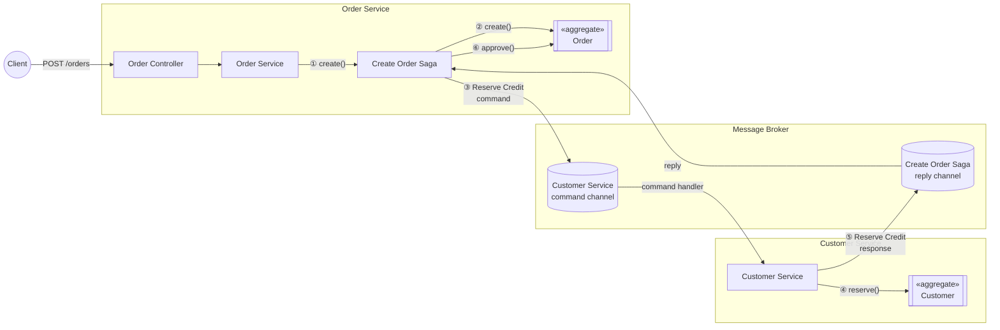

A **transaction** is a set of database operations that must happen together as a single unit of work: either all of them succeed, or none of them do. Inside a single database, the engine guarantees this for you. The hard problem starts when one business action — placing an order — has to update the Order service's database *and* the Inventory service's database, each owned by a different microservice. Now who guarantees they commit together or roll back together?

## Analogy

Two friends agree to buy concert tickets only if they can *both* go. Neither wants to pay unless the other does. So they appoint a third friend as the referee: "I'll ask each of you if you're ready. Only if you *both* say yes do I tell you both to pay. If even one of you backs out, nobody pays." That referee is a **transaction coordinator**, and the "ask first, decide after" dance is **Two-Phase Commit**.

## The ACID Properties

Every transaction should follow four properties, known together as **ACID**:

| Property | Meaning |
| --- | --- |
| **Atomicity** | All operations succeed together or fail together. There is no "half-done" state. |
| **Consistency** | The database is in a valid state before the transaction and after it. It never leaves data broken. |
| **Isolation** | When many transactions run at once, the result looks as if they ran one after another (serially). |
| **Durability** | Once committed, data is permanently saved — even if the database crashes right after. |

<Callout type="info">
Transactions do **not** actually run one after another — they run concurrently for performance. Isolation only guarantees the final result is the *same as if* they had run sequentially. This is called **serializability**.
</Callout>

Across a distributed system, no single engine owns all the data, so we need an explicit protocol. There are three common ones: **Two-Phase Commit (2PC)**, **Three-Phase Commit (3PC)**, and the **Saga pattern**.

## Two-Phase Commit (2PC)

As the name says, the protocol runs in two phases:

- **Phase 1 — Voting / Prepare:** everyone is asked if they are ready to commit.
- **Phase 2 — Decision / Commit:** based on the votes, a final decision (commit or rollback) is sent to everyone.

### Who is involved

- **Application** — initiates the transaction ("here is my set of operations, please do them").
- **Transaction Coordinator** — the central component that manages the transaction and makes the final decision.
- **Participant 1 (Order service)** — owns the order database.
- **Participant 2 (Inventory service)** — owns the inventory database.

### Happy path

If **every** participant votes YES, the coordinator sends **COMMIT** to all. If **even one** votes NO, it sends **ROLLBACK** to all. Participants apply the decision, reply DONE, and the coordinator returns the result.

### Failure path — one participant votes NO

### The secret behind recovery: Write-Ahead Logs

Before any failure scenario makes sense, one key idea: both the coordinator and the participants keep a **log file** (a *write-ahead log*, or WAL) on durable storage like disk, so it survives a crash.

- The coordinator **writes every message to its log before sending it** — it logs "commit" *first*, then sends the COMMIT.
- Each participant logs what it received and how it voted ("received prepare, voted YES") *before* replying.

This rule — **write to the log first, send the message after** — is what lets both sides recover. After restarting, a node reads its log to learn exactly where the transaction was left.

### Failure scenarios (classic interview questions)

**Q1 — The PREPARE message is lost (or the coordinator dies before sending it).**
Participants have executed and logged their work and are waiting for PREPARE. Since it never arrives, each participant hits a **timeout and aborts on its own**. Safe, because nothing was committed. If a late PREPARE arrives after the abort, the participant just replies NO and the whole transaction rolls back.

**Q2 — A participant's YES vote is lost.**
Say P1's YES arrives but P2's is lost (or P2 crashed before sending). The coordinator times out, sees it didn't get all votes, and sends **ROLLBACK** to everyone. When P2 recovers, its log shows an unfinished transaction; it asks the coordinator "what happened?", the coordinator replies "Aborted", and P2 rolls back too.

**Q3 — The COMMIT message is lost.**
Suppose the coordinator logs COMMIT, sends it to P1 and P2, but P3 is down. P1 and P2 commit. P3 is now **blocked** — it voted YES so it may not abort on its own, and it never got the decision so it can't commit either. It must wait. When P3 recovers, it asks the coordinator, which reads COMMIT from its log and tells P3 to commit. Everyone is consistent again.

### The main problem with 2PC

A participant that has voted YES **cannot decide on its own** — it fully depends on the coordinator. If the coordinator dies *after* the YES votes but *before* the decision, all participants are **blocked**, holding their locks, until it returns. This is why 2PC is a **blocking protocol**.

<Callout type="warning">
**Why isn't 2PC used much in microservices?** It is blocking; the coordinator is a **single point of failure**; it holds locks for a long time (bad for performance); and it does not scale well over unreliable networks.
</Callout>

## Three-Phase Commit (3PC)

3PC attacks the blocking problem by inserting **one extra phase** in the middle:

1. **Phase 1 — CanCommit (Voting):** same as 2PC. The coordinator asks "can you commit?" and each participant votes YES or NO.
2. **Phase 2 — PreCommit:** if all votes are YES, the coordinator sends **PRE-COMMIT** — "everyone voted yes; get ready, the commit is coming." Each participant ACKs.
3. **Phase 3 — DoCommit:** the coordinator sends the final **COMMIT**; participants commit and reply DONE.

If any participant votes NO in Phase 1, or fails to ACK in Phase 2, the coordinator sends **ABORT** to everyone — just like the rollback path in 2PC.

### Why the extra phase helps

The PRE-COMMIT message carries one crucial fact: any participant that receives it now **knows every other participant voted YES**. That changes what a participant may do if the coordinator crashes:

- In **2PC**, a YES-voter knows nothing about the other votes, so it must block.
- In **3PC**, a participant that *received* PRE-COMMIT can, after a timeout, talk to the others and **safely commit on its own**. A participant that *didn't* receive it can **safely abort**, knowing the commit decision was never made.

So 3PC is **non-blocking** in the absence of network partitions — participants are no longer completely stuck when the coordinator dies.

### The trade-offs of 3PC

- One **extra round of messages** per transaction, so it is slower than 2PC.
- It can still behave **incorrectly during a network partition** — when the network splits into groups that can't talk, each group may reach a different decision.
- Because of this cost and complexity, 3PC is **rarely used in production** — but it is a very common interview topic.

## Saga Pattern

Both 2PC and 3PC try to make a distributed transaction behave like one big atomic transaction, using locks and a coordinator. The **Saga pattern** takes a completely different approach — and it is the one most modern microservice systems actually use.

### The core idea

Think of a saga as a **relay race**, not a single sprint. A Saga breaks one big distributed transaction into a **sequence of small local transactions**, one per service. Each service:

1. Updates its own database with a normal local ACID transaction, and
2. Publishes an event (or sends a message) that tells the next step to run.

There is no global lock and no waiting on everyone else — each local transaction commits **immediately**, for real, on its own. Nothing is "provisionally" held the way 2PC holds locks.

If every step succeeds, the business operation is done. If one step fails (say, because a business rule is violated — the customer's credit limit is too low), the saga cannot just "roll back" like a normal database transaction, because the earlier steps have *already committed and are visible to other users*. Instead it runs **compensating transactions** — explicit undo actions for every step that already completed, executed **in reverse order**. If the order was created and payment charged, but reserving inventory fails, the saga refunds the payment and cancels the order.

### Two ways to implement a Saga

There are two ways to coordinate the steps, both described on [microservices.io's Saga pattern page](https://microservices.io/patterns/data/saga.html). Take a "Create Order" saga that must check the customer's credit before approving the order.

**1. Choreography — no central coordinator.** Each service listens for events published by others and decides for itself what to do next.

The Order Service creates the order and publishes `OrderCreated` onto its **events channel**. The Customer Service subscribes to that channel, tries to reserve credit against its own `Customer` aggregate, then publishes back either `CreditReserved` or `CreditLimitExceeded` onto *its* events channel. The Order Service subscribes to that and approves or rejects the order accordingly. Nobody is "in charge" — every service just reacts to events flowing through the channels. Simple for a short flow, but with many services it gets hard to see the overall flow just by reading the code, since it's scattered across every participant.

**2. Orchestration — a central saga orchestrator.** One object owns the whole flow, sends explicit commands to each service through a message broker, and interprets the replies.

The Order Controller creates an orchestrator (`CreateOrderSaga`) for this specific order. The orchestrator creates the `Order` aggregate in PENDING state, then sends a `Reserve Credit` command through the message broker's command channel. The Customer Service's command handler picks it up, calls `reserve()` on the `Customer` aggregate, and sends the response back through a reply channel. The orchestrator reads the reply and calls `approve()` (or a compensating "reject") on the `Order` aggregate. This is easier to understand and debug — the whole saga logic lives in one place — but the orchestrator and its message channels are more components to design and run.

<Callout type="info">
**Choreography vs. orchestration, in one line:** choreography is "everyone reacts to events they hear"; orchestration is "one conductor tells everyone what to do." Small sagas (2-3 steps) often use choreography; longer or business-critical sagas usually move to orchestration so the flow stays visible and easy to change.
</Callout>

<Callout type="warning">
**The price: eventual consistency.** Because each service commits immediately, there are moments when the system is temporarily inconsistent — payment charged, stock not yet reserved. It becomes consistent *eventually*, once the whole saga finishes (or all compensations run). See [eventual consistency](/questions/eventual-consistency-explained).
</Callout>

Three extra things worth knowing (also called out on the microservices.io page):

- **Update the database and publish the event as one atomic step.** A service must not commit its local transaction and then separately publish the event — if it crashes in between, the event is lost forever and the saga stalls. This is usually solved with the [Transactional Outbox pattern](/concepts/idempotency) or event sourcing.
- **Sagas lack isolation.** Because every local transaction commits right away, other requests can read "dirty" intermediate state before the saga finishes (e.g., see the order as PENDING). This is different from ACID's Isolation guarantee and is one of the trade-offs teams accept for scalability.
- **There's no automatic rollback.** A normal ACID transaction rolls itself back for free. In a saga, *you* write the undo logic — every step that can fail needs an explicit compensating transaction designed for it up front.

**How does the client find out the result?** The client calls a normal synchronous endpoint (`POST /orders`), but the saga behind it runs asynchronously over several services — so what does that endpoint return? Three common options: (a) hold the response open and reply only once the whole saga finishes; (b) reply immediately with an ID (`orderId`) and let the client poll `GET /orders/{orderId}` for status; or (c) reply immediately and push the final result later over a websocket or webhook. Most systems pick (b) — it's simple and fits a stateless HTTP request/response cycle.

Compensations must also be **idempotent** — a retried refund must not refund twice. See [idempotency](/concepts/idempotency).

## Comparison

| | 2PC | 3PC | Saga |
| --- | --- | --- | --- |
| Consistency | Strong | Strong | **Eventual** |
| Blocking? | Yes (blocks on coordinator failure) | Non-blocking (no partition) | Never blocks |
| Locks held | Long (until commit) | Long | Only per local step |
| Coordinator SPOF | Yes | Reduced | Optional (orchestration) |
| Scales over unreliable network | Poorly | Poorly | **Well** |
| Used in modern microservices | Rarely | Almost never | **Commonly** |

## Interview Follow-Ups

- **Why is 2PC not used much in microservices?** Blocking, coordinator is a single point of failure, holds locks too long, scales poorly over unreliable networks.
- **How does 3PC reduce blocking?** The PreCommit phase tells every participant that everyone voted YES, so survivors can decide among themselves if the coordinator crashes.
- **Why is 3PC still rarely used?** An extra message round makes it slower, and it can still make inconsistent decisions under a network partition.
- **2PC vs Saga in one line?** 2PC gives strong consistency but blocks and doesn't scale; Saga scales and never blocks, but only guarantees eventual consistency and requires a compensating action for every step.
- **What makes recovery possible in 2PC/3PC?** The write-ahead log — write to the durable log *before* sending any message, so a crashed node can read its log and resume.
