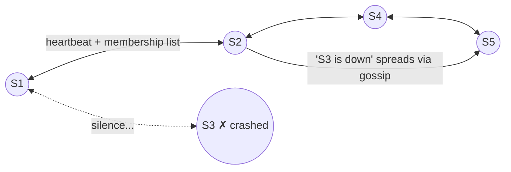

With many servers in a cluster, how does each one know if another has crashed? Everyone pinging everyone doesn't scale — with 100 servers that's 10,000 health checks per second. And a central monitor would itself be a single point of failure: if the monitor crashes, nobody knows anything.

The answer is the **gossip protocol** — named after how gossip spreads in real life: one person tells a few people, they tell a few more, and soon the whole room knows.

## Analogy

Nobody announces office news over a loudspeaker. One colleague mentions it to two others at the coffee machine, each of them mentions it to a couple more — within the hour, everyone knows. No announcer to fail, no single person doing 100 phone calls, and the news survives even if several people go home early.

## How It Works

Every server maintains a **membership list** tracking every other server it knows about:

| Field | Purpose |
| --- | --- |
| Server ID | Unique identifier in the cluster |
| Hash range | Which part of the [hash ring](/concepts/consistent-hashing) it owns |
| Status | Alive ✅ or Down ❌ |
| Last heartbeat | Timestamp of the last heartbeat received |

Then, **every second**, each server:

1. Picks a few **random** peers.
2. Sends them a **heartbeat**: its own status, its hash-range assignment, and its current membership list.
3. Receivers **merge** the incoming list with their own, adopting anything newer.

Updated information spreads across the entire cluster within seconds — epidemically, like gossip.

## Detecting a Failed Server

1. A crashed server **stops sending heartbeats**.
2. Its neighbors notice the silence and mark it **suspicious**.
3. After a configurable timeout (a few seconds), it's marked **DOWN**.
4. The news gossips through the whole cluster.
5. Requests reroute to the dead server's replicas, and its [hash-ring range](/concepts/consistent-hashing) is served by the next server clockwise.

## Deep Dive

### Why random peers?

Randomness is the magic. Information spreads in **O(log N)** rounds (each round roughly doubles who knows), no server ever does more than a constant amount of gossip work, and there's no structure to break — any subset of working servers keeps the protocol alive. Fully decentralized: **every server equally participates in health monitoring.**

### Suspicion before execution

<Callout type="warning">
One missed heartbeat ≠ dead — maybe the network hiccuped or the server paused for garbage collection. Declaring servers dead too eagerly causes *false failovers* (worse than the disease). Hence the two-step: suspicious → timeout → down. Some systems (Cassandra's phi-accrual detector) even compute a *probability* of death from heartbeat history instead of a fixed timeout.
</Callout>

### What else gossip carries

Failure detection is the headline use, but the same channel spreads any cluster metadata: ring ownership changes, schema versions, node joins. Anything that must *eventually* reach everyone without a coordinator is a gossip candidate.

## Real-World Examples

- **Cassandra** and **DynamoDB-style stores** gossip membership and ring state — see [Design a Key-Value Store](/questions/design-key-value-store).
- **Consul (Serf)** uses gossip (the SWIM protocol) for cluster membership.
- **Bitcoin/blockchain networks** propagate transactions by gossip across thousands of nodes.

## Interview Follow-Ups

- Why not a central health monitor? (Single point of failure — the monitor's death blinds the cluster.)
- What does gossip trade away? (Speed and certainty — news takes seconds and members may briefly disagree; it's [eventually consistent](/questions/eventual-consistency-explained) metadata.)
- What is split brain here? (A network partition makes each side gossip "the other side is down" — resolving *that* needs quorum rules, not gossip alone; see [CAP theorem](/concepts/cap-theorem).)
