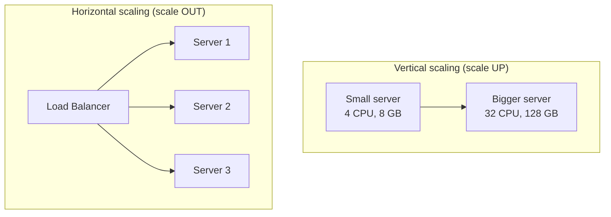
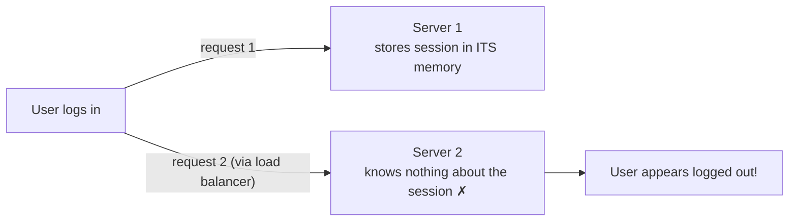
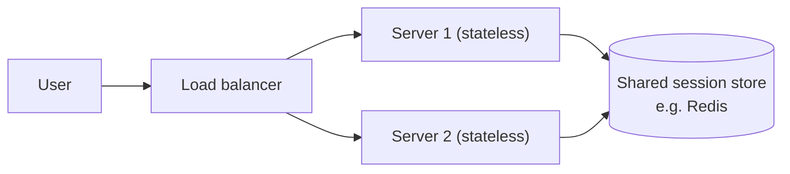

When your system gets more traffic than it can handle, you have exactly two options: make your machine stronger, or add more machines.

## Analogy

Your pizza shop is getting too many orders. You can either hire one superhuman chef who works ten times faster (**vertical scaling**) or hire ten normal chefs and split the orders between them (**horizontal scaling**). The superhuman chef is simpler to manage — but there's a limit to how fast one person can ever be, and if they call in sick, the shop closes.

## How It Works

**Vertical scaling (scale up)** — replace your server with a more powerful one: more CPU, more RAM, faster disks. Nothing about your application has to change.

**Horizontal scaling (scale out)** — add more servers and spread the traffic across them, usually with a [load balancer](/concepts/load-balancing) in front.

## Deep Dive

| | Vertical (up) | Horizontal (out) |
| --- | --- | --- |
| How | Bigger machine | More machines |
| Code changes | Usually none | App must be stateless / distributed |
| Limit | Hard ceiling — the biggest machine money can buy | Practically unlimited |
| Single point of failure | Yes — still one machine | No — one server dying is fine |
| Downtime to scale | Often yes (reboot into bigger hardware) | No — just add servers |
| Cost curve | Gets very expensive at the top end | Linear — commodity hardware |

### The catch: your app must be stateless

Horizontal scaling only works if your application is designed for it. Here is the classic failure:

If a server stores user sessions in its own memory, requests bouncing between servers break. The fix — keep the state in a **shared store** all servers can reach:

Now any server can handle any request — servers become interchangeable, which is exactly what lets you add and remove them freely.

<Callout type="tip">
A common interview trap: "Why not just scale vertically?" The expected answer covers the ceiling (hardware limits), the single point of failure, and cost — then pivots to what horizontal scaling requires (statelessness, load balancing, shared state).
</Callout>

## Real-World Examples

- Startups often begin vertically (one beefy database server) because it's simple.
- Google, Amazon, and Netflix run on huge fleets of commodity servers — pure horizontal scaling.
- Databases frequently scale up first, then shard ([database sharding](/concepts/database-sharding)) when one machine is no longer enough.

## Interview Follow-Ups

- What has to change in an app before it can scale horizontally? (Stateless servers, externalized sessions, shared storage.)
- Can you scale a database horizontally? (Yes — read replicas and sharding, each with trade-offs.)
- When is vertical scaling the right answer? (Small scale, quick wins, stateful legacy systems.)
