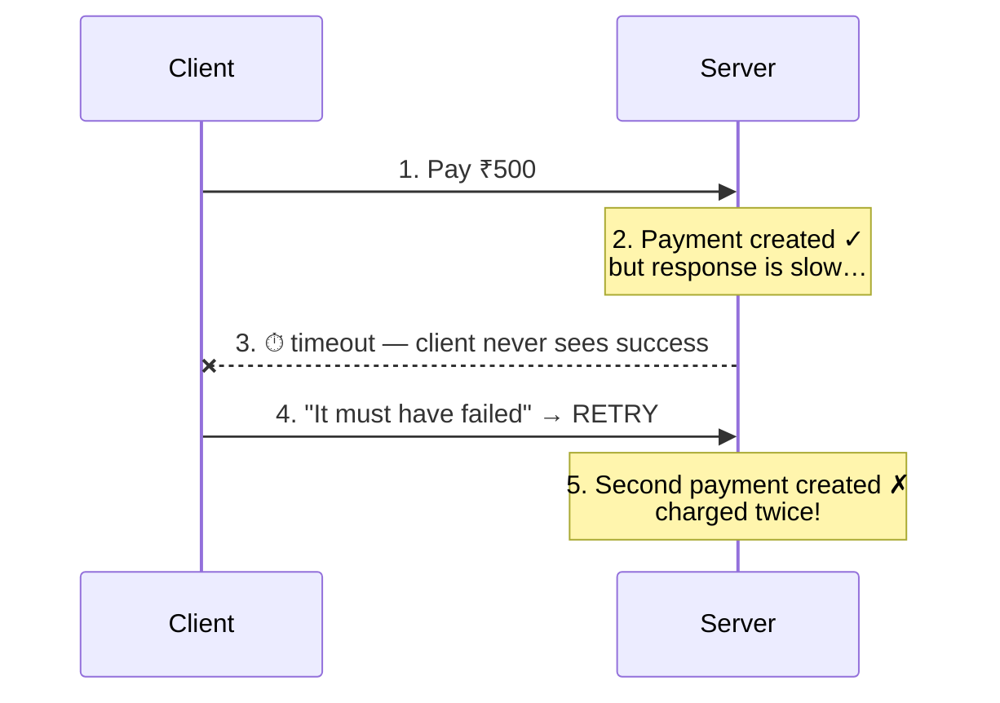
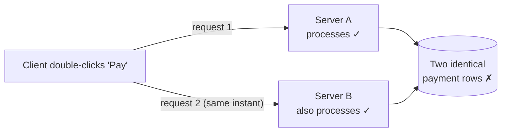
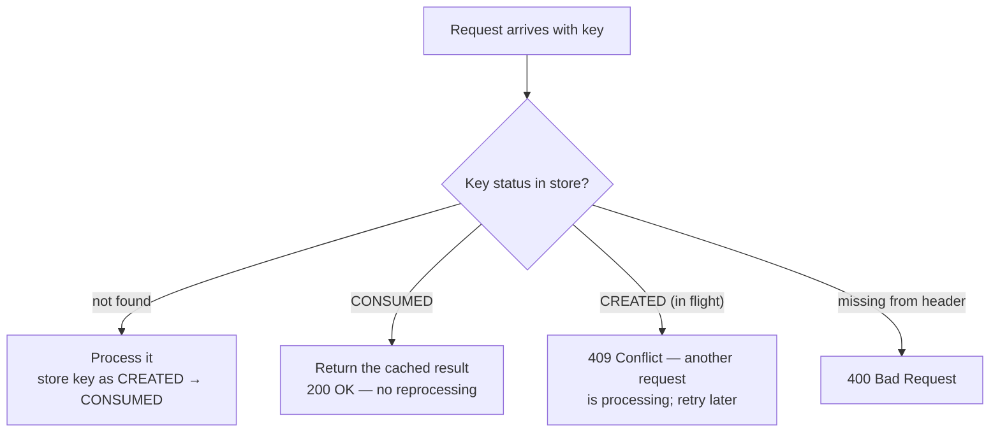
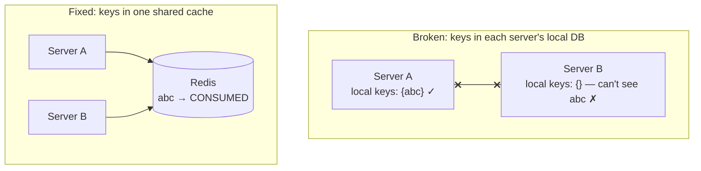

Idempotency means that no matter how many times you send the **same request**, the result is always the same — and no unintended side effects happen (like creating duplicate records or charging a card twice).

It's related to, but different from, [concurrency control](/concepts/concurrency-control):

| Concept | Deals with |
| --- | --- |
| Concurrency | *Multiple users* accessing a resource at the same time |
| Idempotency | *Duplicate requests* (intentional or accidental) from the same user or system |

## Analogy

A hotel guest asks reception to book a taxi, hears no reply over a bad phone line, and calls again. A good receptionist checks the booking list — "already ordered, you're all set" — instead of ordering a second taxi. The guest can safely repeat the request precisely because the receptionist recognizes it.

## Why Duplicate Requests Happen

**Sequential duplicates** (the most common case):



1. Client sends a request; the server processes it successfully (e.g. creates a payment).
2. The response is slow — the connection times out.
3. The client never saw success, assumes failure, and **retries**.
4. Without protection: two identical records.

**Parallel duplicates** (distributed systems):



1. A double-click or automatic retry sends two requests at nearly the same instant.
2. Request 1 lands on Server A, request 2 on Server B.
3. Both process independently — two identical rows.

## The Solution: Idempotency Keys

The client attaches a unique ID — typically a **UUID** like `f47ac10b-58cc-...` — to every operation, sent in a header:

```
POST /payments
Idempotency-Key: f47ac10b-58cc-4372-a567-0e02b2c3d479
```

**Client rules:** generate a *new* UUID for every new operation; reuse the *same* UUID when retrying a failed one.



| Key status | Meaning | Response |
| --- | --- | --- |
| Not in header | Client forgot the key | 400 Bad Request |
| Not found in store | First time seeing this request | Process → store as CREATED |
| CONSUMED | Already completed | 200 OK with the cached result |
| CREATED | Another request is mid-flight | 409 Conflict (retry later) |

## Deep Dive

### Parallel requests still race — add locking

Two requests with the same key can arrive in the same millisecond, both check the store, both see "absent," and both start processing. The fix is a **lock per key** — only one request may hold it:

- **Mutex** — one thread at a time in the critical section.
- **Database row locking** — `SELECT ... FOR UPDATE` while processing.
- **Distributed lock** — needed once multiple servers are involved.

### Multiple servers: share the store

<Callout type="warning">
If each server keeps idempotency keys in its own local database, Server B can't see Server A's keys — the guarantee silently breaks. Store keys in a **shared cache such as Redis**: visible to all servers, very fast, and with distributed locking (e.g. RedLock) built in.
</Callout>



| Feature | Local DB per server | Shared cache (Redis) |
| --- | --- | --- |
| Shared across all servers | ❌ No | ✅ Yes |
| Speed | Moderate | Very fast |
| Distributed locking | Complex | Built-in (RedLock) |
| Data sync between nodes | Manual / slow | Automatic |

### The golden rule

The **client** is responsible for generating and reusing idempotency keys. The **server** is responsible for enforcing them. Together they guarantee no operation executes more than once.

## Real-World Examples

- **Stripe's API** requires an `Idempotency-Key` header on payment requests — exactly this pattern.
- [Message queue](/concepts/message-queues) consumers must be idempotent because at-least-once delivery means duplicates *will* arrive.
- Order checkouts dedupe on an idempotency key so "Place order" double-clicks create one order — see [Design an E-commerce Order System](/questions/design-ecommerce-order-system).

## Interview Follow-Ups

- How long do you keep idempotency keys? (TTL matching the retry window — e.g. 24 h; Stripe keeps them ~24 h.)
- What if Redis loses the keys? (A crash window can allow duplicates — back critical keys with a DB unique constraint as a final guard.)
- Which HTTP methods are naturally idempotent? (GET, PUT, DELETE by spec; POST is not — that's why it needs keys.)
