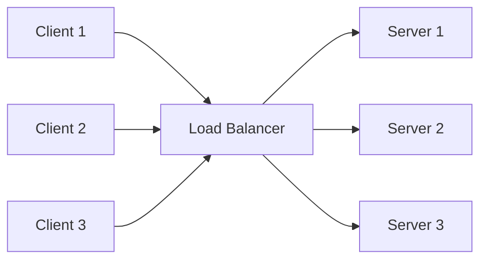
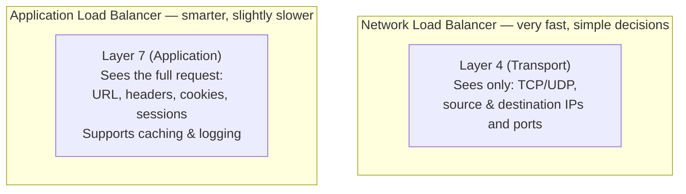
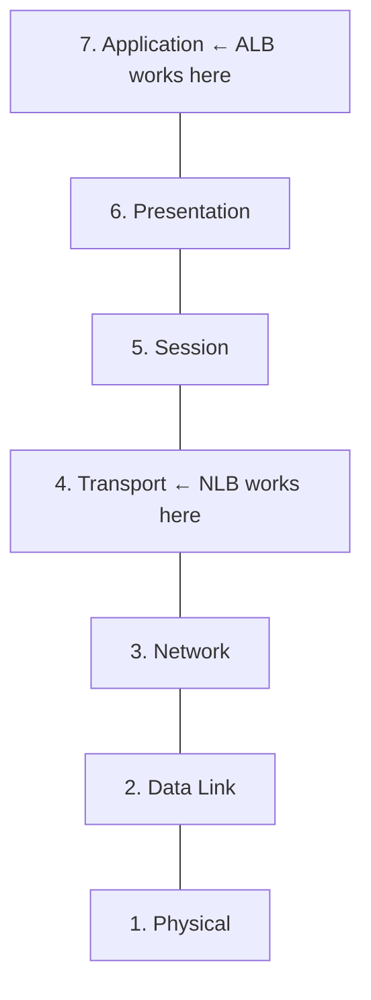
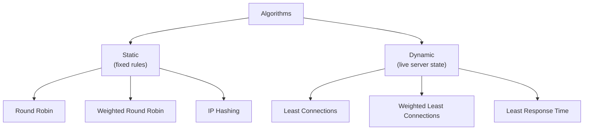
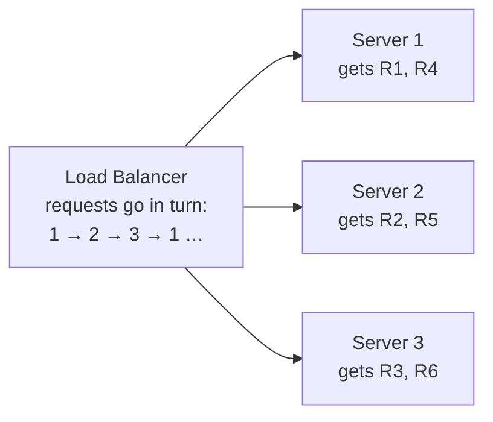
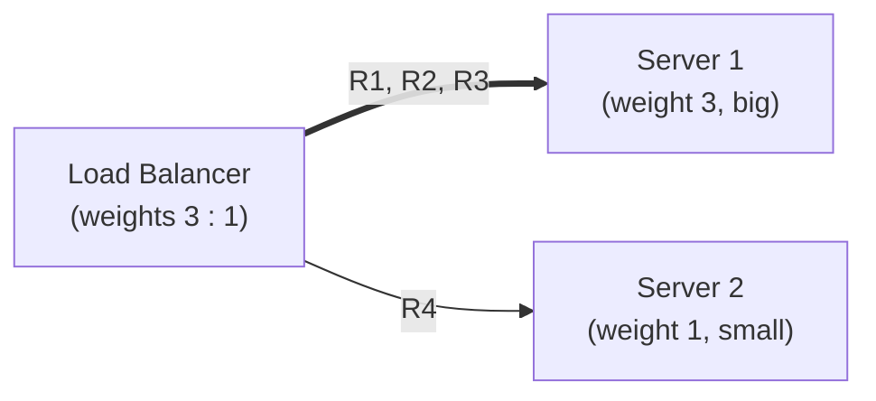
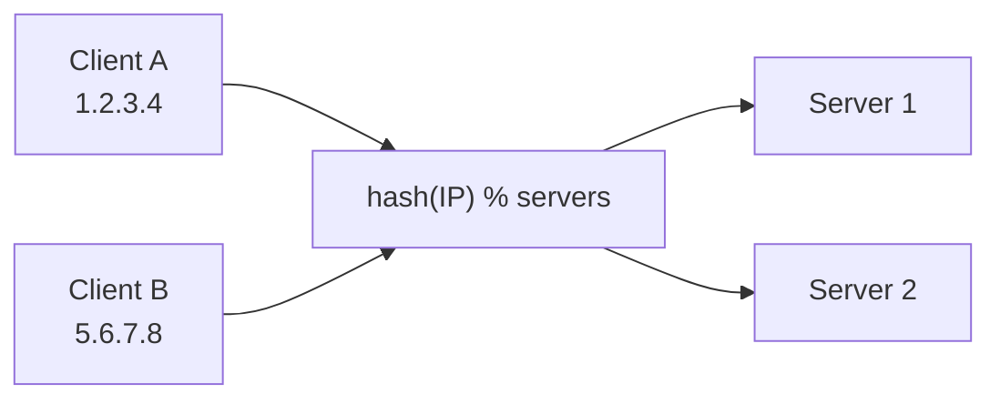
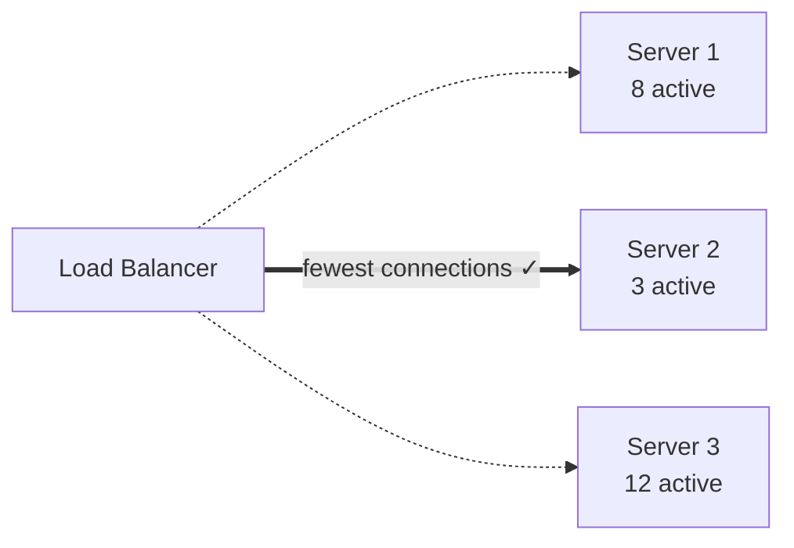

A load balancer sits between clients (users) and a group of servers. Its main job is to distribute incoming traffic across the servers so that no single server gets overloaded. If one server fails, the load balancer can also send traffic to the healthy servers, which improves reliability.

## Analogy

Think of a supermarket with several checkout counters and one member of staff directing customers. Instead of everyone piling into one queue, the staff member points each new customer to a free counter. If one counter closes (a server crashes), customers are simply directed to the others — the shop keeps running.

## How It Works

Every request goes to the load balancer first. The load balancer then picks one of the healthy servers using an algorithm (covered below) and forwards the request there.

## Types of Load Balancers

There are two main categories, named after the OSI layer they work at:

- **Network Load Balancer (NLB)** — works at **Layer 4** (Transport). It only sees TCP/UDP protocol details and the source/destination IP addresses and ports. It makes routing decisions using just this information, which makes it **very fast**.
- **Application Load Balancer (ALB)** — works at **Layer 7** (Application). It can read the actual request — the URL, headers, cookies, and session data — and can do things like logging and caching. This makes it **much smarter, but a little slower** than an NLB.

Where they sit in the OSI model:

<Callout type="tip">
In interviews, mention the L4 vs L7 distinction early — it shows you know load balancers are not all the same. Choose L7 when you need URL-based routing (e.g. `/api` vs `/images`), and L4 when raw speed matters.
</Callout>

## The Algorithms at a Glance

## Static Algorithms

Static algorithms follow fixed rules decided in advance. They do not look at the live condition of the servers.

### Round Robin

Requests are sent to the servers one by one, in a repeating order: Server 1, Server 2, Server 3, then back to Server 1 — traffic is spread evenly across all available servers.

- **Advantage:** very easy to implement; every server receives an equal number of requests.
- **Disadvantage:** it treats all servers the same. If one server is weak and another is powerful, both still get the same number of requests — so the weaker server can get overloaded and go down.

### Weighted Round Robin

Each server is given a fixed weight based on its capacity. Bigger servers get higher weights and therefore receive more requests. With weights 3 : 1, out of every 4 requests, 3 go to the big server and 1 to the small one.

- **Advantage:** low-capacity servers are protected; still easy to implement.
- **Disadvantage:** weights are static and requests are *counted, not measured*. If the 4th request happens to be very heavy, it still lands on the small server — so a weak server can still be overloaded by a few heavy requests.

### IP Hashing

The load balancer takes the client's IP address, runs it through a hash function, and uses the result to pick a server. Because the hash of the same IP is always the same, a given client is always served by the same server — useful when a client must stick to one particular server (for example, to keep session data). This is often called **"sticky sessions."**

- **Advantage:** the same client always reaches the same server — good for session persistence.
- **Disadvantage:** if many clients sit behind one proxy or NAT, they all share the same public IP, all hash to the same server, and that one server can get overloaded. Equal distribution is not guaranteed.

## Dynamic Algorithms

Dynamic algorithms look at the **live state** of the servers (current connections, response time) before choosing where to send a request.

### Least Connections

The load balancer checks how many active connections each server currently has and sends the new request to the server with the fewest.

- **Advantage:** it considers the current load, so overload is unlikely when servers have similar capacity.
- **Disadvantage:** a TCP connection can be active but idle (carrying no traffic) — such connections still count, so the "least busy" server may not actually be the least busy. It also ignores server capacity, so a weak server can still be overloaded.

### Weighted Least Connections

Fixes the capacity problem by also giving each server a weight. For each server the balancer computes:

> **ratio = active connections ÷ weight**

The request goes to the server with the lowest ratio. A powerful server (high weight) can hold many connections before its ratio grows, while a weak server (low weight) is protected.

### Least Response Time

Uses two pieces of live information: **TTFB** (Time To First Byte — how quickly a server starts responding) and **active connections**. The balancer picks the server with the best combination of fewest connections and lowest TTFB, falling back to round robin to break ties.

- **Advantage:** users are sent to the server that is both least busy and responding fastest.
- **Disadvantage:** needs continuous monitoring of response times, which adds overhead.

## Quick Summary

| Algorithm | Type | Best for | Watch out for |
| --- | --- | --- | --- |
| Round Robin | Static | Servers of equal capacity, simple setups | Treats weak and strong servers the same |
| Weighted Round Robin | Static | Servers of different capacities | Weights are fixed; ignores how heavy each request is |
| IP Hashing | Static | Keeping a client on the same server (sticky sessions) | Many clients behind one proxy IP can overload one server |
| Least Connections | Dynamic | Requests that stay connected for different lengths of time | Idle connections still count; ignores server capacity |
| Weighted Least Connections | Dynamic | Mixed-capacity servers with live load awareness | Slightly more complex to implement |
| Least Response Time | Dynamic | Sending users to the fastest, least busy server | Needs constant health/latency monitoring |

## Real-World Examples

- **NGINX** and **HAProxy** are widely used software load balancers supporting most algorithms above.
- **AWS** offers both an Application Load Balancer (L7) and a Network Load Balancer (L4) as managed services.
- Large systems often chain them: DNS → L4 balancer → L7 balancer → services.

## Interview Follow-Ups

- What happens when the load balancer itself fails? (Answer direction: run a standby pair with health checks and failover — the balancer must not become a single point of failure.)
- How does the balancer know a server is down? (Health checks: periodic pings/HTTP checks; unhealthy servers are removed from rotation.)
- When would you pick L4 over L7? (Raw throughput, non-HTTP traffic, lower latency.)
- How do sticky sessions interact with autoscaling? (Stickiness fights rebalancing; prefer external session stores.)
