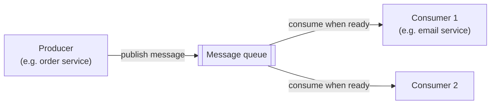
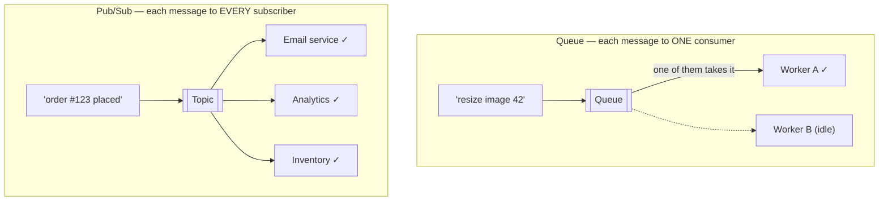
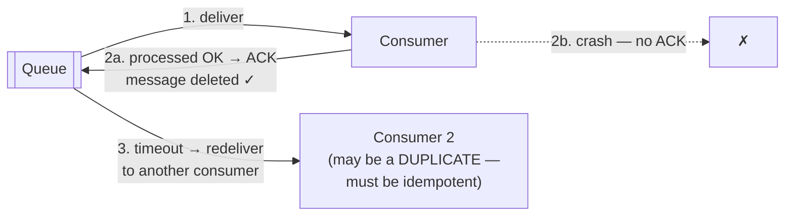

When service A calls service B directly, A must wait for B, and if B is down, A fails too. A message queue breaks that dependency: A drops a message in the queue and moves on; B picks it up whenever it's ready.

## Analogy

A restaurant's order rail. Waiters (producers) clip order tickets onto the rail and go back to their tables — they don't stand in the kitchen waiting. Cooks (consumers) take tickets off the rail at their own pace. A sudden rush doesn't break anything; tickets just accumulate on the rail. If a cook steps out, tickets wait instead of being lost.

## How It Works

- **Producers** publish messages and immediately continue.
- The **queue** stores messages durably until they're processed.
- **Consumers** pull messages at their own pace. Adding consumers scales processing horizontally.

## Deep Dive

### Two messaging patterns

- **Queue (point-to-point):** each message is processed by exactly **one** consumer — work distribution. E.g. "resize this image."
- **Pub/Sub (publish–subscribe):** each message is delivered to **every** subscriber — event broadcasting. E.g. "order #123 was placed" → email service, analytics, and inventory each get a copy.

### Why queues make systems better

- **Decoupling** — producer and consumer don't know each other; either can be redeployed, scaled, or replaced alone.
- **Load leveling** — traffic spikes fill the queue instead of crushing downstream services; consumers drain it steadily.
- **Resilience** — if a consumer dies, messages wait. Nothing is lost.

### Delivery guarantees

<Callout type="warning">
"Exactly-once delivery" is the siren song of messaging. In practice systems give **at-least-once** delivery, which means consumers may see duplicates — so consumers must be [idempotent](/concepts/idempotency). Interviewers often probe exactly this.
</Callout>

- **At-most-once** — fire and forget; messages can be lost. Rarely acceptable.
- **At-least-once** — the standard: redeliver until acknowledged; duplicates possible.
- **Exactly-once** — achievable only within narrow boundaries (e.g. Kafka transactions) — assume duplicates anyway.

How a message survives a consumer crash (this is what "at-least-once" means in practice):

Failed messages that keep failing go to a **dead-letter queue** for inspection instead of blocking everything.

### Kafka vs RabbitMQ (the short version)

- **RabbitMQ** — a classic message *broker*: smart routing, per-message acknowledgment, messages deleted once consumed. Great for task queues.
- **Kafka** — a distributed *log*: messages are kept (hours or days) and consumers track their own position, so events can be **replayed**. Great for event streaming, analytics pipelines, and feeding many independent consumers.

## Real-World Examples

- Uploading a video? The upload service queues "transcode job" and responds instantly — see [Design Video Streaming](/questions/design-video-streaming).
- Order placed → events fan out to email, invoice, and analytics via pub/sub — see [Design a Notification System](/questions/design-notification-system).

## Interview Follow-Ups

- What if the queue itself goes down? (Run it clustered/replicated — Kafka replicates partitions across brokers.)
- How do you preserve message order? (Kafka guarantees order per partition; put related messages on the same partition key.)
- How do consumers handle duplicates? (Idempotency keys / dedup tables — see [Idempotency](/concepts/idempotency).)
