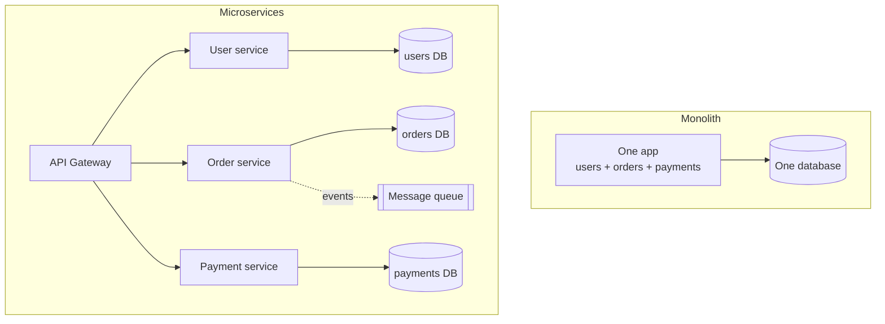
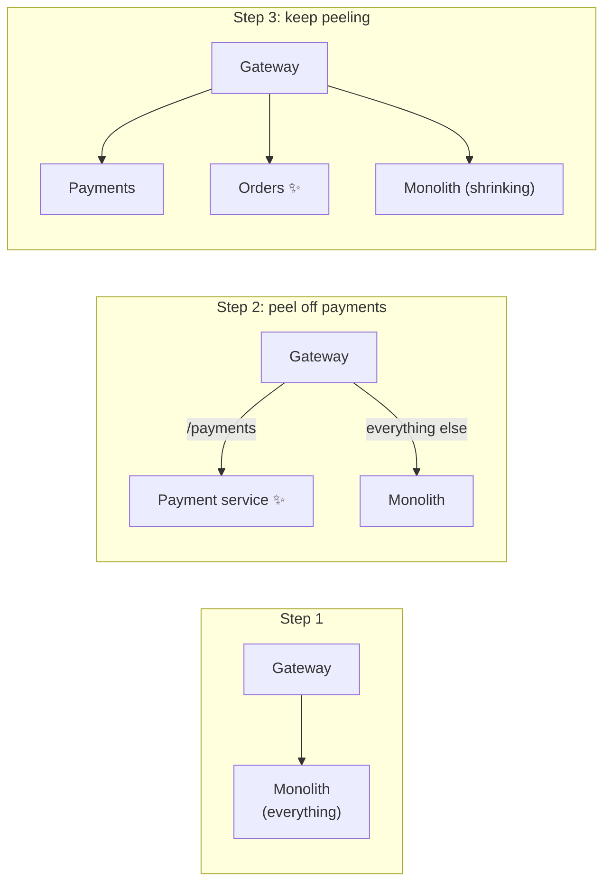

A **monolith** is one codebase, built and deployed as one unit. **Microservices** split the same functionality into independent services — each with its own code, database, and deployment — talking to each other over the network.

## Analogy

A monolith is a **house with every room under one roof** — easy to build, everything a short walk away, but renovating the kitchen means construction dust in the bedrooms, and you can't easily give the busy kitchen more space without extending the whole house. Microservices are a **street of small buildings** — each renovated, rebuilt, or expanded independently, but now you need roads, addresses, and deliveries between them.

## How It Works

## Deep Dive

| | Monolith | Microservices |
| --- | --- | --- |
| Deployment | One unit — simple | Many units — needs automation |
| Scaling | Whole app together | Each service independently |
| A crash | Can take everything down | Isolated (if designed well) |
| Data | One DB, easy joins & transactions | DB per service; cross-service data is hard |
| Team structure | Works for one team | Shines with many teams owning services |
| Debugging | One log, one stack trace | Distributed tracing across services |
| Latency | In-process calls (~ns) | Network calls (~ms), retries, timeouts |

### What microservices actually buy you

- **Independent deployment** — the payments team ships without waiting for the search team.
- **Independent scaling** — scale the hot service, not the whole app.
- **Fault isolation** — recommendations being down shouldn't stop checkout.
- **Tech freedom** — each service can pick its own stack/database.

### What they cost

<Callout type="warning">
Microservices trade code complexity for **operational** complexity. Every function call that becomes a network call gains latency, partial failure, retries, and the need for distributed tracing. Without strong DevOps automation, they make everything worse.
</Callout>

- Network failures between services must be handled everywhere (timeouts, retries, circuit breakers).
- No cross-service transactions — consistency needs patterns like sagas and [idempotent](/concepts/idempotency) handlers.
- You now operate dozens of deployables, plus an [API gateway](/concepts/api-gateway) and usually a [message queue](/concepts/message-queues).

### The pragmatic path

Start with a **modular monolith** (clean internal boundaries), extract services only when a real pressure appears — a component needing independent scale, a team blocked by deploy coupling. This is how Amazon and Netflix actually evolved; nobody starts with 500 services.

The migration itself uses the **strangler pattern** — peel off one capability at a time, never a big-bang rewrite:

## Real-World Examples

- **Netflix and Amazon** — canonical microservices stories, driven by team scale.
- **Shopify** — famously runs a huge, successful modular monolith.
- **Segment** publicly migrated to microservices *and partially back* when the overhead outweighed the benefit.

## Interview Follow-Ups

- How do services share data without shared databases? (APIs, events via queues, read-only replicas of each other's data.)
- What is a distributed monolith? (Microservices so entangled they must deploy together — worst of both worlds.)
- How would you split an existing monolith? (Strangler pattern: peel off one capability at a time behind the gateway.)
