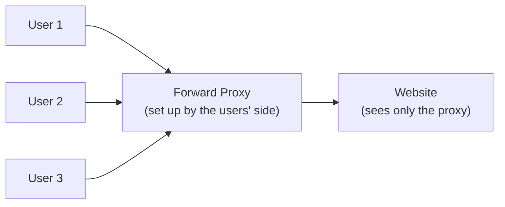
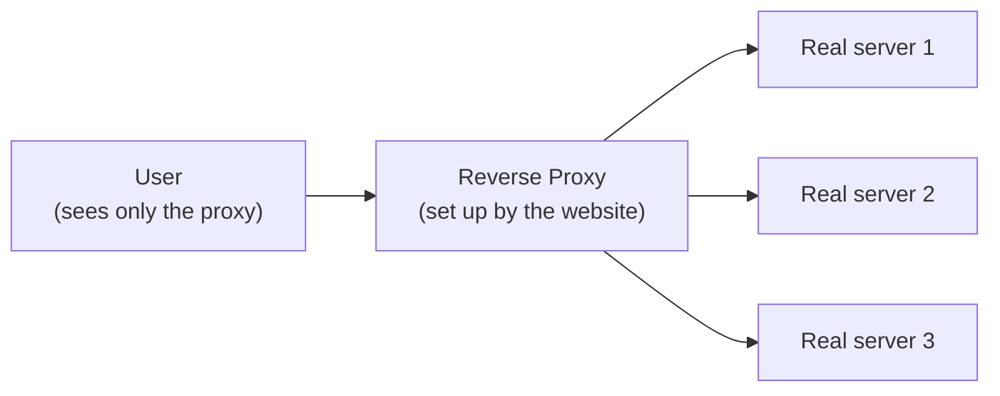

A proxy is just a middleman that sits between two sides and passes messages back and forth. The only real question is: **which side is it standing in front of?**

- A **forward proxy** stands in front of the **users** (the clients).
- A **reverse proxy** stands in front of the **servers** (the websites).

That single difference is what everything else comes from.

## Forward Proxy — the users' middleman

Imagine everyone in an office wants to visit websites. Instead of each computer going out to the internet directly, they all go through one machine first. That machine is the forward proxy.

The website never sees the individual users — only the proxy. That makes it great for:

- **Privacy** — your real identity/location is hidden behind the proxy (this is basically what a VPN does).
- **Control** — an office or school can block certain sites for everyone at once.
- **Speed** — if ten people ask for the same page, the proxy can keep a saved copy (caching).

## Reverse Proxy — the servers' middleman

Now flip it around. A popular website may run on many servers behind the scenes. Visitors shouldn't have to know or care. One machine sits in front and greets every visitor — the reverse proxy.

The user never sees the real servers. The proxy quietly decides which server should answer. That makes it great for:

- **Load balancing** — spreads visitors across many servers so none gets overwhelmed (see [Load Balancing](/concepts/load-balancing)).
- **Security** — the real servers stay hidden, which makes attacks harder.
- **Speed** — it can cache pages and handle encryption (HTTPS) so the servers do less work.

## Side-by-Side Comparison

| What you compare | Forward proxy | Reverse proxy |
| --- | --- | --- |
| Stands in front of | The clients (users) | The servers (websites) |
| Who it hides | The user, from the website | The servers, from the user |
| Who sets it up | The user / their office or school | The website owner |
| Main jobs | Privacy, filtering, blocking, caching | Load balancing, security, caching, SSL |
| Everyday example | A VPN or an office network filter | Cloudflare, or NGINX in front of an app |

<Callout type="tip">
Easy way to remember: **forward proxy protects the people going out; reverse proxy protects the servers being visited.** Same middleman idea — just facing opposite directions.
</Callout>

## Interview Follow-Ups

- Is a load balancer a reverse proxy? (Essentially yes — a reverse proxy specialized in distributing load; NGINX does both jobs.)
- Where does an [API gateway](/concepts/api-gateway) fit? (It's a reverse proxy with extra API-specific duties: auth, rate limiting, routing.)
- Can one system use both? (Absolutely — corporate users behind a forward proxy visiting a site fronted by a reverse proxy.)
