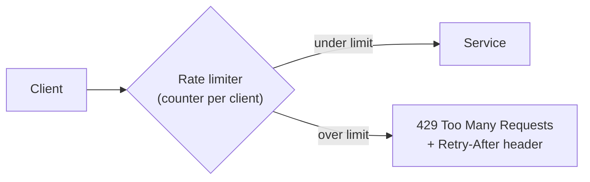
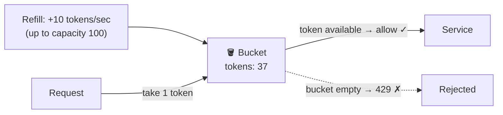
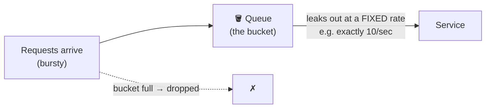
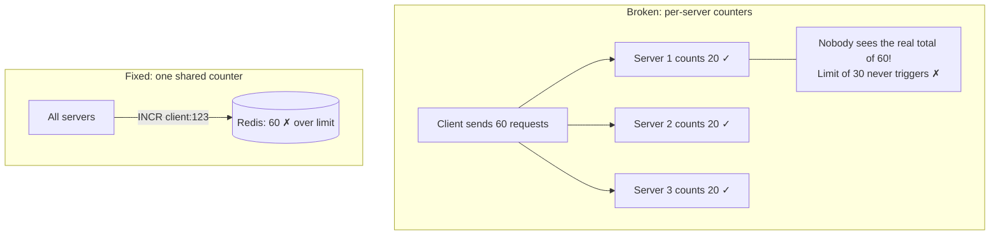

Without limits, one buggy script, scraper, or attacker can consume all your capacity and take the service down for everyone. A rate limiter enforces a simple contract: **this many requests per client per time window — no more.**

## Analogy

An amusement park ride lets 30 people on per ride cycle. A queue forms at the gate; when the ride is full, the gate closes and newcomers either wait or leave. Nobody can rush the ride no matter how eager they are — capacity is protected by the gate, not by hoping visitors behave.

## How It Works

The limiter keeps a counter per client (API key, user ID, or IP). Each request either passes (counter incremented) or is rejected with **HTTP 429** and ideally a `Retry-After` header.

## Deep Dive

### The algorithms

- **Fixed window** — "100 requests per minute": reset the counter every minute. Simple, but bursty at boundaries — 100 requests at 11:59:59 and 100 more at 12:00:01 is 200 in two seconds.
- **Sliding window** — count requests in the *trailing* 60 seconds. Smooth, slightly more bookkeeping.
- **Token bucket** *(most common)* — the bucket holds tokens, refilled at a steady rate (e.g. 10/sec, capacity 100). Each request takes a token; empty bucket → rejected. Allows **short bursts** (spend saved-up tokens) while capping the sustained rate.

- **Leaky bucket** — requests enter a queue processed at a fixed rate; overflow is dropped. Produces a perfectly smooth outflow.

### Where the counters live

A single server can keep counters in memory. But with many servers behind a [load balancer](/concepts/load-balancing), each server sees only a slice of a client's traffic — so counters move to a **shared store, typically Redis**, with atomic increment + expiry. That's the heart of the [Design a Rate Limiter](/questions/design-rate-limiter) interview question.

### Design choices interviewers probe

<Callout type="tip">
Always mention *what the client experiences*: 429 status, `Retry-After`, and rate-limit headers (`X-RateLimit-Remaining`). Handling the rejection gracefully is part of the design.
</Callout>

- **What do you key on?** User ID (fair per account), API key (per customer), IP (anonymous traffic — but NAT shares IPs).
- **Hard vs soft limits** — reject outright vs briefly queue/throttle.
- **Tiered limits** — free tier 100/hr, paid tier 10,000/hr.

## Real-World Examples

- GitHub's API: 5,000 requests/hour per token, with rate-limit headers on every response.
- Stripe, Twitter/X, and virtually every public API publish rate limits.
- Login endpoints rate-limit aggressively to block credential-stuffing attacks.

## Interview Follow-Ups

- Token bucket vs leaky bucket? (Token allows bursts up to capacity; leaky enforces a constant rate.)
- How do distributed servers share limits? (Central Redis counters — or approximate local counters synced periodically when perfect accuracy isn't needed.)
- Where should the limiter sit? (Usually the [API gateway](/concepts/api-gateway) — one place, before any real work happens.)
