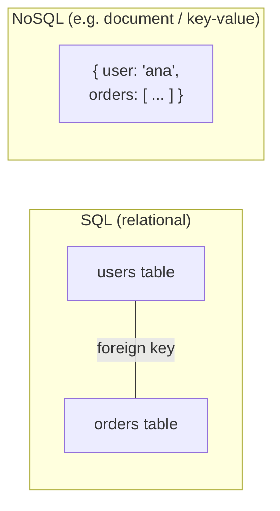
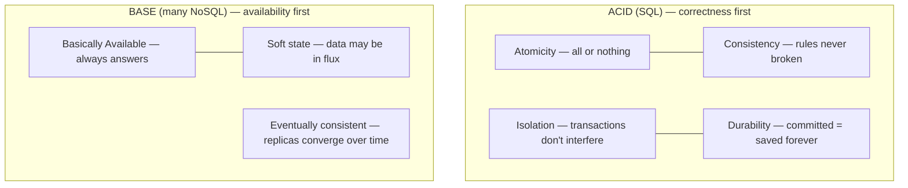

"SQL vs NoSQL" is really a question about what you're willing to trade: relational databases give you strong structure and guarantees; NoSQL databases give up some of that to scale out more easily.

## Analogy

A SQL database is a **filing cabinet with strict forms** — every record has the same fields, forms reference each other by ID, and a clerk (transactions) guarantees nothing is ever half-filed. NoSQL is a **wall of labeled boxes** — throw anything in a box, grab it back instantly by its label, add a thousand more boxes whenever you like. Finding "every box containing a red item," though, means opening a lot of boxes.

## How It Works

## Deep Dive

| | SQL | NoSQL |
| --- | --- | --- |
| Data model | Tables, rows, foreign keys | Key-value, documents, wide-column, graph |
| Schema | Fixed, enforced up front | Flexible, per-record |
| Queries | Rich SQL: joins, aggregations | Mostly by key; limited joins |
| Transactions | Strong ACID | Often limited or eventual |
| Scaling | Vertical first; sharding is manual work | Built to scale horizontally |
| Examples | PostgreSQL, MySQL | Redis, MongoDB, Cassandra, DynamoDB |

### The four main NoSQL families

- **Key-value** (Redis, DynamoDB) — a giant dictionary; blazing fast lookups by key. See [Design a Key-Value Store](/questions/design-key-value-store).
- **Document** (MongoDB) — JSON-like documents; flexible nested data.
- **Wide-column** (Cassandra) — rows with huge numbers of dynamic columns; write-optimized.
- **Graph** (Neo4j) — relationships are first-class; great for social networks.

### ACID vs BASE

SQL databases promise **ACID** (Atomicity, Consistency, Isolation, Durability) — the money-transfer guarantee. Many NoSQL systems promise **BASE** (Basically Available, Soft state, Eventually consistent) — the system stays up and data converges over time. This links directly to the [CAP theorem](/concepts/cap-theorem).

<Callout type="tip">
In interviews, don't say "NoSQL because scale." Say *why*: "The access pattern is simple key lookups at huge volume with no cross-entity transactions — that's the sweet spot for a key-value store."
</Callout>

## Real-World Examples

- Banking ledgers: SQL — correctness above all.
- Shopping carts and session data: key-value stores — simple lookups, huge volume.
- Product catalogs: document stores — every product has different attributes.
- Most real companies use **both** ("polyglot persistence"): SQL for core records, NoSQL for scale-heavy edges.

## Interview Follow-Ups

- Can SQL scale horizontally? (Yes — read replicas and sharding — but you build and operate it yourself.)
- Can NoSQL do transactions? (Increasingly yes — MongoDB and DynamoDB have them — but with limits and costs.)
- What decides the choice? (Access patterns, consistency needs, and scale — in that order.)
