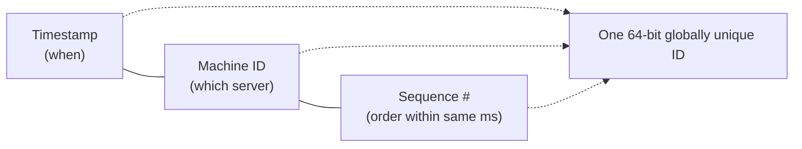

Many systems need a unique ID for every new thing — every tweet, order, message, or short URL. On one server this is trivial (auto-increment: 1, 2, 3…). With **many servers creating IDs at the same time**, two servers can easily produce the same number — and everything built on "IDs are unique" breaks.

## Analogy

Two ticket counters at a fair both start numbering tickets from 1 — two visitors end up holding ticket #7. The fixes are exactly the distributed-systems fixes: give each counter a **different ticket book range** (counter A: 1–1,000, counter B: 1,001–2,000), or print tickets with the **counter number and time** on them so no two tickets can ever match.

## Option 1 — Snowflake IDs (the "counter number + time" fix)

A **Snowflake ID** (invented at Twitter) is a single 64-bit number built from three parts:

| Part | Purpose |
| --- | --- |
| **Timestamp** | Records exactly when the ID was created |
| **Machine ID** | Identifies which server created it |
| **Sequence number** | Separates multiple IDs created in the same millisecond |

Two servers can never collide (different machine IDs), and one server can't collide with itself (the sequence number separates same-millisecond IDs). **No coordination, no single point of failure, no database needed** — every server mints IDs locally at full speed. Bonus: IDs are roughly **time-ordered**, so sorting by ID ≈ sorting by creation time.

## Option 2 — ZooKeeper ID ranges (the "ticket book" fix)

A coordination service (like ZooKeeper) hands each server its own **block of IDs**, so servers never clash:

| Server | Assigned ID range |
| --- | --- |
| Server 1 | 1 to 1,000,000 |
| Server 2 | 1,000,001 to 2,000,000 |
| Server 3 | 2,000,001 to 3,000,000 |

Each server counts through its range locally and asks for a new block when it runs low. Simple and collision-proof; the trade-off is depending on the coordinator (and IDs no longer being globally time-ordered).

## Turning IDs into Short Codes — Base62

Numeric IDs are long and ugly in URLs. **Base62 encoding** rewrites a number using 62 characters (A–Z, a–z, 0–9) — the same idea as binary or hex, just base 62:

- 7 characters of Base62 = 62⁷ ≈ **3.5 trillion** combinations — enough for centuries of URL-shortener traffic.
- Letters and digits only — safe in URLs, no special characters.

This ID → Base62 pipeline is the heart of the [URL shortener design](/questions/design-url-shortener): unique number from Snowflake/ZooKeeper → encode → 7-character short code.

## Why Not Just Hash or Random?

- **Hash the content (MD5/SHA)?** 32–40 characters; trimming to 7 causes collisions. Not suitable at scale.
- **Random UUIDs?** Great for uniqueness (128 bits — collisions practically impossible) and used everywhere as [idempotency keys](/concepts/idempotency) — but they're 36 characters, unordered, and index poorly as database primary keys compared to time-ordered Snowflakes.

<Callout type="tip">
Interview shortcut: "auto-increment doesn't scale past one server; UUIDs are unordered and long; so I'd use Snowflake — time-ordered, 64-bit, coordination-free." That one sentence covers the whole trade-off space.
</Callout>

## Interview Follow-Ups

- What happens if a server's clock goes backwards? (Snowflake's known weakness — refuse to issue IDs until the clock catches up, or track the last timestamp.)
- Why are time-ordered IDs better for databases? (Inserts append to the "right edge" of the [index](/concepts/database-indexing) instead of splattering randomly across it.)
- How does Instagram/Twitter shard by ID? (The machine/shard bits inside the ID route straight to the owning [shard](/concepts/database-sharding).)
