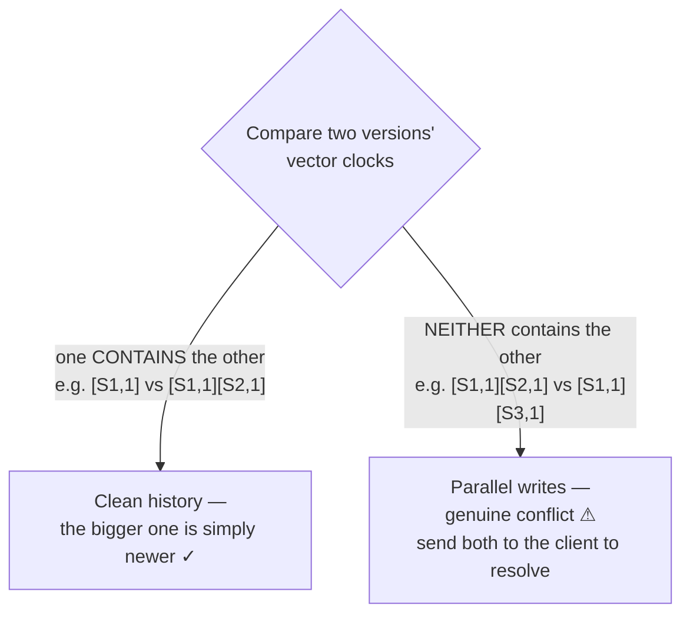
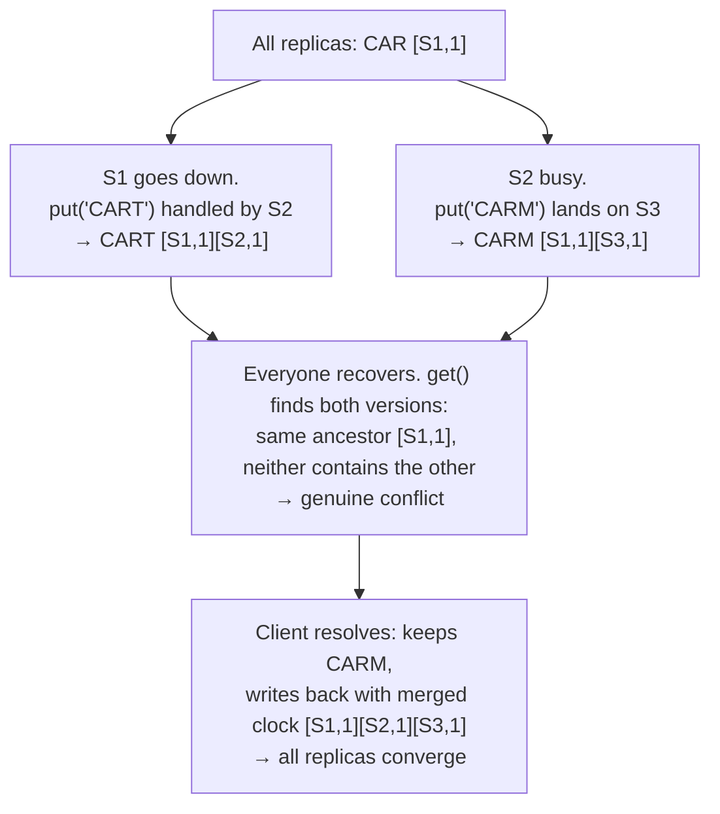

In a replicated database, servers can temporarily disagree about a value — a server crashes and comes back with stale data, a network failure stops an update from reaching some replicas, or two clients update the same key at the same time on different servers. **Data versioning** is how the system tells these situations apart, and the classic tool is the **vector clock**.

## Analogy

Two editors get the same draft of a document by email. Editor A adds a paragraph and sends it back; editor B, offline, *also* edits their old copy. When both versions arrive, the history tells the story: A's version says "based on draft v1," B's version *also* says "based on draft v1" — neither saw the other's work. That's a genuine conflict a human must merge. If instead B had edited *A's* version, the history would show a clean chain — no conflict at all.

## How It Works

A vector clock is a list of `[server, counter]` pairs attached to each value:

| Clock | Meaning |
| --- | --- |
| `[S1, 1]` | Server S1 made update #1 |
| `[S1,1][S2,1]` | S1 updated first, **then** S2 — a clean sequential history |
| `[S1,1][S2,1]` **vs** `[S1,1][S3,1]` | Both branched from S1's version — **parallel writes, conflict!** |

The rule: if one clock **contains** the other, it's simply newer — no conflict. If **neither contains the other**, the writes happened in parallel and the system cannot automatically pick a winner.

## A Full Conflict, Step by Step

Three replicas (S1 coordinator, S2, S3) all hold `CAR [S1,1]`:

The conflict is **detected** by comparing clocks and **resolved** by the client application (business logic decides — perhaps "CARM" was the more recent action), which writes back a merged version. All replicas sync to it — [eventual consistency](/questions/eventual-consistency-explained) completing its promise.

## Deep Dive

### Vector clocks vs Last-Write-Wins

The lazy alternative is **LWW**: stamp each write with a timestamp, highest wins. Simple — but one of two parallel writes is **silently discarded** (and server clocks aren't perfectly synced anyway). Vector clocks preserve both versions at the cost of pushing the merge decision to the application. Amazon's cart famously merges (which is why deleted items occasionally reappear); Cassandra defaults to LWW.

### The cost

<Callout type="warning">
Clocks grow — one entry per server that ever updated the key. Real systems cap the list (drop oldest entries past ~10), accepting a tiny risk of missing an ancient conflict. If asked "what's the downside of vector clocks?" — this, plus pushing conflict resolution complexity onto every client.
</Callout>

## Real-World Examples

- **Amazon Dynamo** (the paper behind DynamoDB) made vector clocks + client-side merge famous — the full flow is in [Design a Key-Value Store](/questions/design-key-value-store).
- **Riak** exposes sibling versions to clients exactly this way.
- Collaborative editors evolved the idea further into CRDTs, which make merges automatic.

## Interview Follow-Ups

- When is LWW acceptable? (When losing one of two near-simultaneous writes is harmless — metrics, presence, caches.)
- Who resolves conflicts — server or client? (Client/app logic; only it knows whether "merge carts" or "newest wins" is right for the business.)
- How is this different from a version *number*? (A single counter detects staleness on one server; a *vector* detects parallel histories across many servers — compare [optimistic concurrency control](/concepts/concurrency-control).)
