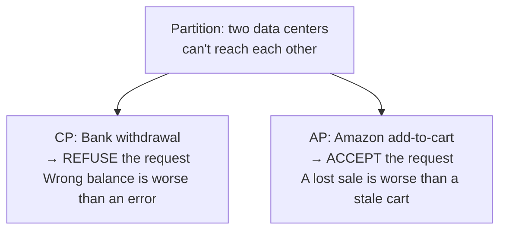

## Problem Statement

"Explain the CAP theorem — and give a real example of choosing consistency versus availability."

The theory is covered in the [CAP theorem concept](/concepts/cap-theorem); this page is about *answering the interview question well*.

## The Answer Structure

**1. State it precisely (not the pop version):**

> "When a network partition happens — and it will — a distributed system must choose between consistency (every read sees the latest write) and availability (every request gets an answer). Partition tolerance isn't optional, so the real decision is C vs A *during failures*."

**2. Give one CP example and one AP example:**

**CP — ATM withdrawal.** Two ATMs, partitioned. If both stayed available, you could withdraw your full balance at each — the bank chooses consistency: the disconnected ATM refuses or limits withdrawals. An error message beats double-spending.

**AP — Amazon's cart.** During a partition, "add to cart" must never fail — a blocked purchase is lost revenue. Each side accepts writes; when the partition heals, carts are *merged* (which is why deleted items occasionally reappear — a deliberate, documented trade-off in the Dynamo paper).

**3. Close with nuance:**

> "It's per-operation, not per-system: the same shop wants AP for carts but CP for payment capture. And quorum systems tune the dial with R + W > N rather than picking an extreme."

<Callout type="tip">
The cart-merge detail ("that's why deleted items sometimes come back") is a memorable, true story that shows you understand consequences, not just definitions.
</Callout>

## Follow-Up Questions

- Where does a single-server database sit in CAP? (CAP doesn't apply — no partitions inside one node; it's about *distributed* state.)
- What does "eventual" mean concretely in AP systems? (Typically milliseconds; see [eventual consistency](/questions/eventual-consistency-explained).)
- How do quorums tune the trade-off? (Higher W/R → stronger consistency, lower availability; see [Design a Key-Value Store](/questions/design-key-value-store).)
