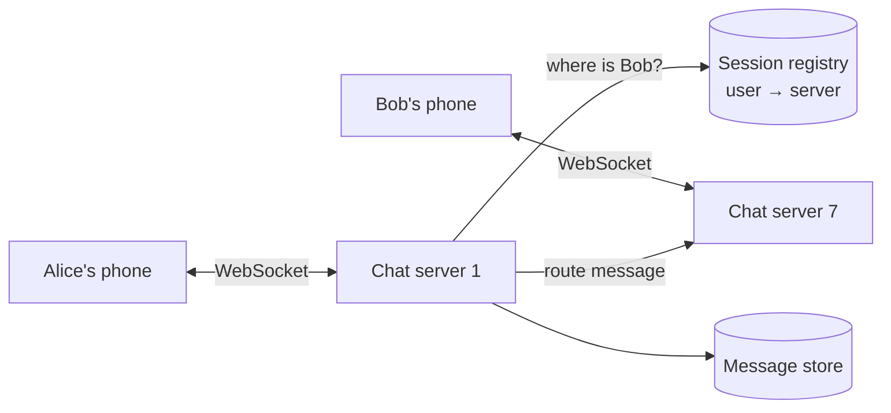
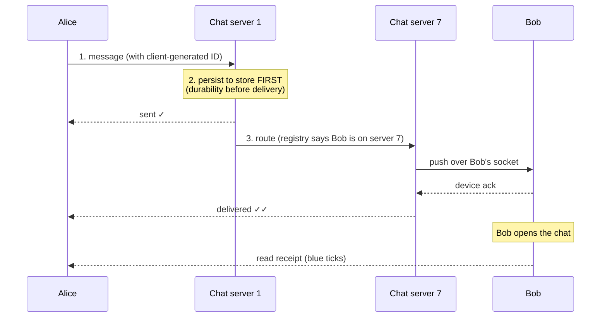

## Problem Statement

Design WhatsApp's core: 1:1 chat with real-time delivery, sent/delivered/read receipts, offline users receiving messages when they return, and group chats.

## Clarifying Questions

- 1:1 only, or groups too? Max group size?
- Message history stored server-side, or device-to-device (end-to-end encrypted)?
- Media messages? (Defer — images go to object storage + a URL in the message.)
- Scale? (Say 500 M daily users, billions of messages/day.)

## Requirements

**Functional:** send/receive in real time; delivery + read receipts; offline delivery; online/last-seen status; group chat.
**Non-functional:** delivery latency < ~100 ms; **no message ever lost**; messages arrive in order per conversation.

## The Key Decision: How Messages Reach Phones

HTTP polling ("any new messages?" every few seconds) wastes battery and adds latency. Chat needs a **persistent connection**: each client keeps one **WebSocket** open to a chat server, and the server *pushes* messages down instantly.

**The routing problem:** Alice connects to server 1, Bob to server 7. When Alice messages Bob, server 1 looks up Bob's location in a **session registry** (Redis: `user → chat-server`) written on every connect/disconnect, then forwards to server 7, which pushes down Bob's socket.

## High-Level Design — Message Flow

1. Alice sends message (client generates a message ID — an [idempotency](/concepts/idempotency) key, so retries never duplicate).
2. Server 1 **persists it** to the message store *first* — durability before delivery — and acks to Alice: **sent ✓**.
3. Server 1 looks up Bob → forwards to server 7 → pushes over Bob's socket.
4. Bob's device acks → **delivered ✓✓** flows back to Alice.
5. Bob opens the chat → **read** receipt (blue ticks).

**Offline delivery:** if Bob has no session, the message simply waits in the store; when Bob reconnects, his client syncs everything after its last-received ID. A push notification (via the [notification system](/questions/design-notification-system)) tells him to open the app.

## Deep Dive

### Storage

Billions of small, append-only, time-ordered messages, queried as "recent messages of conversation X" — a perfect fit for a **wide-column store** (Cassandra/HBase): partition key = `conversation_id`, clustering by message ID. Per-conversation ordering comes free from per-partition ordering ([sharding](/concepts/database-sharding) by conversation).

### Ordering

Don't trust client clocks. Order by server-assigned per-conversation sequence (or time-based IDs from the partition owner). Global cross-conversation order is unnecessary.

### Group chat

Sender → one write to the group conversation, then the server fans out to each member's session (mostly-offline members just get notifications). Small groups: fan-out inline; huge groups/channels: fan-out via [queue](/concepts/message-queues) workers — the same push-vs-pull tension as the [Twitter feed](/questions/design-twitter-feed).

### Online status

Presence service: connect → online; disconnect/heartbeat timeout → last-seen. Don't broadcast every flicker — friends fetch presence on demand + subscribe to changes for open chats only.

## Trade-offs & Alternatives

- **WebSocket servers are stateful** — connection-aware load balancing ([L4](/concepts/load-balancing)) and graceful drain on deploys; a dying server drops ~1 M sockets that must reconnect elsewhere (thundering herd — add jitter).
- **End-to-end encryption** changes storage: the server relays ciphertext it can't read; history lives on devices.
- **Consistency choice:** durability-then-delivery favors "never lose a message" over raw latency — the right call for chat.

## Follow-Up Questions

- Multiple devices per user? (Session registry maps user → *set* of connections; each device tracks its own sync cursor.)
- Typing indicators? (Ephemeral events over the socket — never persisted, dropped if offline.)
- How do you scale the session registry? (It's a key-value lookup at connect/message rate — Redis Cluster, sharded by user ID.)
