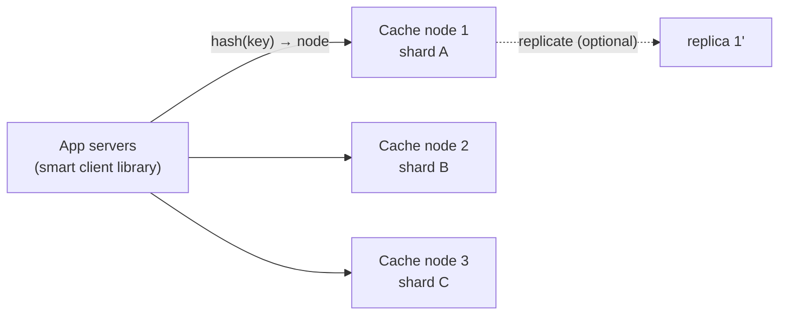
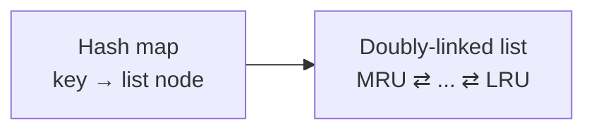

## Problem Statement

Design a distributed in-memory cache (a mini Redis Cluster): `get(key)` / `put(key, value, ttl)` at sub-millisecond latency, spread across many nodes because the working set exceeds one machine's RAM.

## Clarifying Questions

- Cache-aside helper or full storage layer? (Cache: misses are normal, data is recoverable from the source of truth.)
- Consistency needs? (Best-effort — it's a cache; losing a node loses only speed, not truth.)
- Scale? (Say 1 TB of hot data, 5 M ops/sec.)

## Requirements

**Functional:** get/put/delete with TTL; automatic eviction when full.
**Non-functional:** P99 < 1 ms; linear horizontal scaling; a node death costs cache hits, never correctness.

## High-Level Design

- **Partitioning:** the client library hashes each key onto the [consistent-hashing ring](/concepts/consistent-hashing) and talks **directly** to the owning node — no router hop, keeping latency down. Virtual nodes even out load.
- **Within a node:** a hash map for O(1) lookup + a structure for eviction (below). Single-threaded event loop per core (the Redis trick) avoids locking.

## Deep Dive

### LRU eviction in O(1)

The interview classic: hash map + doubly-linked list. The map gives O(1) find; the list keeps recency order — on access, move the entry to the head (O(1) unlink/relink); on eviction, drop the tail. Every operation stays O(1).

TTL expiry: check lazily on read (expired → treat as a miss) plus background sampling to reclaim memory — exactly Redis's strategy.

### Replication — do you even need it?

A pure cache can skip it: a node dies → its slice misses → the database absorbs a temporary miss storm and the cache refills. If that miss storm is dangerous (at high scale it usually is), add async [replication](/concepts/database-replication) per shard and promote the replica on failure — trading 2× memory cost for stable hit rates.

### The failure modes to volunteer

<Callout type="warning">
These three come from the [caching concept](/concepts/caching), and interviewers expect them unprompted:

- **Stampede** — a hot key expires and thousands of requests rebuild it simultaneously → per-key mutex or jittered TTLs.
- **Penetration** — queries for keys that exist nowhere always miss through to the DB → cache negative results, or a Bloom filter.
- **Hot keys** — one celebrity key overloads its single owner node → replicate that key across several nodes, or let clients cache it locally for a few seconds.
</Callout>

### Cluster membership

Nodes discover each other and detect failures via a **gossip protocol**, just like in the [key-value store design](/questions/design-key-value-store) — no central coordinator to become a single point of failure. When membership changes, the ring updates and only the affected arc of keys re-maps.

## Trade-offs & Alternatives

- **Smart client vs proxy routing:** the client library avoids a network hop but must track ring state; a proxy (like Twemproxy) centralizes routing at the cost of latency and a new component.
- **LRU vs LFU:** LRU is simpler and usually good; LFU protects steady-popular items from being evicted by one-off scans.
- **Consistency:** a cache tolerates brief staleness by design — don't build quorum reads for it; that's what the [key-value store](/questions/design-key-value-store) is for.

## Follow-Up Questions

- How does resharding work when you add nodes? (Consistent hashing moves only one arc; keys can migrate lazily — a miss on the new node just refills from the source.)
- What's the memory overhead of LRU bookkeeping? (Two pointers + map entry per item — real but worth it; Redis actually uses sampled approximate LRU to save memory.)
- How do you keep the cache warm after a deploy/restart? (Persistence snapshots, replica promotion, or gradual traffic ramp.)
