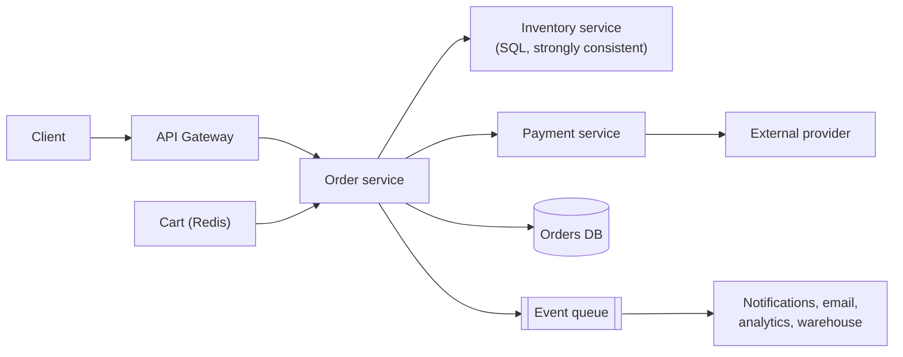
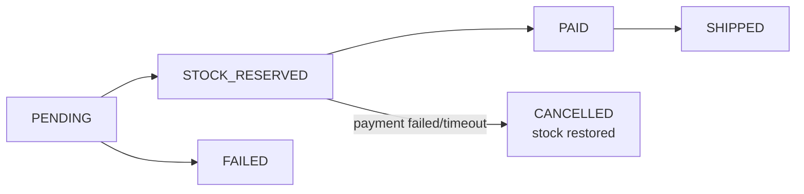

## Problem Statement

Design the order flow of an online shop: users add items to a cart, check out, pay, and the system tracks inventory so you **never sell more stock than exists** — even when a flash sale sends 10,000 people after 100 units.

## Clarifying Questions

- Flash-sale spikes expected? (Yes — that's the hard part.)
- Is a brief "sorry, sold out at payment" acceptable, or must the cart guarantee stock? (Standard: stock is only guaranteed at order placement, optionally reserved for N minutes.)
- Payment via external provider (Stripe-like)? (Yes.)
- Scale? (Say 1 M orders/day, 100× spikes.)

## Requirements

**Functional:** cart; place order; reserve inventory; take payment; order status tracking; cancellation restores stock.
**Non-functional:** **no overselling** (strong consistency where it counts); **no double-charging**; checkout survives traffic spikes; order data is never lost.

## High-Level Design

Different data, different stores ([SQL vs NoSQL](/concepts/sql-vs-nosql) in practice): **cart** in Redis (ephemeral, high-churn, losing it is annoying not catastrophic); **inventory and orders** in a transactional SQL database (money and stock need ACID).

## Deep Dive

### 1. Not overselling — concurrency control

Two buyers, last unit. Both read `stock = 1`, both decide it's available, both decrement → stock −1, oversold. This is exactly the seat-booking race from [concurrency control](/concepts/concurrency-control):

- **Optimistic (OCC):** `UPDATE stock SET qty = qty - 1 WHERE item = X AND qty >= 1` — the atomic condition makes the database the referee; 0 rows updated = sold out. Great for normal load.
- **Pessimistic (PCC):** `SELECT ... FOR UPDATE` locks the row for the whole reservation transaction. Safer under fierce contention, but a flash sale turns the row into a lock convoy.
- **Flash-sale extra:** put a counter in Redis (atomic `DECR`) as a fast gate in front of the DB, and/or queue purchase attempts and admit them at a controlled rate.

### 2. Not double-charging — idempotency

The client times out after "Place order" and retries; or the payment webhook is delivered twice. Every mutation carries an [idempotency key](/concepts/idempotency): the order request key dedupes order creation; the same key is passed to the payment provider (Stripe's `Idempotency-Key`) so retried charges return the original result instead of charging again.

### 3. The order state machine

Orders move through explicit states, and every transition is recorded. **Reservations expire**: reserve stock → 10-minute payment window → success confirms, failure/timeout releases the stock back (a background sweeper handles abandoners).

### 4. Order placed — everything else is async

Payment confirmed → emit `order.paid` to the [queue](/concepts/message-queues); email, invoice, warehouse, and analytics each consume independently. A slow email service must never block checkout, and queue redelivery means those consumers are idempotent too.

## Trade-offs & Alternatives

- **Reserve-at-cart vs reserve-at-checkout:** reserving in the cart feels nicer but lets idle carts hold stock hostage; industry standard is reserve at checkout with a short TTL.
- **Strong consistency only where needed:** inventory/payment = CP; product pages, reviews, recommendations = cached and eventual. Don't pay the consistency tax everywhere.
- **Saga vs two-phase commit** across order + payment + inventory services: sagas (sequence of local transactions + compensating actions like "release stock") are the practical choice; 2PC blocks and scales poorly.

## Follow-Up Questions

- Payment succeeded but your DB write failed — now what? (Reconciliation: provider webhooks + periodic sweeps comparing provider records against orders; the idempotency key lets you match them.)
- How do you show "only 3 left!" counters? (Cached, approximate, eventually consistent — precision only matters at the decrement.)
- Partial failures in a multi-item order? (Reserve all-or-nothing in one transaction, or allow split fulfillment — a product decision with big system consequences.)
