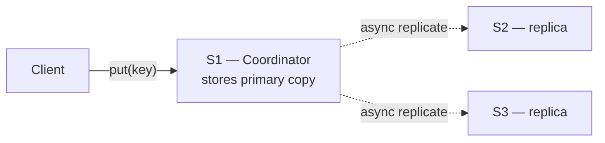
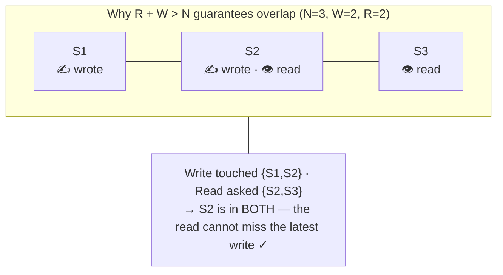
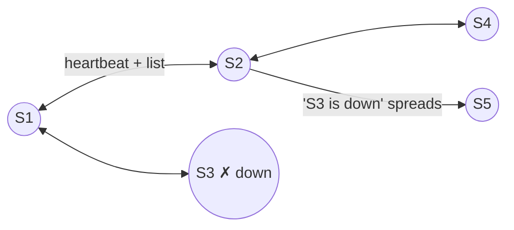

## Problem Statement

Design a distributed key-value database — a giant dictionary spread across many servers. Store data with `put(key, value)`, retrieve it with `get(key)`. Think of a locker room: each locker has a number (the key), and your belongings (the value) are inside.

**Real-world example:** Amazon's "Add to Cart" — your user ID is the key, your cart is the value. Billions of users; must be fast, reliable, and always available.

## Clarifying Questions

- What scale — total data size and requests/second?
- Consistency vs availability: is a slightly stale read acceptable? (Usually yes — that's the point of these systems.)
- Value size limits? Single-key operations only, or scans too?

## Requirements

- **Scalability** — millions of users without slowing down; add servers to grow.
- **Decentralization** — no single server whose crash breaks everything.
- **Eventual consistency** — all servers agree on the data *eventually*, even after network problems.

## High-Level Design

Four building blocks, layered in order:

1. **Partitioning** — split data across servers with [consistent hashing](/concepts/consistent-hashing)
2. **Replication** — copy each key to N servers for fault tolerance
3. **Get/Put with quorums** — the R + W > N rule
4. **Versioning** — vector clocks to detect and resolve conflicts

### Step 1 — Partitioning with consistent hashing

Why can't one server hold everything? A single server storing all key-value pairs would:

- **Run out of memory** quickly with millions of entries.
- **Become a bottleneck** — too slow with millions of simultaneous requests.
- **Cause a total outage** if that one server crashes.

So we split the data — and the splitting technique matters. Naive `hash(key) % n` remaps almost every key whenever a server is added. Instead, servers and keys live on a **hash ring** ([consistent hashing](/concepts/consistent-hashing)): each key belongs to the first server clockwise from its position. Adding or removing a server only moves the keys in one small arc, and **virtual nodes** (each server at many ring positions) keep the load even.

A concrete example — servers at ring positions 20 (S1), 50 (S2), 80 (S3):

```
hash(user123) = 45  →  first server clockwise after 45 is S2 (at position 50)
```

So `user123`'s data lives on S2. Add S4 at position 60 and only the keys between 50 and 60 move to it; everything else stays put.

### Step 2 — Replication: coordinator and preference list

The server that owns a key's hash range is its **coordinator**. Its job, in order:

1. Store the **primary copy** of the data.
2. Walk clockwise on the ring to find **N − 1 additional servers**.
3. Send copies of the data to those replica servers.
4. Manage the **preference list** for this key.

Replication happens **asynchronously** — the coordinator does not wait for all replicas before confirming to the client. That gives:

- **Fast write responses** — the client isn't kept waiting for all copies.
- **Better throughput** — multiple writes happen in parallel.
- **High scalability** — replicas catch up in the background without blocking the main flow.

The coordinator maintains a **preference list** — the ordered list of servers holding this key:

| Position | Server |
| --- | --- |
| Primary | S1 — the coordinator |
| Replica 1 | S2 — first server clockwise |
| Replica 2 | S3 — second server clockwise |



### Step 3 — Quorums: the golden rule R + W > N

- **N** = total replicas (e.g. 3)
- **W** = confirmations required before a write is "successful"
- **R** = replies required before a read returns

With N=3, W=2, R=2: R + W = 4 > 3, so **any read quorum overlaps any write quorum** — a read always reaches at least one server with the latest write.



**Put** (`put("CAR")`, W=2): coordinator stores it, replicates to S2/S3 in the background, and confirms success as soon as **2 of 3** servers acknowledge — S3 may still be catching up.

**Get** (`get("CAR")`, R=2), step by step:

| Step | What happens |
| --- | --- |
| 1 | `hash("CAR") = 45` → S1 is the coordinator |
| 2 | S1 contacts **all** servers in the preference list: S1, S2, S3 |
| 3 | Each server sends back its value **and version (vector clock)** |
| 4 | As soon as **R = 2** servers respond → return the data to the client |
| 5 | Fewer than R servers respond → **Read Failed ❌** |

Why ask **all** replicas but wait for only R? Because replicas can disagree (crashes, network delays) — collecting every available version lets the system compare vector clocks, detect conflicts, and return the most up-to-date value (or flag the conflict for the client to resolve).

## Deep Dive: Conflicts and Vector Clocks

A **vector clock** is a tag on each value recording who updated it: `[S1,1]` = "S1 made update #1."

Failure story (N=3):

1. All replicas hold `CAR [S1,1]` — synced.
2. S1 goes down. A `put("CART")` is handled by S2 → `CART [S1,1][S2,1]`.
3. S2 is busy. A `put("CARM")` lands on S3 → `CARM [S1,1][S3,1]`.

When everyone recovers, a read finds both `[S1,1][S2,1]` and `[S1,1][S3,1]`: same ancestor `[S1,1]`, but **neither contains the other** — the writes happened in parallel. This is a genuine conflict the system can't auto-resolve.

**Resolution:** return *both* versions to the client application, which picks or merges (e.g. keeps `CARM`), then writes back with the merged clock `[S1,1][S2,1][S3,1]`. All replicas converge — this is [eventual consistency](/questions/eventual-consistency-explained) in action, and exactly how Amazon's cart merges work.

## Deep Dive: Failure Detection — Gossip Protocol

With 100 servers, everyone pinging everyone is 10,000 checks/second — and a central monitor would be a single point of failure. Instead, servers **gossip**:

- Every second, each server sends a heartbeat + its membership list to a few *random* peers.
- Receivers merge the lists; news spreads across the whole cluster in seconds — like office gossip.
- Missed heartbeats → mark the server suspicious → after a timeout, DOWN; its ring range shifts to the next server clockwise and traffic reroutes to replicas.



## Summary — The Complete Picture

How every concept fits together in a production key-value database like Amazon DynamoDB or Apache Cassandra:

| Concept | What it does and why it matters |
| --- | --- |
| Partitioning | Splits data across many servers so no single machine is overwhelmed |
| [Consistent hashing](/concepts/consistent-hashing) | Places servers and keys on a ring; only nearby keys move when servers change |
| Virtual nodes (VNodes) | Each server appears multiple times on the ring for even load distribution |
| Replication (N) | Stores N copies of every key across different servers for fault tolerance |
| Coordinator | The primary server for a key — stores it and manages its replicas |
| Preference list | Ordered list of servers (coordinator + replicas) holding a specific key |
| Async replication | Copies spread to replicas in the background — keeps writes fast |
| W (write quorum) | Minimum servers that must confirm before a write succeeds |
| R (read quorum) | Minimum servers that must reply before a read returns |
| **R + W > N** | The golden rule: guarantees every read sees the latest write |
| [Vector clocks](/concepts/vector-clocks) | `[server, counter]` tags per update to detect and resolve conflicts |
| [Eventual consistency](/questions/eventual-consistency-explained) | All replicas agree on the same data — not instantly, but reliably over time |
| [Gossip protocol](/concepts/gossip-protocol) | Servers share heartbeats + membership lists every second to detect failures fast |

<Callout type="tip">
**The golden rule: R + W > N.** This one formula balances consistency, availability, and performance. Set W high for strong write guarantees; set R high for strong read guarantees. The trade-off is speed vs accuracy — and this rule lets you tune it precisely.
</Callout>

## Trade-offs & Alternatives

- **Tuning the quorum dial:** W=N, R=1 → strong writes, fast reads, fragile writes during failures. W=1, R=1 → fastest but weakest guarantees. R+W>N is the balanced default.
- **Vector clocks vs last-write-wins:** LWW (Cassandra's default) is simpler but silently drops one of two concurrent writes; vector clocks preserve both at the cost of client-side resolution.
- **This is an AP design** ([CAP](/concepts/cap-theorem)): availability first. For CP semantics you'd use a consensus system (etcd, ZooKeeper) instead.

## Follow-Up Questions

- How does a new server bootstrap its data? (Streams the ring range it now owns from its predecessor.)
- What if a replica was down during a write? (Hinted handoff — a neighbor holds the write and delivers it when the replica returns; read repair fixes stale replicas during gets.)
- Why read from all replicas but wait for only R? (Latency: respond at the R-th reply; completeness: still collect stragglers for conflict detection/repair.)
