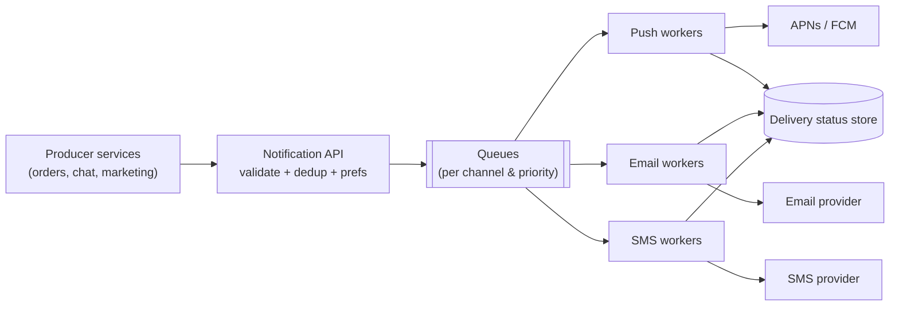
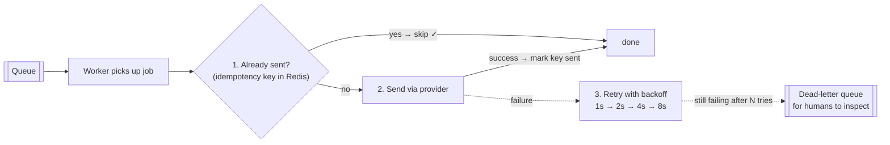

## Problem Statement

Design the platform service every product team uses to reach users: push notifications, email, and SMS — triggered by events ("order shipped", "new message", "price drop"), respecting user preferences, at millions of notifications per hour.

## Clarifying Questions

- Which channels? (Push + email + SMS.)
- Real-time triggers only, or also scheduled/bulk campaigns?
- Strictness: is a rare duplicate acceptable? A rare miss? (Duplicates annoying but survivable; losses bad for critical notices — prioritize at-least-once + dedup.)
- Scale? (Say 10 M notifications/hour, spiky.)

## Requirements

**Functional:** other services submit notification requests; per-user channel preferences and opt-outs; templates; delivery status tracking.
**Non-functional:** high throughput with burst absorption; at-least-once delivery with dedup; critical notices (OTP!) prioritized over marketing.

## High-Level Design

The backbone is a [message queue](/concepts/message-queues) — notification sending is naturally asynchronous and bursty:

1. **Notification API** — accepts `{user, event type, payload, idempotency key}`; checks preferences/opt-outs; resolves template; enqueues one message per chosen channel.
2. **Queues** — separated **per channel** (different throughput/failure profiles) and **per priority** (OTP lane never queues behind a 5 M-user campaign).
3. **Workers** — pull, render, call the third-party provider (APNs/FCM, email, SMS), record status, retry on failure.

## Deep Dive

### Not losing, not duplicating

- Queue + acks give **at-least-once** — a worker dying mid-send causes redelivery.
- Redelivery means possible duplicates → **dedup with an [idempotency key](/concepts/idempotency)** (`event id + user + channel`) checked in Redis before sending.
- Repeatedly failing messages → **dead-letter queue** for inspection, not infinite retries.
- Retries use **exponential backoff** — hammering a struggling provider makes it worse.

### Third-party providers fail

Providers are outside your control: per-provider [rate limits](/concepts/rate-limiting), circuit breakers, and a fallback provider for critical SMS/email. Provider callbacks (bounces, delivery receipts) update the status store.

### User preferences & throttling

Check at send time, not enqueue time (preferences may change in between). Add per-user frequency caps ("max 3 marketing pushes/day") and quiet hours — the *product* side of rate limiting.

## Trade-offs & Alternatives

- **One queue vs many:** many queues (channel × priority) isolate failures and let you scale workers independently — worth the operational overhead at this scale.
- **At-least-once + dedup** vs at-most-once: duplicates are recoverable, silent losses aren't. For OTPs, users retry anyway.
- **Batch API calls** to providers (FCM batch) trade latency for throughput on campaigns.

## Follow-Up Questions

- A campaign to 5 M users just got enqueued — how do OTPs stay fast? (Priority queues + reserved worker capacity.)
- How do you know a push was actually delivered? (You often don't — track provider accept + app-open receipts; treat delivery as probabilistic.)
- Scheduled notifications? (A scheduler service moves due jobs onto the queues — don't sleep in workers.)
