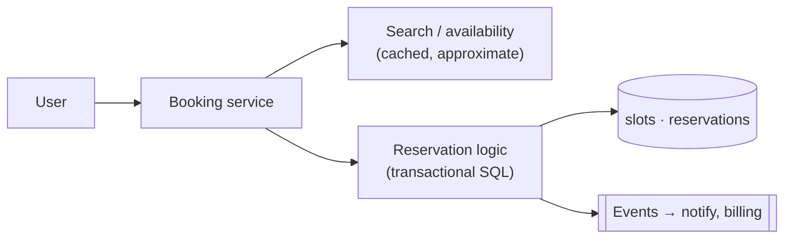
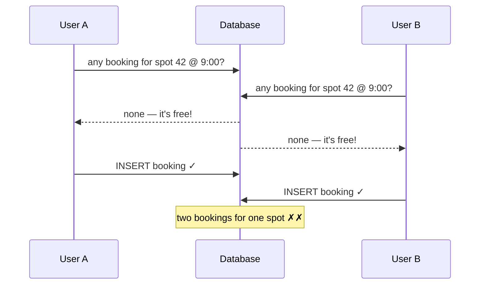

## Problem Statement

Design a parking-lot (or cinema-seat / doctor-slot) reservation system: users see available slots for a time window and book one. The invariant that makes it an interview question: **one slot, one booking — no double-booking, ever**, even when many users tap the same slot simultaneously.

## Clarifying Questions

- Slots are time-bound? (Yes — slot × time-range, e.g. spot 42 from 9:00–11:00.)
- Payment inside the flow? (Reserve → pay within N minutes → confirmed, else released — like [e-commerce checkout](/questions/design-ecommerce-order-system).)
- Scale? (City-wide: thousands of lots, but *contention is per-slot* — the interesting load is many users per hot slot, not raw QPS.)

## Requirements

**Functional:** search availability; reserve a slot for a time range; pay to confirm; cancel; expire unpaid holds.
**Non-functional:** **zero double-booking (strong consistency — this is a CP feature)**; availability search fast and cache-friendly; booking flow survives retries safely.

## High-Level Design

**Split reads from writes.** Availability *search* can be slightly stale (cached, refreshed on booking events) — showing a spot that just got taken is fine, because the *booking write* is where truth is enforced.

**Data model (SQL):** `reservations(slot_id, start_time, end_time, user_id, status)` with an [index](/concepts/database-indexing) on `(slot_id, start_time)`. A booking succeeds only if no overlapping `ACTIVE` reservation exists.

## Deep Dive: The Double-Booking Race

Two users book spot 42 for 9:00. Both query "any overlapping reservation?" → both see none → both insert. Two bookings:

The fixes, in interview-answer order (full theory: [concurrency control](/concepts/concurrency-control)):

1. **Database constraint as the last line of defense.** For fixed slots the elegant trick is a **unique constraint** on `(slot_id, time_bucket)` — the second insert simply fails, no locking logic to get wrong. (Postgres exclusion constraints handle arbitrary ranges.)
2. **Pessimistic locking** when you need check-then-act: `SELECT ... FOR UPDATE` on the slot row → check overlap → insert → commit. Contenders queue up behind the lock; first wins, second sees the new reservation.
3. **Optimistic (version column)** works too but retries a lot on hot slots — for booking, contention on a popular slot is the *expected* case, which is precisely when [PCC beats OCC](/concepts/concurrency-control).

<Callout type="tip">
Saying "the unique constraint means even a bug in my application code can't double-book" is the kind of defense-in-depth statement interviewers remember.
</Callout>

### Holds and expiry

`PENDING` reservation with `expires_at = now + 10 min` → pay to become `ACTIVE` → sweeper (or lazy check) releases expired holds. Users retrying payment reuse their [idempotency key](/concepts/idempotency), so a flaky network can't create two holds.

## Trade-offs & Alternatives

- **Lock granularity:** lock the slot row, never "the lot" — coarse locks serialize unrelated bookings.
- **Redis-first holds** (SETNX with TTL) offload hot-slot contention from the DB, but Redis and DB can now disagree — keep the DB constraint as the authority.
- **Search freshness vs cost:** real-time availability push (websockets) is possible but rarely worth it; a "this slot was just taken — pick another" error path is standard.

## Follow-Up Questions

- Recurring reservations? (Materialize occurrences into slots, or check overlap against recurrence rules — materializing is simpler and indexable.)
- How would you shard? (By lot/venue ID — all contention for a slot stays on one shard, preserving local transactions.)
- What availability number does this design choose in CAP terms? (CP for booking: during a partition, refuse bookings rather than risk double-booking — see [CAP trade-offs](/questions/cap-theorem-tradeoffs).)
