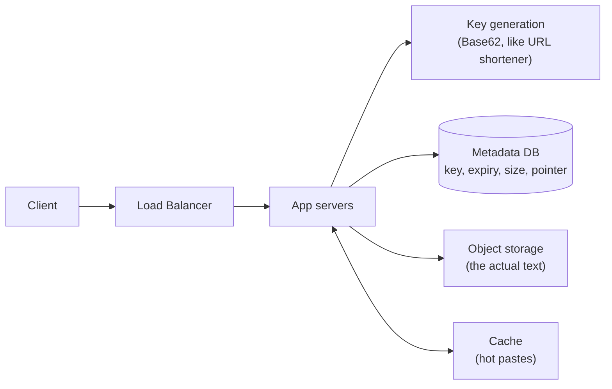
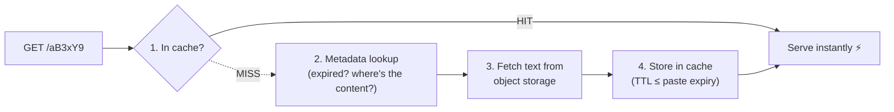

## Problem Statement

Design Pastebin: users paste a blob of text, get a short link (`pastebin.com/aB3xY9`), and anyone with the link can read the text. A gentle first case study — it's the [URL shortener](/questions/design-url-shortener) plus content storage.

## Clarifying Questions

- Max paste size? (Say 10 MB.)
- Do pastes expire? (Yes — optional TTL: 1 hour to never.)
- Anonymous pastes? Editing? Syntax highlighting? (Keep scope: anonymous, immutable, plain text.)
- Scale? (Say 1 M new pastes/day, 10:1 read:write.)

## Requirements

**Functional:** create paste → unique short key; read paste by key; optional expiry.
**Non-functional:** high availability for reads, low read latency, durable storage (never lose a paste before expiry).

## Estimating the Scale

- Writes: 1 M/day ≈ 12/sec. Reads: ≈ 120/sec. Modest!
- Storage: 1 M/day × avg 10 KB = 10 GB/day → ~3.6 TB/year. **Storage, not traffic, is the interesting axis.**

## High-Level Design

**The key separation:** metadata (small, queried) lives in a database; the paste *content* (potentially megabytes) lives in **object storage** (S3-style). Databases are poor blob stores — this split is the main thing the interviewer wants to see beyond the URL-shortener design.

| Metadata column | Notes |
| --- | --- |
| short_key | Base62, generated like the URL shortener's codes |
| content_ref | Object-storage path |
| created_at / expires_at | Expiry handling |
| size, content_type | Limits, future syntax highlighting |

## Deep Dive

### Read path (the hot path)

Check [cache](/concepts/caching) for the paste → hit: serve directly; miss: metadata lookup → fetch from object storage → cache it (with TTL ≤ paste expiry). Very popular pastes can also go behind a [CDN](/concepts/cdn) since content is immutable — cache forever, no invalidation problem.

### Expiry

Don't delete eagerly with per-paste timers. Two-layer approach:

- **Lazy check** — on read, if `expires_at` has passed → return 404 (correctness).
- **Background sweeper** — periodic job deletes expired metadata and objects (space reclamation).

### Abuse

Public write endpoint → [rate limit](/concepts/rate-limiting) paste creation per IP, cap paste size, and scan/flag malicious content.

## Trade-offs & Alternatives

- **DB-only storage** (content in the database): simpler, fine at small scale; migrate blobs out when size hurts backups and replication.
- **Immutability** is a gift: no invalidation, CDN-friendly, trivially cacheable. Allowing edits would forfeit all of that — push back if asked casually.
- Same ID-generation trade-offs as the [URL shortener](/questions/design-url-shortener) (Base62 counter vs random keys).

## Follow-Up Questions

- How would you add "burn after reading"? (Atomic read-and-mark — delete on first successful read; watch out for prefetchers.)
- Private pastes? (Unlisted = unguessable longer keys; truly private = auth + ACL check on read.)
- What if a paste goes viral? (Cache + CDN absorb it; the DB only sees the first miss.)
