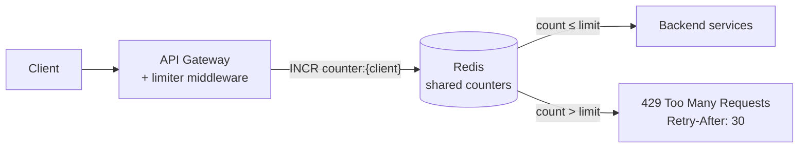
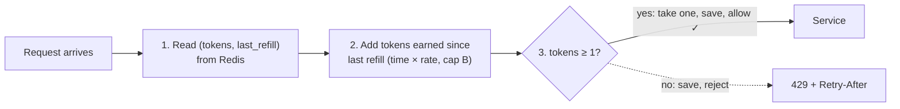

## Problem Statement

Design a rate limiter for an API platform: each client may make at most N requests per time window (e.g. 100/minute). Over the limit → reject. It must work correctly even though requests are spread across many servers.

## Clarifying Questions

- What do we limit on — user ID, API key, or IP?
- One global rule, or different limits per endpoint / pricing tier?
- Hard rejection (429) or soft throttling (queueing)?
- How exact must the limit be? (Is 105 requests slipping through at 100 acceptable?)

## Requirements

**Functional:** track request counts per client per window; reject over-limit requests with HTTP 429 + `Retry-After`; support per-tier rules.

**Non-functional:** tiny added latency (this sits on *every* request — aim < 5 ms); highly available; accurate across a distributed fleet.

## High-Level Design

Place the limiter in the [API gateway](/concepts/api-gateway), with counters in Redis so all servers share one view:



Why shared storage? With 20 gateway servers and per-server in-memory counters, a client's traffic spreads across all 20 — each sees only 1/20th, and the real limit becomes ~20× what you configured. Central counters fix this ([full algorithm background](/concepts/rate-limiting)).

## Deep Dive

### Algorithm choice: token bucket

Each client has a bucket with capacity **B** tokens, refilled at rate **r**/second. A request takes one token; empty → 429. This caps the sustained rate at *r* while allowing brief bursts up to *B* — matching how real clients behave.

Implementation detail that impresses: don't refill with a timer. Store `(tokens, last_refill_ts)` and compute lazily on each request:

```
tokens = min(B, tokens + (now - last_refill_ts) * r)
if tokens >= 1: tokens -= 1; allow
else: reject
```



### Atomicity

Two requests reading `tokens=1` simultaneously would both pass. Make check-and-decrement atomic with a **Redis Lua script** (runs as one atomic operation) — the standard answer to "what about race conditions?"

### Redis down — fail open or closed?

<Callout type="tip">
Classic probe. **Fail open** (allow traffic, lose limiting) protects user experience; **fail closed** (reject everything) protects the backend. Most products fail open for normal APIs and fail closed for abuse-sensitive endpoints like login. Saying "it depends on the endpoint — and here's how" is the senior answer.
</Callout>

### What the client sees

- `429 Too Many Requests` + `Retry-After: <seconds>`
- Headers on every response: `X-RateLimit-Limit`, `X-RateLimit-Remaining`, `X-RateLimit-Reset`

## Trade-offs & Alternatives

- **Fixed window counters** — simplest (one `INCR` + `EXPIRE`), but bursty at window edges.
- **Sliding window log** — exact but stores a timestamp per request; memory-hungry.
- **Sliding window counter** — weighted blend of two fixed windows; good accuracy, cheap. Common production choice.
- **Local + sync hybrid** — per-server counters synced every ~100 ms: much faster, slightly inaccurate. Fine when limits are protective rather than billable.

## Follow-Up Questions

- How do you rate-limit unauthenticated traffic? (By IP — with care: NAT means one IP can be thousands of users.)
- Redis latency is now on every request — how do you keep it low? (Same-AZ placement, connection pooling, pipelining, local caching of *rules*.)
- How do per-tier limits work? (Rule lookup by API key → tier config; counters keyed per client, limits from the tier.)
