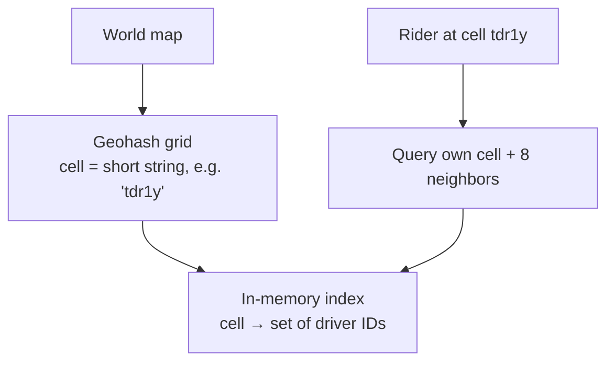
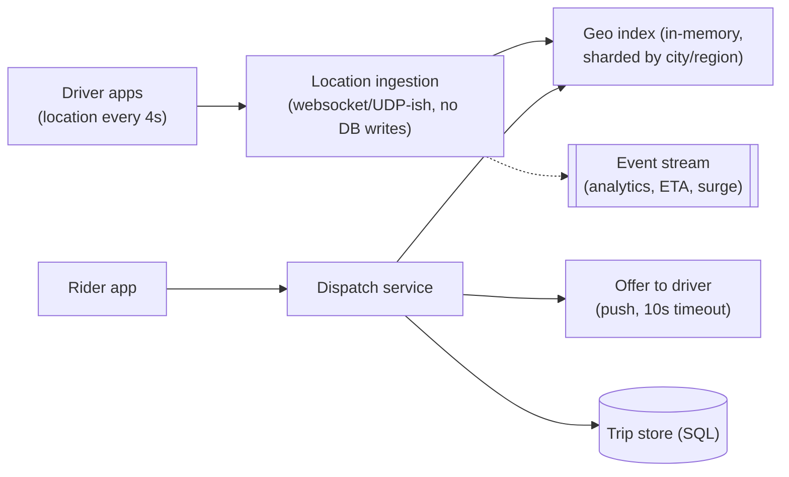

## Problem Statement

Design Uber's core loop: drivers stream their live locations; a rider requests a ride; the system finds nearby available drivers, offers them the trip, and tracks the ride to completion.

## Clarifying Questions

- Scope: matching + live tracking? (Skip pricing/ETA-prediction internals and payments — mention they exist.)
- Scale? (Say 1 M concurrent drivers, location updates every 4 s → 250 K location writes/sec.)
- Match quality: nearest driver, or smarter? (Nearest-with-filters is fine for the interview.)

## Requirements

**Functional:** drivers publish location + availability; riders request rides; match and dispatch with driver accept/decline; live trip tracking.
**Non-functional:** matching in ~seconds; location ingestion at massive write volume; a lost location update is fine ([AP](/concepts/cap-theorem)), a double-assigned driver is not (CP for dispatch).

## The Core Problem: "Which Drivers Are Near Me?"

A `WHERE lat BETWEEN … AND lng BETWEEN …` query over a million moving points can't use a normal [index](/concepts/database-indexing) well — B-trees index one dimension. The standard answer: **geohashing** — divide the world into grid cells and index by cell ID.

- Encode each driver's position into a **geohash cell** (~1 km at precision 5, shorter prefix = bigger cell).
- Keep an in-memory map `cell → drivers` (Redis sets or a specialized service).
- "Nearby" = my cell + its 8 neighbors (checking neighbors handles riders near a cell edge), then exact-distance sort the small candidate set.

Alternatives worth naming: **quadtrees** (adaptive cell size — dense cities get finer cells) and **S2/H3** libraries (what Uber actually uses — hexagonal cells).

## High-Level Design

- **Location ingestion is its own high-volume path:** update the in-memory geo index (overwrite — only the latest position matters) and emit to a [Kafka-style stream](/concepts/message-queues) for analytics; don't write every ping to a database.
- **Dispatch:** query the geo index → rank candidates (distance, rating, direction) → offer to the best driver with a timeout → decline/timeout moves to the next.
- **Trips** (created on accept) are business records → transactional SQL store, state machine like [orders](/questions/design-ecommerce-order-system): `REQUESTED → MATCHED → PICKUP → IN_RIDE → COMPLETED`.

## Deep Dive

### Don't double-book a driver

Two riders match the same driver simultaneously. The offer step must **atomically claim** the driver: `SET driver:42:claim rider-X NX EX 15` in Redis — first claim wins, the loser's dispatch moves on. On accept, the claim becomes a trip; the driver leaves the available pool. Same [concurrency-control](/concepts/concurrency-control) essence as seat booking.

### Sharding by geography

Partition the geo index [by city/region](/concepts/database-sharding) — matching is inherently local; a Delhi rider never needs Mumbai's index. Hot-city shards can split further into sub-regions.

### The hot-cell problem

A concert ends: thousands of riders and drivers in one cell. Mitigations: finer cells in dense areas (quadtree/H3 shine here), batching dispatch requests, and surge pricing as a *demand-shaping* tool — a systems answer, not just business.

## Trade-offs & Alternatives

- **Freshness vs write load:** 4-second pings balance battery/bandwidth vs accuracy; interpolate positions between pings for smooth map display.
- **In-memory index durability:** it's rebuildable from live pings within seconds — deliberately *not* durable storage.
- **Nearest vs globally-optimal matching:** batching requests for a few hundred ms and solving assignment jointly beats greedy nearest — say it exists, don't derive it.

## Follow-Up Questions

- How does live trip tracking reach the rider's screen? (Driver pings → pub/sub channel per trip → rider's websocket — same pattern as [chat](/questions/design-chat-app).)
- ETA computation? (Precomputed road-graph routing + live traffic from the very location stream you're ingesting.)
- What if the dispatch service crashes mid-match? (Claims expire via TTL; the rider's request re-enters matching — idempotency keys prevent duplicate trips.)
