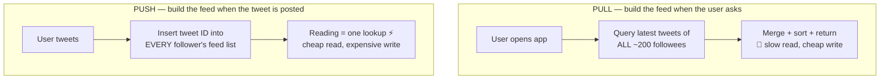
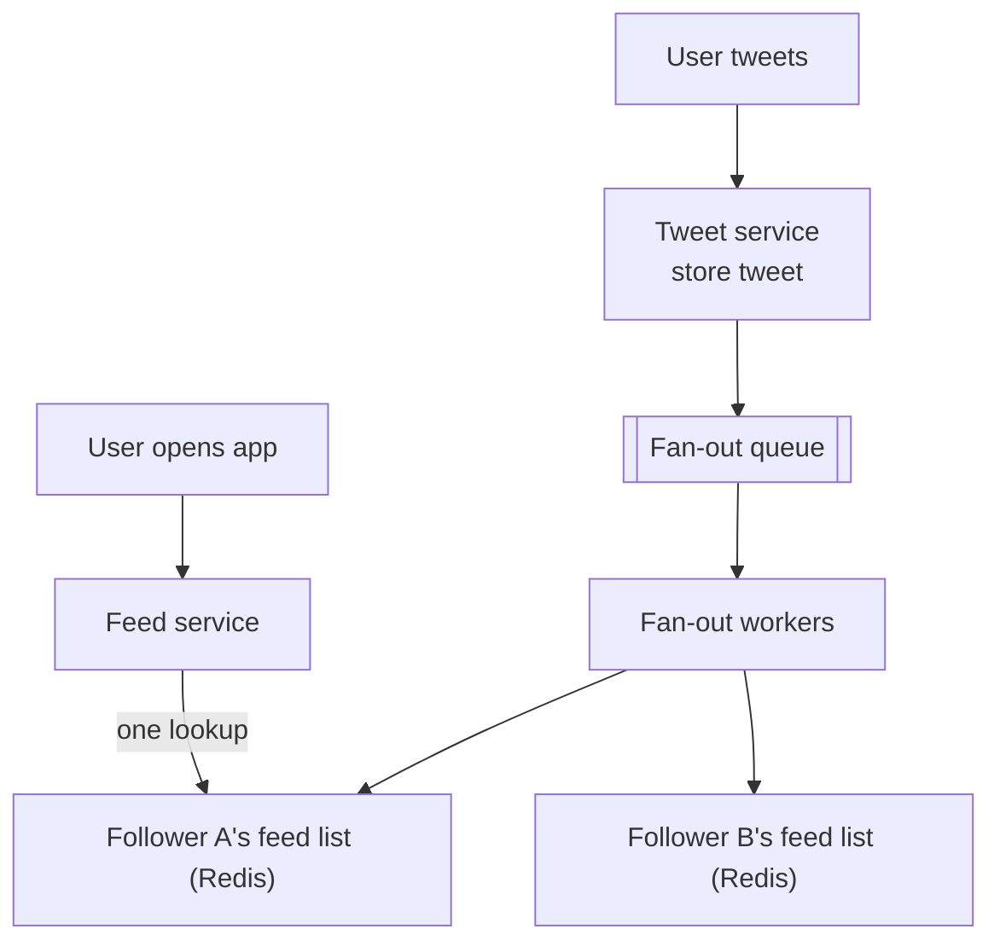

## Problem Statement

Design Twitter's core: users post tweets, follow others, and open the app to see a **home feed** of recent tweets from everyone they follow, newest first.

## Clarifying Questions

- Scope: posting + following + home feed? (Skip DMs, trends, ads.)
- Scale? (Say 200 M daily users, 100 M tweets/day, average 200 followees.)
- Feed freshness: is a few seconds' delay fine? (Yes — [eventual consistency](/questions/eventual-consistency-explained) is acceptable here.)
- Ranked or chronological? (Chronological first; ranking is a layer on top.)

## Requirements

**Functional:** post tweet; follow/unfollow; fetch home feed (paginated).
**Non-functional:** feed loads < 200 ms; posting feels instant; read:write ratio is extreme — a tweet is written once and read potentially millions of times. **Optimize reads.**

## The Core Problem: Building the Feed

Two opposite strategies:

**Pull (fan-out on read):** store tweets by author. When a user opens the app, query the latest tweets of all ~200 followees, merge, sort. Writes are cheap; **every feed load is a 200-way scatter-gather** — too slow at this read volume.

**Push (fan-out on write):** every user has a precomputed **feed cache** (list of tweet IDs in Redis). When someone tweets, insert the tweet ID into *each follower's* feed list. Reads become a single cache lookup — blazing fast. Cost: a tweet by a user with 1,000 followers = 1,000 writes.

The fan-out happens **asynchronously** via a [message queue](/concepts/message-queues) — the poster gets instant confirmation while workers populate follower feeds over the next seconds.

## High-Level Design

- **Tweet service** — writes tweets to storage ([sharded](/concepts/database-sharding) by tweet ID or author).
- **Social graph service** — follows/followers (key-value: user → follower list).
- **Fan-out workers** — consume the queue, write tweet IDs into follower feed lists in Redis (feed lists capped at ~800 entries).
- **Feed service** — read the ID list from Redis, **hydrate** (fetch tweet content + author profile, also heavily cached), return page.

## Deep Dive: The Celebrity Problem

<Callout type="warning">
This is *the* follow-up. A user with 100 M followers tweets → pure push means 100 M writes per tweet — a write storm that can take minutes and melt Redis.
</Callout>

**Hybrid fan-out (what Twitter actually did):**

- Normal users (< ~10 K followers): **push** — fan-out on write.
- Celebrities: **pull** — their tweets are *not* fanned out. At read time, the feed service merges the user's precomputed list with a live query of the few celebrities they follow (whose recent tweets are cached hot anyway).

Best of both: bounded write cost, still one-ish lookup reads.

## Trade-offs & Alternatives

- **Feed lists in RAM are expensive** — cap length, evict feeds of inactive users, rebuild lazily via pull when they return.
- **Consistency:** a follower may see a tweet seconds late (queue lag) — acceptable ([AP choice](/concepts/cap-theorem)); the *author* must see their own tweet immediately (read-your-own-writes).
- **Ranking** ("best tweets first") replaces the simple merge with a scoring layer over candidates — same infrastructure, extra compute stage.

## Follow-Up Questions

- How does pagination work? (Cursor-based on tweet ID/timestamp — offsets break when new tweets arrive.)
- Unfollow/block — do old tweets vanish instantly? (Filter at read time; lazily clean the feed list.)
- Where do likes/retweet counts come from? (Separate counter service, heavily cached, eventually consistent.)
- How would you add the "For You" ranked feed? (Candidate generation → feature scoring → re-rank; the chronological pipeline becomes one candidate source.)
