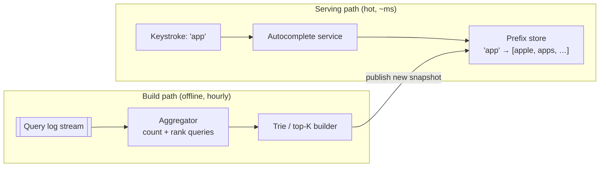
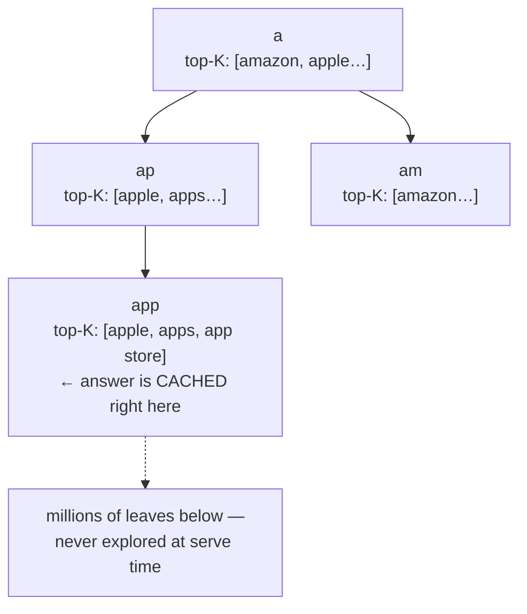

## Problem Statement

Design Google-style autocomplete: as the user types each character, show the top 5–10 most likely completions — within about 100 ms, or the suggestions feel laggy and useless.

## Clarifying Questions

- Suggestions from a fixed catalog (products) or from what people search (query logs)? (The classic version: query logs, ranked by popularity.)
- Personalized or global? (Global first; personalization is a re-rank layer.)
- How fresh must trends be? (A new hot query should appear within hours, not milliseconds.)
- Scale? (Say 5 B searches/day → ~10× that in keystroke requests.)

## Requirements

**Functional:** given a prefix, return top-K completions; update popularity from real queries; filter offensive suggestions.
**Non-functional:** P99 < 100 ms end-to-end; enormous read volume (every keystroke!); freshness within hours is fine — **this is a read-optimized, precomputed system**.

## The Core Insight: Precompute Everything

Searching a database per keystroke (`LIKE 'appl%' ORDER BY popularity` — even [indexed](/concepts/database-indexing)) can't hit 100 ms at this volume. Instead: **store the answer, not the question** — for every prefix, precompute the top-K completions, so serving is a single key-value lookup.

### The data structure: a trie with cached top-K

A **trie** stores strings by shared prefixes — walking `a→p→p` reaches the subtree of everything starting with "app." The crucial optimization: **each node caches its own top-K list**, so serving never explores the subtree (which could be millions of leaves). Lookup = walk the prefix, return the cached list — O(prefix length).

In practice the trie is flattened into a key-value table (`prefix → top-K`) capped at, say, the first 6–8 characters, sharded and replicated like any [key-value store](/concepts/sql-vs-nosql).

## High-Level Design

**Serving:** browser (debounced ~50 ms) → edge-[cached](/concepts/cdn) endpoint → autocomplete service → prefix store. Hot prefixes ("a", "the", trending terms) sit in memory everywhere — the cache hit ratio is astronomical because everyone types the same short prefixes.

**Building:** every real search emits to a [log stream](/concepts/message-queues) → periodic aggregation (hourly batch, or streaming for trends) counts queries → rebuild prefix→top-K snapshots → **publish atomically** (version-swap, so a user's session never mixes two snapshot generations mid-word).

## Deep Dive

### Ranking beyond raw counts

Frequency alone surfaces stale hits. Blend: recency-weighted counts (time decay), trending boost (last-hour spike detection), language/region segmentation, and a blocklist filter applied at *build* time (never serve-then-filter — too slow).

### Sharding the prefix space

[Shard](/concepts/database-sharding) by prefix hash. Watch the hot-shard problem: single-letter prefixes are queried orders of magnitude more — replicate those keys widely or pin them into every serving node's memory.

### Why not compute on the fly with streaming counts?

You *could* maintain exact live counts per prefix, but per-keystroke reads at 50 B/day demand the flattest possible read path; hourly freshness satisfies the requirement. Stating this **read-path vs freshness trade** explicitly is the mark of a good answer.

## Trade-offs & Alternatives

- **Trie in RAM vs KV table:** in-memory trie = elegant, bounded by RAM per node; flattened KV = trivially sharded/replicated, at ~6-8× storage (one row per prefix of each query).
- **Debounce interval:** longer = fewer requests but laggier feel; ~50–100 ms is the sweet spot.
- **Personalization:** re-rank the global top-K client-side against the user's own history — avoids per-user server state on the hot path.

## Follow-Up Questions

- How do typos get handled? (Fuzzy matching via edit-distance candidates or a spell-correct pass — significantly more compute; often a separate service.)
- How fast can a breaking-news term appear? (Streaming pipeline with 1–5 min windows feeding a "trending" overlay merged at serve time.)
- How big is the prefix table? (Estimate live: 1 B unique queries × ~7 prefixes × ~100 bytes ≈ 700 GB — sharded, it's fine. Doing this math unprompted scores points.)
