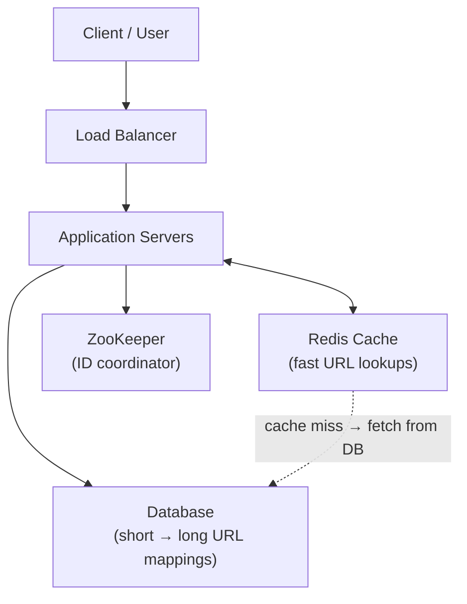

## Problem Statement

A URL shortener takes a long, hard-to-share web address and turns it into a short, easy-to-use link. When someone opens the short link, the system automatically sends them to the original long address.

```
Long URL:   https://www.google.com/search/system-design-url-shortener
Short URL:  https://tinyurl.com/Ab3xYz1
```

## Clarifying Questions

Before designing, ask the interviewer:

- How many URLs are created per day? (Sets the scale of everything else.)
- How long should short URLs live — forever, or can they expire?
- Do we need custom aliases (user picks the short code)?
- Do we need click analytics?
- What's the expected read:write ratio? (Redirects massively outnumber creations.)

## Requirements

**Functional**

- **Create a short URL** — user sends a long URL, system returns a short one:
  ```
  POST /shorten
  Request:   { "url": "https://google.com" }
  Response:  { "shortUrl": "https://tinyurl.com/Ab3xYz1" }
  ```
- **Redirect** — opening `GET /Ab3xYz1` sends the user to the original URL.

**Non-functional**

- Very low latency on redirects (this is 90%+ of traffic).
- High availability — a broken shortener breaks every link ever created.
- Short codes must be unique at massive scale.

## Estimating the Scale

| Assumption | Number |
| --- | --- |
| URLs generated per day | 10 million |
| URLs per year | 10M × 365 = 3.65 billion |
| URLs over 100 years | 3.65B × 100 = 365 billion |

**Why 7 characters?** Using Base62 encoding (A–Z, a–z, 0–9 = 62 characters), 7 characters give 62⁷ ≈ 3.5 trillion combinations — more than enough for 365 billion URLs.

<Callout type="tip">
Doing this "how many characters do we need" calculation out loud is a classic way to score points in the interview — it shows you size the system before designing it.
</Callout>

## High-Level Design



| Component | Role |
| --- | --- |
| Load Balancer | Distributes traffic across app servers |
| Application Servers | Handle URL creation and redirect logic |
| Redis Cache | Fast in-memory store for frequent URL lookups |
| ZooKeeper | Assigns ID ranges to each server |
| Database | Permanent storage of all short ↔ long URL mappings |

## Deep Dive

### Generating the short code

**Option A — Hash the URL (not recommended).** MD5/SHA1 produce 32–40 character hashes; trimming to 7 characters causes collisions (two URLs getting the same code). Not suitable at large scale.

**Option B — Unique ID + Base62 (recommended).**

1. Generate a unique numeric ID for each URL.
2. Convert that number to a 7-character Base62 string.
3. Store the mapping: short code ↔ long URL.


### Unique IDs across many servers (Snowflake)

In a distributed system many servers run at once. A **Snowflake ID** stays globally unique by combining three parts:

| Part | Purpose |
| --- | --- |
| Timestamp | Records exactly when the ID was created |
| Machine ID | Identifies which server created the ID |
| Sequence number | Handles multiple IDs in the same millisecond |

No central database is needed and there's no single point of failure.

### Coordinating servers with ZooKeeper

An alternative (or complement): ZooKeeper hands each server its own **block of IDs**, so servers never clash:

| Server | Assigned ID range |
| --- | --- |
| Server 1 | 1 to 1,000,000 |
| Server 2 | 1,000,001 to 2,000,000 |
| Server 3 | 2,000,001 to 3,000,000 |

### Caching redirects with Redis

Redirects are extremely read-heavy, so the app server checks Redis **before** the database:

- **Cache HIT** — short code found in Redis → return the long URL instantly, no DB call.
- **Cache MISS** — not in Redis → fetch from the database → store it in Redis for next time.

Each cached entry gets a **TTL** (e.g. 24 hours) so rarely-used URLs don't fill up memory. The database is only hit on a miss, which drastically reduces load, and users get sub-millisecond redirects.

### Database design

| Column | Description |
| --- | --- |
| id | Unique number (Snowflake ID) |
| short_url | The 7-character short code |
| long_url | The full original URL |
| created_at | When the short URL was created |

## Trade-offs & Alternatives

| Decision | What we chose & why |
| --- | --- |
| Short code length | 7 characters — supports 3.5 trillion unique URLs |
| Encoding | Base62 — letters and digits only, safe in URLs |
| ID generation | Snowflake — distributed, fast, no single point of failure |
| Coordination | ZooKeeper — assigns ID ranges per server |
| Caching | Redis — in-memory cache for ultra-fast redirects |
| Storage | Relational database — permanent URL mappings |

- **301 vs 302 redirect:** 301 (permanent) lets browsers cache the redirect — less load on you, but you lose analytics. 302 keeps every click hitting your servers so you can count them.
- **SQL vs NoSQL:** the data model is a simple key→value mapping at huge scale, so a NoSQL store also works well; SQL is fine when paired with aggressive caching.

## Follow-Up Questions

- How would you support custom aliases? (Check availability first; store them in the same table with a uniqueness constraint.)
- How would you add click analytics without slowing redirects? (Emit an async event to a message queue; aggregate later.)
- What happens if Redis goes down? (Requests fall through to the DB — make sure it can survive the extra load, or run Redis replicas.)
- How do you handle expired or deleted URLs? (Return 404/410; clean up lazily or with a background job.)
