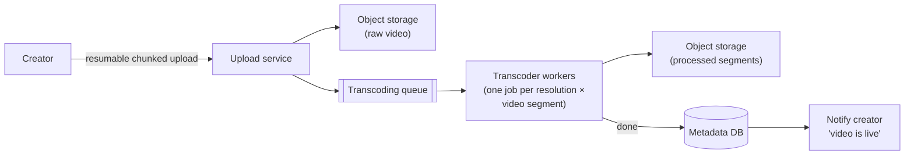
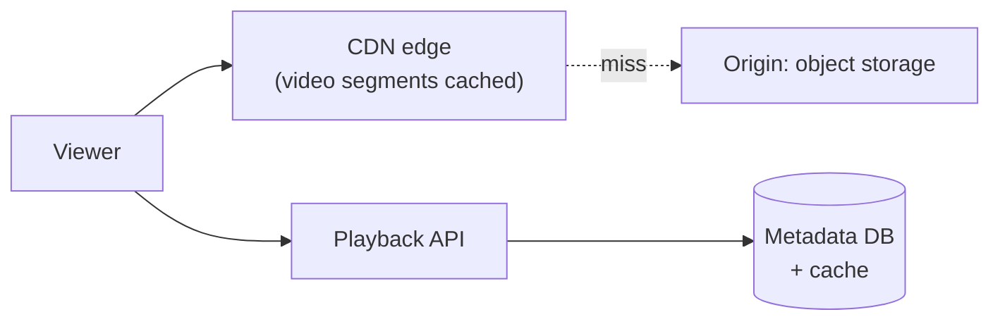

## Problem Statement

Design YouTube's core: creators upload videos; the system processes them; viewers anywhere in the world watch with minimal buffering on any device and network speed.

## Clarifying Questions

- Scope: upload + processing + playback? (Skip recommendations, comments, live streaming.)
- Scale? (Say 500 hours of video uploaded per minute; 1 B watch-hours/day — reads dwarf writes by ~10⁵.)
- Latency target: video available seconds or minutes after upload? (Minutes is industry-normal.)

## Requirements

**Functional:** upload (resumable — files are GBs); transcode to multiple qualities; stream with adaptive quality; metadata (title, views).
**Non-functional:** smooth playback on any connection; global low latency; never lose an uploaded video; processing pipeline scales with upload volume.

## High-Level Design — Two Separate Systems

The write path (upload/process) and read path (watch) share almost nothing — treat them separately.

### Write path: upload → transcode

- **Resumable uploads:** client uploads in chunks (e.g. 10 MB) directly to object storage via pre-signed URLs; a dropped connection resumes at the last chunk instead of restarting a 4 GB file.
- **Transcoding is the classic [message-queue](/concepts/message-queues) workload:** bursty, CPU-heavy, parallelizable. Split each video into ~10-second **segments** and fan out (segment × resolution) jobs across a worker fleet — a 2-hour video transcodes in minutes because hundreds of workers each handle a piece. Failed jobs retry (workers are idempotent); a completion tracker flips the video to "ready."

### Read path: stream via CDN

Videos are **not** downloaded as one file. **Adaptive bitrate streaming (HLS/DASH):** each video exists as segments in several qualities (240p…4K) plus a **manifest** listing them. The player fetches segment-by-segment, *measuring bandwidth as it goes*, and switches quality per segment — that's why YouTube goes blurry instead of buffering when your connection dips.

All segment traffic is served from the [CDN](/concepts/cdn); with 100 K concurrent viewers on a hot video, the origin sees a handful of misses and the edges absorb everything else (Netflix pushes this so far its CDN boxes live inside ISPs).

## Deep Dive

### Metadata & view counts

Video metadata: [sharded](/concepts/database-sharding) DB by video ID, aggressively [cached](/concepts/caching) — a viral video's metadata is read millions of times an hour. **View counts** must not be a per-view DB increment: count approximately (batch increments in Redis, flush periodically) — nobody needs view counts to be transactionally exact.

### Storage economics

Petabytes/day → tiered storage: hot (recent/popular) on fast object storage replicated to CDNs; cold long-tail on cheaper archival tiers, pulled up on demand. Deduplicate re-uploads by content hash.

## Trade-offs & Alternatives

- **Pre-transcode everything vs on-demand:** pre-transcode popular ladder rungs; for long-tail videos, lazily transcode rare resolutions on first request to save compute/storage.
- **Segment length:** shorter (2–4 s) = faster quality switching + lower live latency; longer (10 s) = better compression + fewer requests.
- **Consistency:** metadata (title edits, counts) is happily [eventual](/questions/eventual-consistency-explained); the only strong requirement is durability of the video bytes.

## Follow-Up Questions

- How would live streaming differ? (Real-time transcode, short segments, seconds-not-minutes pipeline, no full-file upload.)
- How do you protect content (DRM)? (Encrypted segments + license servers — name it, don't design it.)
- Why does the first second of playback matter so much, and how do you optimize it? (Startup: fetch manifest + first low-quality segment fast, then ramp up.)
