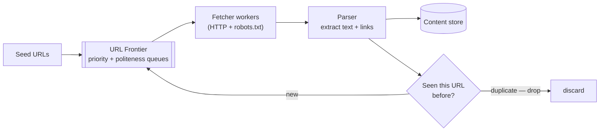
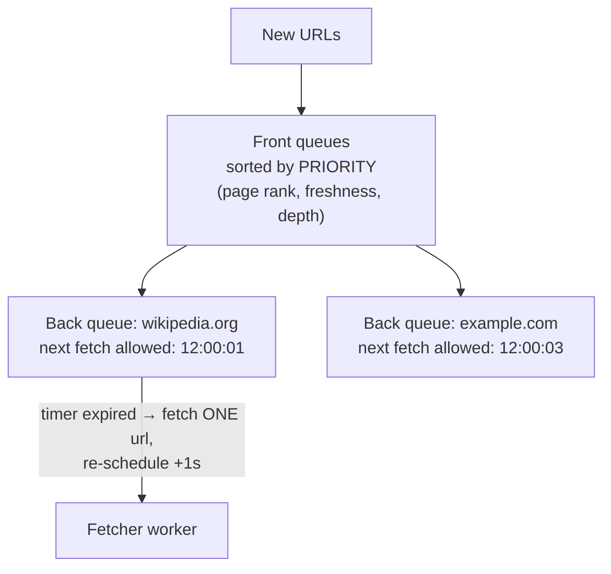

## Problem Statement

Design a web crawler (like Googlebot's core): start from seed URLs, download pages, extract links, and keep going — billions of pages — without hammering any single website or crawling the same page twice.

## Clarifying Questions

- Purpose? (Search indexing — store page content for an indexer.)
- Scale and freshness? (Say 1 B pages/month; re-crawl popular pages more often.)
- HTML only? (Yes — skip images/JS rendering for scope.)
- Politeness rules? (Respect robots.txt; limit per-domain request rate.)

## Requirements

**Functional:** fetch pages, parse + extract links, enqueue new URLs, store content, avoid duplicates.
**Non-functional:** massive throughput (≈400 pages/sec sustained for 1 B/month); polite (never overload a site); resilient (a crash mustn't lose the crawl state); avoid crawler traps.

## High-Level Design

The heart is the **URL frontier** — the smart queue of what to fetch next:

Loop: frontier hands a URL to a fetcher → fetch (checking robots.txt, cached per domain) → parse → content to storage → new links dedup-checked → unseen ones re-enter the frontier.

## Deep Dive

### The URL frontier — politeness + priority

A plain FIFO queue fails twice: it lets you bombard one domain with parallel requests (rude — you'll be IP-banned), and it treats a spam page like the homepage of Wikipedia.

Standard structure (from the Mercator design):

- **Front queues by priority** — page rank, update frequency, depth.
- **Back queues, one per domain**, each with a *next allowed fetch time* — a worker takes the domain whose timer expired, fetches **one** URL, re-schedules the domain (e.g. +1 s). Per-domain [rate limiting](/concepts/rate-limiting) built into the data structure.

### "Have I seen this URL?" at billions

A set of billions of URLs doesn't fit in memory. Use a **Bloom filter**: a probabilistic set using ~10 bits per element — "definitely not seen" or "probably seen." False positives (~1%) just mean rarely skipping a new URL — acceptable; false negatives never happen, so you never re-crawl endlessly.

<Callout type="tip">
Naming the Bloom filter here — with the honest caveat about false positives — is one of the highest-value 30 seconds in this interview.
</Callout>

### Content dedup and traps

- Same page, different URLs (mirrors, tracking params): hash the *content* (checksum or SimHash for near-duplicates) and skip storing repeats.
- **Crawler traps** (infinite calendars, session-ID URLs): cap per-domain URL counts and path depth; normalize URLs (strip tracking params).

### Distributing it

Partition the frontier **by domain hash** across crawler nodes ([consistent hashing](/concepts/consistent-hashing)) — all URLs of a domain land on one node, keeping politeness enforcement local. Frontier state lives in persistent queues, so a crashed node's partition is recoverable.

## Trade-offs & Alternatives

- **BFS vs priority crawling:** BFS is simple but wastes budget on junk; priority needs a scoring signal you must bootstrap.
- **Freshness vs coverage:** the re-crawl scheduler splits budget between revisiting known pages and discovering new ones — adaptive per-page (news hourly, static yearly).
- **Politeness vs throughput:** per-domain delays cap speed on any one site; total throughput comes from breadth across millions of domains.

## Follow-Up Questions

- How do you crawl JavaScript-rendered pages? (Headless browser pool — ~100× more expensive; reserve for pages that need it.)
- How would you detect that a page changed without downloading it? (HTTP `ETag`/`Last-Modified` conditional gets.)
- DNS at 400 fetches/sec? (Local caching DNS resolvers — DNS becomes a real bottleneck.)
