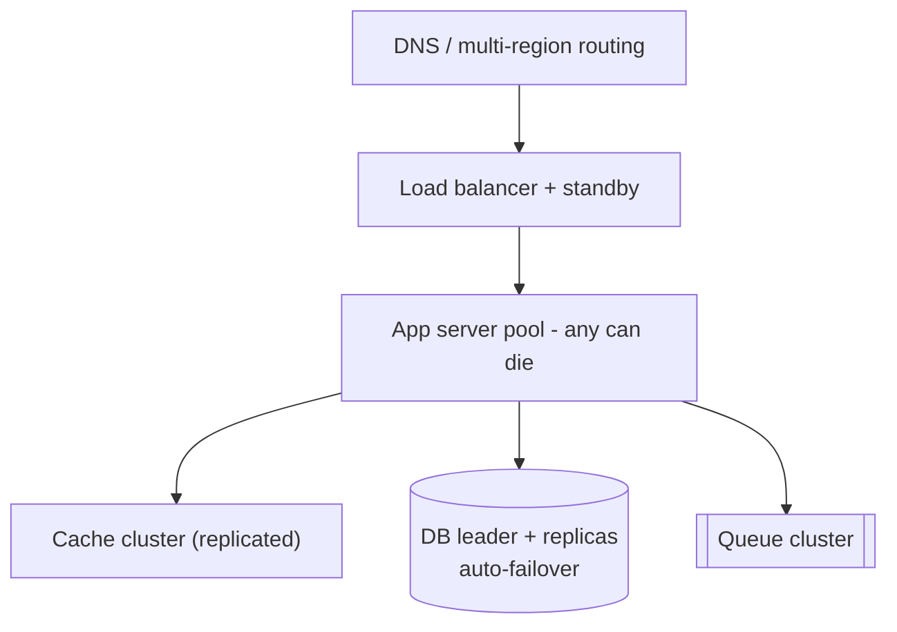
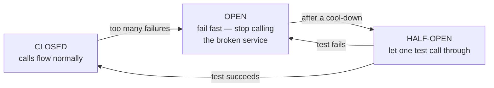

## Problem Statement

"How would you make this system highly available — say, 99.99% uptime?"

99.99% ("four nines") allows less than **1 hour of downtime per year**. You don't get there by hoping components don't fail — you get there by assuming **everything fails** and designing so no single failure is visible to users.

## The Core Principle: No Single Point of Failure

Walk each layer and ask: *if this exact box dies right now, what do users see?*

- **App servers** — run several identical stateless instances behind a [load balancer](/concepts/load-balancing); one dying is invisible.
- **Load balancer itself** — runs as an active/standby pair (it must not become the new single point of failure).
- **Database** — [replication](/concepts/database-replication) with automatic failover: a follower is promoted when the leader dies.
- **Cache/queues** — clustered (Redis Sentinel/Cluster, Kafka replicated partitions).
- **Whole data center** — deploy across multiple availability zones or regions; route around a dead one at the DNS/CDN layer.

## Detection and Recovery

Redundancy is useless if failures go unnoticed:

- **Health checks** — balancers ping servers and eject unhealthy ones automatically.
- **Timeouts + retries with backoff** — never wait forever on a dependency; retry safely ([idempotency](/concepts/idempotency) makes retries safe).
- **Circuit breakers** — after repeated failures, stop calling the broken dependency and fail fast instead of piling up threads.

## Graceful Degradation

<Callout type="tip">
The senior insight interviewers listen for: availability isn't binary. When a dependency is down, serve a *reduced* experience instead of an error — stale cache instead of live data, feeds without recommendations, checkout without the reviews widget. "The site is slower and slightly stale" beats "the site is down."
</Callout>

Async work helps here too: put non-critical work (emails, analytics) behind a [message queue](/concepts/message-queues) so its failure never blocks the user path.

## The Trade-offs to Name

- Every "nine" multiplies cost and complexity — 99.99% is much more expensive than 99.9%; ask what the business actually needs.
- Multi-region active-active means confronting the [CAP theorem](/concepts/cap-theorem) — cross-region consistency vs availability.
- Failover automation itself can misfire (split brain) — it needs quorum-based coordination.

## Follow-Up Questions

- What's the difference between availability and durability? (Answering requests vs never losing data — different mechanisms.)
- How do you *measure* availability? (SLIs/SLOs — successful request ratio, not server uptime.)
- How do you test failure handling? (Chaos engineering — Netflix's Chaos Monkey kills servers in production on purpose.)
