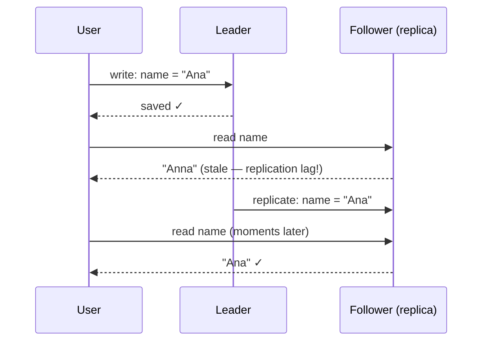

## Problem Statement

"Your design says the feed is 'eventually consistent.' What does that mean, and why is it okay?"

## The Definition

Eventual consistency is a promise: **you may not get the very latest data on every read, but given enough time without new updates, all replicas will agree on the same value.**

The window of staleness is usually **milliseconds** — but during failures it can stretch, and design must tolerate that.

## Why Choose It

It's not a bug — it's a deliberate trade ([CAP theorem](/concepts/cap-theorem)) that buys:

- **High availability** — replicas keep answering even when they can't coordinate.
- **Fast writes** — confirm without waiting for every copy ([async replication](/concepts/database-replication)).
- **Scalability** — adding replicas doesn't slow the system down.

## When It's Acceptable — and When It Isn't

**Fine (stale reads are harmless):**

- Social feeds, like/view counts, follower numbers
- Product reviews, search indexes
- Shopping carts, user preferences, DNS

**Not fine (stale reads cause real harm):**

- Account balances and payments
- Inventory of the *last* item; seat/ticket booking
- Access revocation ("this user was just banned")

**The judging question:** *what's the cost of acting on data that's a second old?* If the answer is "nothing" or "mild confusion," eventual consistency is free scale. If the answer is "money lost or double-sold seats," pay for strong consistency — see [concurrency control](/concepts/concurrency-control).

<Callout type="tip">
Bonus points: mention **read-your-own-writes** — users tolerate stale views of *others'* data but expect to see their *own* edits immediately, which you get by routing a user's reads to the leader briefly after they write.
</Callout>

## Follow-Up Questions

- How do replicas converge after a conflict? (Last-write-wins, vector clocks, or app-level merge — see [Design a Key-Value Store](/questions/design-key-value-store).)
- What consistency does your feed design actually need? (Per-feature answer, not per-system.)
- How long is "eventually"? (Measure it: replication lag is a first-class metric with alerts.)
