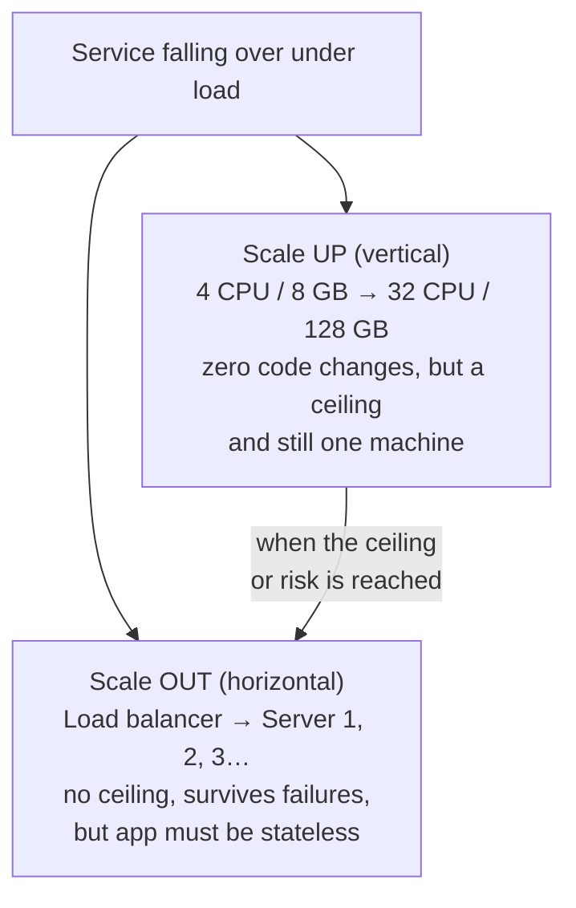

## Problem Statement

"Your service is falling over under load. Do you scale up or scale out — and what are the trade-offs?"

Background concept: [Horizontal vs Vertical Scaling](/concepts/horizontal-vs-vertical-scaling).

## Model Answer

**Short version:** scale up for simplicity until it stops working; scale out for the long run — but only after making the app stateless.

| Trade-off | Vertical (up) | Horizontal (out) |
| --- | --- | --- |
| Effort | Zero code changes | App must be stateless; needs a [load balancer](/concepts/load-balancing) |
| Ceiling | The biggest machine that exists | Effectively none |
| Availability | Still one machine — one failure, total outage | Survives individual server deaths |
| Cost | Superlinear at the high end | Roughly linear, commodity hardware |
| During scaling | Often needs downtime | Add servers live |

**The three things horizontal scaling demands:**

1. **Statelessness** — no user session or file stored on an individual server; state moves to Redis/DB/object storage.
2. **A load balancer** to spread traffic and detect dead servers.
3. **A data strategy** — the database becomes the next bottleneck: read replicas first, then [sharding](/concepts/database-sharding).

<Callout type="tip">
Strong answers mention the *sequence* real companies follow: scale up (cheap win) → cache → read replicas → scale out the app tier → shard the database last. Jumping straight to "shard everything" signals inexperience, not sophistication.
</Callout>

## Follow-Up Questions

- Why does state break horizontal scaling? (Requests land on different servers; server-local session data disappears mid-session.)
- Is the database scaled the same way? (Reads scale out easily via replicas; writes are much harder — sharding.)
- When is vertical scaling the *right* long-term answer? (Predictable modest scale, stateful legacy software, or where simplicity is worth more than resilience.)
