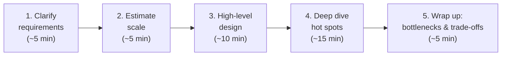
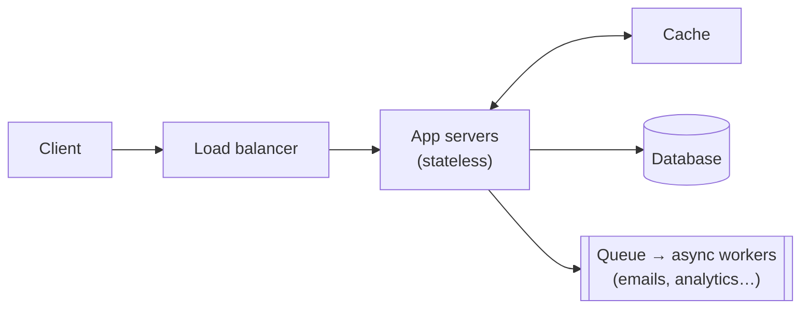

## Problem Statement

"Design Twitter." Forty minutes. Go.

The question is deliberately vague — the interviewer is testing whether you can bring **structure** to an open-ended problem, not whether you've memorized Twitter's architecture. The single biggest mistake candidates make is jumping straight to boxes and arrows.

## The Framework

### Step 1 — Clarify requirements (never skip this)

Ask questions before designing anything:

- **Functional:** What are the 2–3 core features? (For Twitter: post, follow, view feed. Ignore DMs and trends unless asked.)
- **Non-functional:** How many users? Read-heavy or write-heavy? How fresh must data be? Is downtime tolerable?

Then *say the scope out loud*: "I'll design posting and the home feed for 100 M daily users, favoring availability over strict consistency."

### Step 2 — Estimate the scale

A few quick numbers change the whole design — see the [URL shortener](/questions/design-url-shortener) example where the math dictates 7-character codes:

- Requests/second = daily users × actions per day ÷ ~100,000 seconds per day.
- Storage = items/day × size × retention.
- **Read:write ratio** — the most design-shaping number of all.

### Step 3 — High-level design

Now draw the boxes — this skeleton fits 80% of designs; you then customize it:

Walk through one write path and one read path end to end, out loud: "a request hits the [load balancer](/concepts/load-balancing), an app server checks the [cache](/concepts/caching), falls back to the database, and slow work goes to a [queue](/concepts/message-queues)."

### Step 4 — Deep dive where it hurts

The interviewer will steer ("how does the feed stay fast?"). If they don't, pick the hardest part yourself: the data model, the hot-path query, sharding strategy, or the consistency story. This is where depth is scored.

### Step 5 — Wrap up

Name the bottlenecks and single points of failure honestly, say what you'd improve with more time, and summarize the key trade-offs you made.

## Common Mistakes

<Callout type="warning">
- **Designing for Google scale when they said 10,000 users** — or ignoring scale entirely. The estimate step exists to prevent both.
- **Silent drawing.** The interview is a conversation; narrate your reasoning and check in ("does this direction make sense?").
- **One-tool-fits-all.** "I'll use MongoDB for everything" with no justification scores worse than a simple design with clear reasons.
</Callout>

## Follow-Up Questions

- How would your design change with 100× the traffic? (Have an answer ready — it's the most common closer.)
- What breaks first in your design? (Knowing your own bottleneck is a senior signal.)
- Why this database / cache / queue? (Every component choice needs one sentence of *why*.)
