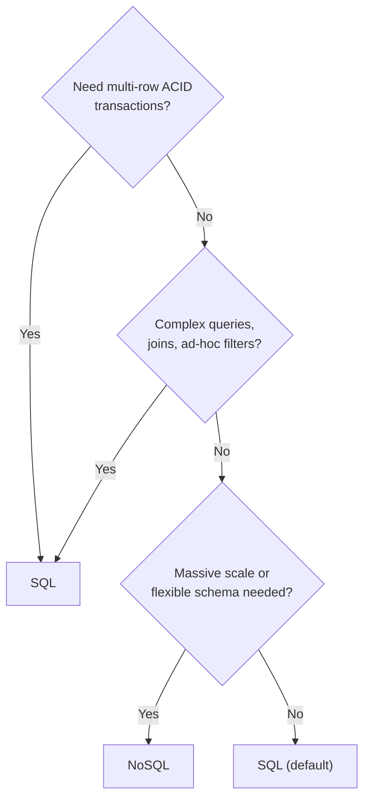

## Problem Statement

"For your design — would you use a SQL or NoSQL database, and why?"

This appears in almost every system design interview. The trap is answering with technology loyalty ("NoSQL scales better") instead of a reasoned decision.

## Clarifying Questions

- What are the access patterns — lookups by key, or rich queries and joins?
- Do we need transactions across multiple entities?
- What's the scale — GBs on one machine, or TBs across many?
- How structured and stable is the data's shape?

## The Decision Framework

**Choose SQL when** ([full concept](/concepts/sql-vs-nosql)):

- Money or inventory moves between rows — you need real transactions.
- You query data many different ways (joins, aggregations, reporting).
- The data is naturally relational and its shape is stable.
- *Examples: payments ledger, order management, booking systems.*

**Choose NoSQL when:**

- Access is dominated by simple key lookups at very high volume.
- Data must spread across many servers effortlessly ([sharding](/concepts/database-sharding) built in).
- Records vary in shape (flexible schema) or you're storing event streams.
- You can accept [eventual consistency](/questions/eventual-consistency-explained) for availability.
- *Examples: session store, shopping cart, activity feeds, IoT telemetry.*

## Model Answer (30 seconds)

> "Default to SQL — it's proven, transactional, and flexible to query. I'd reach for NoSQL for a specific reason: this workload is simple key-value lookups at millions of QPS with no cross-entity transactions, which is exactly what a key-value store is built for. Real systems mix both: SQL for the order ledger, Redis for sessions, Cassandra for the activity feed."

<Callout type="tip">
Naming the *specific* NoSQL family (key-value vs document vs wide-column vs graph) and why it matches the access pattern is what separates a strong answer from a buzzword answer.
</Callout>

## Follow-Up Questions

- Can Postgres handle our scale before we reach for NoSQL? (Usually further than people think — replicas, partitioning, caching first.)
- How would you migrate from SQL to NoSQL later? (Dual-write behind a feature flag, backfill, cut over reads.)
- What do you lose by giving up joins? (You denormalize — duplicate data and keep it in sync yourself.)
