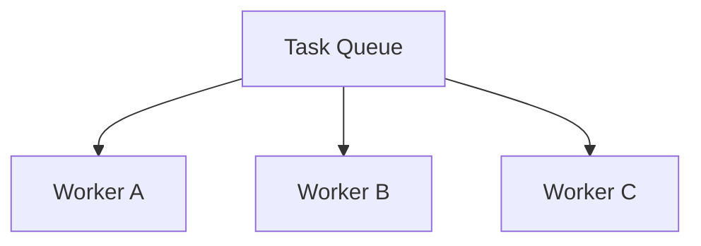
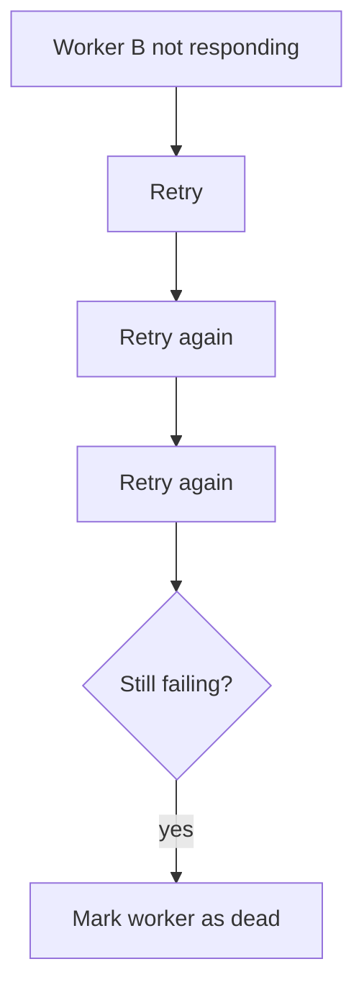
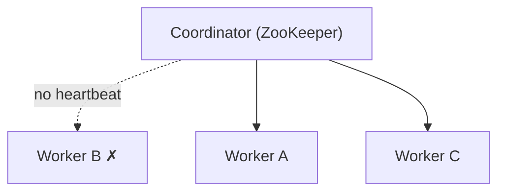
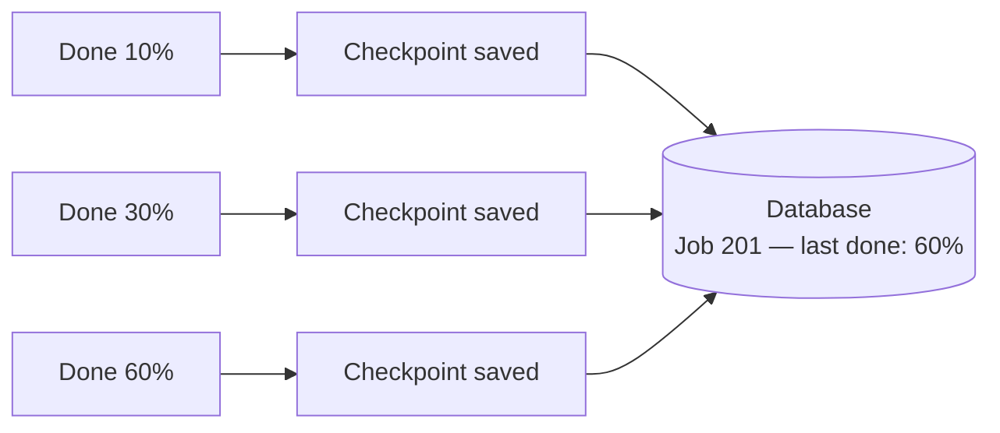
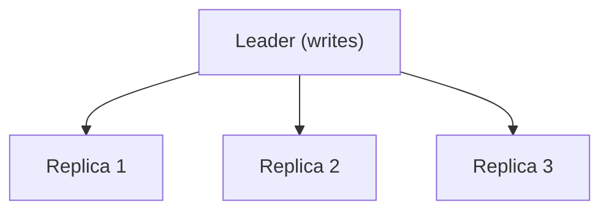
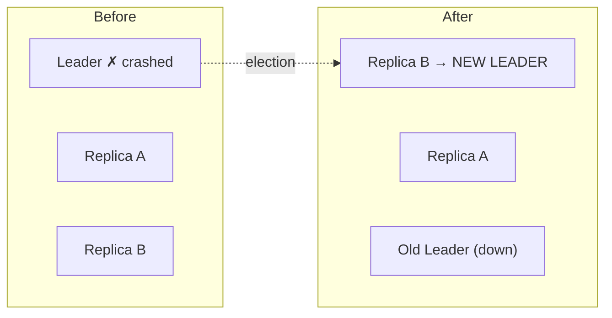
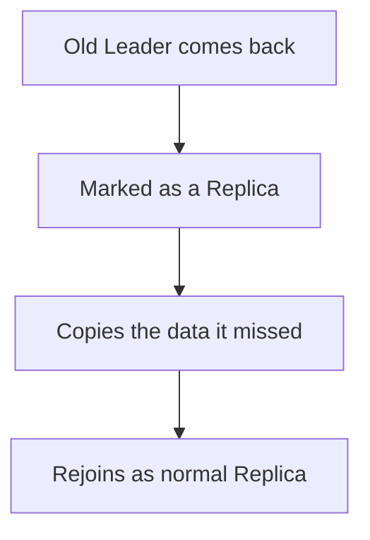

## Problem Statement

"What happens if a worker node fails? How would you design the system to recover from it?"

At first this looks like a simple fault-tolerance question. But the interviewer isn't looking for one tool name like ZooKeeper or Kubernetes — they want to see how you *think*: whether you can start with a basic idea, find its weak point, and improve the design step by step.

## Start by Asking a Clarifying Question

Before answering, ask one thing:

> "Are there many worker nodes doing the work, or is there only one worker node?"

This changes the whole answer, because it splits into two very different cases:

1. **Many worker nodes** are processing tasks — losing one just means redistributing its work.
2. **Only one worker node** handles all the requests — losing it means the system may become unavailable.

## Scenario 1: Many Worker Nodes

Imagine three workers pulling jobs off a shared queue. Now Worker B crashes. How does the system recover?



### Step 1 — Retry Before Assuming Failure

Never decide a worker is dead the moment it stops replying. Many failures are only temporary: a short network glitch, a brief CPU spike, a garbage-collection pause, a container restarting.



<Callout type="tip">
The first move is always a retry, not a failover. A few retries before declaring a worker unhealthy avoids unnecessary failovers caused by small, temporary problems.
</Callout>

### Step 2 — Add a Central Coordinator

Once retries are exhausted, some component must manage recovery — this is where a tool like Apache ZooKeeper fits in. The coordinator keeps checking each worker's health via **heartbeats** — small "I'm alive" messages sent at regular intervals (the same idea behind a [gossip protocol](/concepts/gossip-protocol), just centralized here instead of peer-to-peer).



If Worker B stops sending heartbeats, the coordinator detects the failure, marks Worker B unavailable, and hands its pending work to Worker A and Worker C. This is the **Competing Consumers** pattern: instead of one worker owning all the tasks forever, many workers pull from the same [queue](/concepts/message-queues) — so the system keeps running even if one worker disappears.

**A common follow-up:** *"What if Worker B was running a long job? How will Worker A know where to continue?"* This is where many candidates get stuck.

### Step 3 — Use Checkpoints

The answer is checkpointing. Instead of saving progress only at the very end, the worker periodically saves its progress to permanent storage.



Say Worker B crashes after finishing 60% of a job. Worker A picks up the same job, reads the last checkpoint, and continues from 60% — not from zero:

```
while (job is not finished) {
  processNextBatch()
  saveCheckpoint(jobId, currentProgress)
}

// After a crash, another worker does:
progress = fetchCheckpoint(jobId)
resumeJob(progress)
```

This avoids repeating finished work, reduces recovery time, and makes long jobs fault-tolerant. Checkpointing is widely used in batch processing, ETL pipelines, stream processing, and distributed schedulers.

## Scenario 2: Only One Worker Node

Now the interviewer changes the problem: *"There is only one worker node handling all writes. What if it crashes?"*

This is very common in practice — a primary database server, a Redis primary, a Kafka controller, or a master node in a distributed system. If that single node goes down, the whole system can become unavailable.

### Step 1 — Use a Leader–Replica Setup

Instead of trusting one machine, keep several copies. One node is the **Leader**; the others are **Replicas**. The Leader handles all writes, and the Replicas continuously copy data from the Leader (standard [database replication](/concepts/database-replication)). As long as the Leader is healthy, everything runs normally.



### Step 2 — The Leader Fails

Now suppose the Leader crashes. Someone has to decide which Replica becomes the new Leader. This decision **cannot** be left to each node on its own — otherwise two replicas might both think they're the Leader, corrupting data.

### Step 3 — Leader Election

Again, a coordinator like ZooKeeper solves this. It watches all replicas, and when the Leader fails it detects the failure, compares replica states, picks the most up-to-date replica, and promotes it to the new Leader.



This is called **Leader Election**. The goal is to keep downtime small while guaranteeing no committed data is lost.

### What If the Old Leader Comes Back?

Another great follow-up: *"Suppose the old Leader comes back a few minutes later. What should happen?"*

It must **not** become the Leader again right away.



ZooKeeper sees a new Leader already exists, demotes the old Leader to a Replica, and only lets it act as a normal replica once it's copied all the updates it missed while it was down.

<Callout type="warning">
Skipping this step causes **split-brain** — two nodes both believing they're in charge, each accepting writes the other doesn't know about. The rule is strict: an old Leader always rejoins as a demoted, fully-synced Replica, never as a second Leader.
</Callout>

## Putting It All Together

When answering this question, don't jump straight to tool names — walk the interviewer through how the design grows:

1. Ask whether there are many workers or a single worker.
2. For many workers, start with retries to handle temporary failures.
3. Add a coordinator (ZooKeeper) to spot real failures and redistribute work (Competing Consumers).
4. Handle long jobs with checkpoints so a new worker can resume from the last saved point.
5. For a single worker, move to a Leader–Replica setup.
6. Use Leader Election to promote the most up-to-date replica automatically.
7. Let the old Leader rejoin as a Replica instead of retaking charge.

## Key Takeaways

| Problem | Solution |
| --- | --- |
| Worker briefly unresponsive | Retry a few times before giving up |
| Worker truly dead | Coordinator (ZooKeeper) redistributes its work |
| Long job interrupted | Checkpoints let another worker resume midway |
| Single point of failure | Leader–Replica architecture |
| Leader crashes | Leader Election promotes the best replica |
| Old leader returns | It rejoins as a replica and syncs missing data |

Worker node failures are unavoidable in distributed systems — the real challenge isn't stopping failures, it's recovering smoothly, with little downtime and no lost data. Interviewers don't expect you to memorize every framework; they want to see whether you can start with a simple design, find its weak spots, and grow it into a resilient, production-ready architecture.

## Follow-Up Questions

- What happens if the coordinator itself fails? (ZooKeeper/etcd run as a small odd-numbered cluster and elect their own leader internally via a consensus protocol like Zab or Raft — the coordinator's own availability is solved recursively, not by a single box.)
- How do you stop retries from flooding a slow-but-alive worker? (Exponential backoff, and a circuit breaker so a struggling worker isn't hammered with traffic while it recovers.)
- Why does leader election need a majority, not just "any" surviving replica? (Quorum voting is what prevents split-brain during a network partition — a replica can only become Leader with votes from more than half the cluster.)
